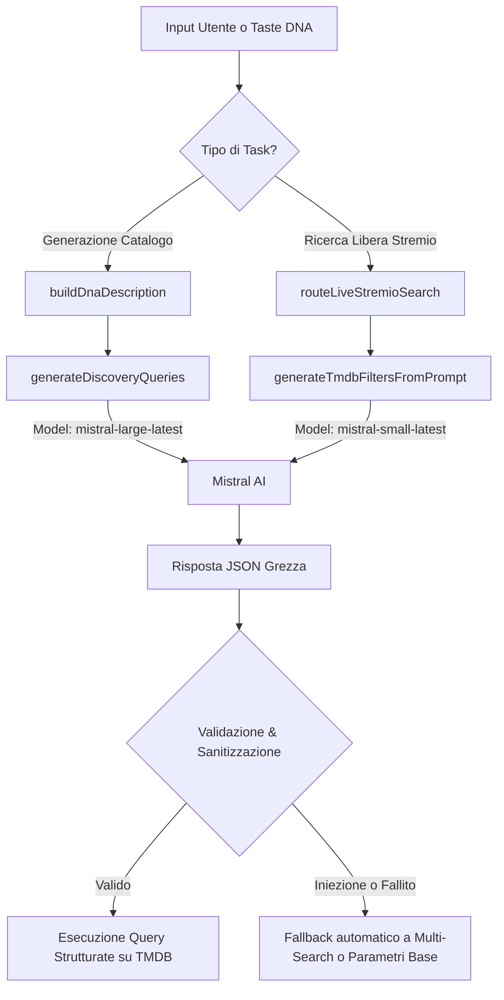

# Motore AI (Mistral AI & Query Synthesizer)

Questo documento descrive in dettaglio l'integrazione dell'Intelligenza Artificiale all'interno di YACA (Yet Another Catalog Addon). Il motore AI ha il compito di tradurre le preferenze naturali dell'utente (il suo Profilo di Gusto o Taste DNA) o le sue ricerche libere in query di ricerca strutturate ed estremamente mirate per i cataloghi TMDB, Kitsu e Trakt.

Il sistema si appoggia interamente sulle API di **Mistral AI** ed è implementato principalmente all'interno dei seguenti componenti:
*   [src/ai/querySynthesizer.js](../src/ai/querySynthesizer.js): Gestisce la scomposizione del Taste DNA in query parallele per la generazione dei cataloghi personalizzati.
*   [src/ai/router.js](../src/ai/router.js): Traduce le ricerche libere in linguaggio naturale (Live Search) in filtri TMDB e instrada le query al provider corretto.
*   [src/ai/prompts.js](../src/ai/prompts.js): Contiene le definizioni delle regole di base, dei dizionari di traduzione delle keyword e dei JSON schema per l'AI.

---

## Architettura del Flusso AI

L'AI all'interno di YACA interviene in due scenari principali:
1.  **Sintesi delle preferenze (Query Synthesizer)**: Quando l'addon deve compilare un catalogo personalizzato (es. *True Blend* o *Hidden Gems*), il DNA dell'utente viene tradotto in una descrizione testuale e inviato all'AI per generare un piano di ricerca parallelo composto da 2-4 query distinte.
2.  **Live Search (Ricerche Libere)**: Quando l'utente inserisce una frase di ricerca arbitraria nella barra di ricerca di Stremio (es. *"Film horror anni 80 sulle navi"*), l'AI converte questa stringa in parametri strutturati di TMDB.



---

## Query Synthesizer

Il Query Synthesizer ([src/ai/querySynthesizer.js](../src/ai/querySynthesizer.js)) converte la rappresentazione vettoriale delle preferenze dell'utente in un set di query strutturate che esprimono "vibe" o macro-temi specifici.

### 1. Compilazione del DNA (`buildDnaDescription`)
Prima di interpellare l'AI, il sistema raccoglie i dati del profilo e genera una descrizione testuale naturale del gusto dell'utente. Il processo segue questa gerarchia di priorità:
1.  **DNA Manuale (Priorità Massima)**: Generi e keyword esplicitamente indicati o bloccati dall'utente nelle impostazioni del profilo (`manualDNA`).
2.  **DNA Inferito (Vettori)**: Estrae dal vettore fuso finale (`V_final`) del profilo di gusto i primi $N$ generi e parole chiave ordinati per peso.

La stringa risultante si presenta ad esempio così:
> *"User Manual Genres: Horror, Sci-Fi. Inferred Preferred Genres: Thriller, Action. Inferred Preferred Keywords: space travel, alien, spaceship."*

### 2. Strategie di Prompting e Generazione
YACA implementa due distinte strategie di scomposizione a seconda del catalogo di destinazione:

#### A. Strategia "True Blend" (`TRUE_BLEND_SYSTEM_PROMPT`)
*   **Obiettivo**: Trovare contenuti che riflettano i macro-temi dominanti dell'utente, senza mischiare generi contrastanti nello stesso oggetto (es. non mischiare un thriller cupo con una commedia romantica).
*   **Configurazione**: Genera esattamente 2 o 3 oggetti di query.
*   **Operatori logici**: Predilige l'operatore **OR (pipe `|`)** sulle keyword per creare un pool di risultati ampio e diversificato da fondere in seguito.
*   **Modello utilizzato**: `mistral-large-latest` con `temperature: 0.3`.

#### B. Strategia "Hidden Gems" (`HIDDEN_GEMS_SYSTEM_PROMPT`)
*   **Obiettivo**: Scoprire film o serie di nicchia, indipendenti o sperimentali a bassa popolarità su TMDB, evitando blockbuster di massa.
*   **Configurazione**: Genera esattamente 3 o 4 oggetti di query.
*   **Operatori logici**: Predilige l'operatore **AND (comma `,`)** per incrociare chirurgicamente concetti specifici (es. *"snow,serial killer,isolation"*), riducendo la platea a opere d'autore o di nicchia.
*   **Modello utilizzato**: `mistral-large-latest` con `temperature: 0.3`.

---

## Live Search & Routing AI

All'interno di [src/ai/router.js](../src/ai/router.js), YACA espone una logica per mappare le ricerche libere dell'utente in parametri TMDB. Questo permette una ricerca di tipo semantico all'interno dell'addon.

### 1. Traduzione semantica e Regole Generali
Per garantire che le API di TMDB possano digerire l'input dell'utente, l'AI applica una serie di regole stringenti (configurate in [src/ai/prompts.js](../src/ai/prompts.js)):
*   **Traduzione concettuale**: I concetti descrittivi in lingua italiana vengono tradotti nei corrispettivi sostantivi inglesi più semplici (es. *"balene"* $\rightarrow$ *"whale"*, *"natalizia"* $\rightarrow$ *"christmas"*).
*   **Regola dell'operatore singolo**: Nelle keyword è consentito un solo operatore per blocco di query: o solo AND (`,`) o solo OR (`|`). Non è ammesso mischiarli in una singola stringa (es. `cyberpunk|neon` è valido, `cyberpunk|neon,hacker` viene scartato o corretto).
*   **Mappatura dei codici lingua**: Riconosce indicazioni geografiche e linguistiche (es. *"film americani"* $\rightarrow$ `original_language: "en"`, *"in italiano"* $\rightarrow$ `language: "it-IT"`).

### 2. Risposta JSON Schema
L'AI deve rispondere restituendo un oggetto JSON che segue una delle due strutture definite in [src/ai/prompts.js](../src/ai/prompts.js):
*   `single_query`: Per mappare una ricerca singola.
*   `multi_query`: Per pianificare più ricerche in parallelo (es. se la ricerca contiene concetti slegati come *"Io amo Game of Thrones ma la mia ragazza Bridgerton"*).

Esempio di query generata dall'AI per la frase *"Film di fantascienza anni 90 con viaggi nel tempo"* (risoluzione in `single_query`):
```json
{
  "strategy": "discovery",
  "genre_ids": [878],
  "year_from": "1990",
  "year_to": "1999",
  "keyword": "time travel",
  "target": "tmdb"
}
```

---

## Sicurezza, Validazione e Fallback (Defensive Design)

Il sistema è protetto da allucinazioni dell'AI, errori di parsing JSON e prompt injection attraverso un solido strato di difesa nel codice JS:

1.  **Whitelisting dei campi**: La funzione `sanitizeSingleQuery` analizza l'output restituito da Mistral e rimuove qualsiasi campo non esplicitamente definito all'interno del set `ALLOWED_AI_FIELDS`.
2.  **Validazione dei tipi**: Vengono eseguiti controlli di tipo bloccanti (es. `genre_ids` deve essere un array di soli numeri interi, `people_list` deve contenere solo stringhe).
3.  **Kids Mode Enforcement**: Se la modalità Kids è attiva sul profilo utente corrente, al system prompt viene concatenata una direttiva critica invalicabile:
    > *"CRITICAL: The user is in KIDS MODE. You MUST ONLY generate queries for family-friendly, children-appropriate content. Never generate queries containing adult, violent, scary, or sexually suggestive keywords or themes."*
4.  **Fallback Resiliente**: In caso di errore di connessione con Mistral AI o di un output corrotto non riparabile, la funzione `parseMistralResponse` devia su un fallback sicuro strutturato in modalità `multi_search`, che esegue una ricerca testuale classica su TMDB usando l'input originario dell'utente, impedendo che l'addon smetta di funzionare.

---

## Variabili d'Ambiente Utilizzate

Il modulo AI utilizza le seguenti chiavi di configurazione (lette prima dalle preferenze salvate dell'utente e poi, come fallback globale, dal file `.env` del server):

| Chiave | Scopo | Note |
| :--- | :--- | :--- |
| `MISTRAL_API_KEY` | Chiave di autenticazione per le chiamate a Mistral AI. | Obbligatoria per attivare le funzionalità AI. |
| `TMDB_API_KEY` | Chiave di autenticazione TMDB. | Utilizzata in concomitanza per tradurre keyword testuali in ID numerici TMDB. |
