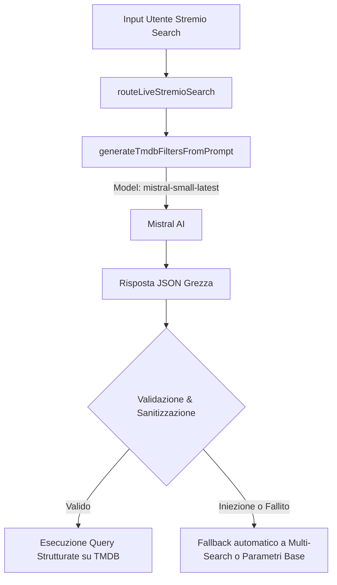

# Motore AI (Mistral AI & Live Search Router)

Questo documento descrive in dettaglio l'integrazione dell'Intelligenza Artificiale all'interno di YACA (Yet Another Catalog Addon). Il motore AI ha il compito di tradurre le ricerche libere in linguaggio naturale inserite dall'utente in query strutturate ed estremamente mirate per i provider di contenuti (TMDB, Kitsu, Trakt).

Il sistema si appoggia sulle API di **Mistral AI** ed è implementato principalmente all'interno dei seguenti componenti:
*   [src/ai/router.js](../src/ai/router.js): Traduce le ricerche libere in linguaggio naturale (Live Search) in filtri TMDB e instrada le query al provider corretto.
*   [src/ai/prompts.js](../src/ai/prompts.js): Contiene le definizioni delle regole di base, dei dizionari di traduzione delle keyword e dei JSON schema per l'AI.

> [!NOTE]
> La generazione e il pre-filtraggio dei cataloghi personalizzati (es. *True Blend*, *Smart AND*, *Top Genres*) non richiedono chiamate esterne ad ogni richiesta: sono eseguiti a latenza zero dal motore SQL in-memory **DuckDB** e dal calcolatore bayesiano **VSM** ([catalogStrategies.js](../src/engines/hybrid/catalogStrategies.js)).

---

## Architettura del Flusso AI

L'AI all'interno di YACA interviene primariamente nello scenario di **Live Search (Ricerche Libere)**:
Quando l'utente inserisce una frase di ricerca arbitraria nella barra di ricerca di Stremio (es. *"Film horror anni 80 sulle navi"* o *"Io amo Game of Thrones ma la mia ragazza Bridgerton"*), l'AI converte questa stringa in parametri strutturati di TMDB.


```mermaid
graph TD
    A[Input Utente Stremio Search] --> B[routeLiveStremioSearch]
    B --> C[generateTmdbFiltersFromPrompt]
    C -->|Model: mistral-small-latest| D[Mistral AI]
    D --> E[Risposta JSON Grezza]
    E --> F{Validazione & Sanitizzazione}
    F -->|Valido| G[Esecuzione Query Strutturate su TMDB]
    F -->|Iniezione o Fallito| H[Fallback automatico a Multi-Search o Parametri Base]
```

---

## Live Search & Routing AI

All'interno di [src/ai/router.js](../src/ai/router.js), YACA espone una logica per mappare le ricerche libere dell'utente in parametri TMDB. Questo permette una ricerca di tipo semantico all'interno dell'addon.

### 1. Traduzione semantica e Regole Generali
Per garantire che le API di TMDB possano digerire l'input dell'utente, l'AI applica una serie di regole stringenti (configurate in [src/ai/prompts.js](../src/ai/prompts.js)):
*   **Traduzione concettuale**: I concetti descrittivi in lingua italiana vengono tradotti nei corrispettivi sostantivi inglesi più semplici (es. *"balene"* $\rightarrow$ *"whale"*, *"natalizia"* $\rightarrow$ *"christmas"*).
*   **Regola dell'operatore singolo**: Nelle keyword è consentito un solo operatore per blocco di query: o solo AND (`,`) o solo OR (`|`). Non è ammesso mischiarli in una singola stringa (es. `cyberpunk|neon` è valido, `cyberpunk|neon,hacker` viene scartato o corretto).
*   **Mappatura dei codici lingua**: Riconosce indicazioni geografiche e linguistiche (es. *"film americani"* $\rightarrow$ `original_language: "en"`, *"in italiano"* $\rightarrow$ `language: "it-IT"`).

### 2. Risposta JSON Schema
L'AI deve rispondere restituendo un oggetto JSON che segue una delle due strutture definite in [src/ai/prompts.js](../src/ai/prompts.js):
*   `single_query`: Per mappare una ricerca singola.
*   `multi_query`: Per pianificare più ricerche in parallelo (es. se la ricerca contiene concetti slegati).

Esempio di query generata dall'AI per la frase *"Film di fantascienza anni 90 con viaggi nel tempo"* (risoluzione in `single_query`):
```json
{
  "strategy": "discovery",
  "genre_ids": [878],
  "year_from": "1990",
  "year_to": "1999",
  "keyword": "time travel",
  "target": "tmdb"
}
```

---

## Sicurezza, Validazione e Fallback (Defensive Design)

Il sistema è protetto da allucinazioni dell'AI, errori di parsing JSON e prompt injection attraverso un solido strato di difesa nel codice JS:

1.  **Whitelisting dei campi**: La funzione `sanitizeSingleQuery` analizza l'output restituito da Mistral e rimuove qualsiasi campo non esplicitamente definito all'interno del set `ALLOWED_AI_FIELDS`.
2.  **Validazione dei tipi**: Vengono eseguiti controlli di tipo bloccanti (es. `genre_ids` deve essere un array di soli numeri interi, `people_list` deve contenere solo stringhe).
3.  **Kids Mode Enforcement**: Se la modalità Kids è attiva sul profilo utente corrente, al system prompt viene concatenata una direttiva critica invalicabile:
    > *"CRITICAL: The user is in KIDS MODE. You MUST ONLY generate queries for family-friendly, children-appropriate content. Never generate queries containing adult, violent, scary, or sexually suggestive keywords or themes."*
4.  **Fallback Resiliente**: In caso di errore di connessione con Mistral AI o di un output corrotto non riparabile, la funzione `parseMistralResponse` devia su un fallback sicuro strutturato in modalità `multi_search`, che esegue una ricerca testuale classica su TMDB usando l'input originario dell'utente, impedendo che l'addon smetta di funzionare.

---

## Variabili d'Ambiente Utilizzate

Il modulo AI utilizza le seguenti chiavi di configurazione (lette prima dalle preferenze salvate dell'utente e poi, come fallback globale, dal file `.env` del server):

| Chiave | Scopo | Note |
| :--- | :--- | :--- |
| `MISTRAL_API_KEY` | Chiave di autenticazione per le chiamate a Mistral AI. | Obbligatoria per attivare le funzionalità AI di Live Search. |
| `TMDB_API_KEY` | Chiave di autenticazione TMDB. | Utilizzata in concomitanza per tradurre keyword testuali in ID numerici TMDB. |
