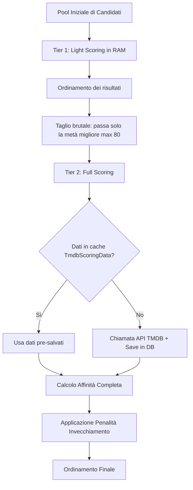

# Algoritmi di Scoring e Merging

Questo documento illustra nel dettaglio gli algoritmi, i modelli matematici e le logiche di fusione implementate in YACA per la generazione e la personalizzazione dei cataloghi.

Le logiche di calcolo e raccomandazione si trovano principalmente in:
*   [src/profile/ProfileScorer.js](../src/profile/ProfileScorer.js): Core engine di scoring per l'affinità dei contenuti (vettoriale, bayesiano e penalità di rotazione).
*   [src/profile/ProfileBuilder.js](../src/profile/ProfileBuilder.js): Gestore del ciclo di vita dei profili e aggiornamento incrementale dei vettori.
*   [src/utils/dnaExtractor.js](../src/utils/dnaExtractor.js): Estrattore di vettori e fusione matematica del DNA (statico + attivo).
*   [src/engines/hybrid/scoringEngine.js](../src/engines/hybrid/scoringEngine.js): Due-Tier scoring orchestrator e gestore cache di scoring.
*   [src/engines/hybrid/catalogStrategies.js](../src/engines/hybrid/catalogStrategies.js): Strategie di compilazione per i cataloghi speciali (*True Blend*, *Hidden Gems*, ecc.).
*   [src/utils/resultMerger.js](../src/utils/resultMerger.js): Algoritmi di Interleaving e Consensus Scoring.

---

## 1. Taste Profile & DNA Vettoriale

YACA modella l'identità cinematografica dell'utente usando un approccio basato sul **Vector Space Model (VSM)**. Le preferenze dell'utente sono rappresentate da un vettore multidimensionale i cui elementi sono coppie chiavi-valore del tipo `prefisso:valore` (es. `g:28` per il genere Action, `k:12984` per la keyword *time travel*, `d:3` per il regista Christopher Nolan).

Il DNA finale dell'utente (`V_final`) è il risultato della fusione dinamica di due componenti vettoriali:

### Vettore Statico (`V_static`)
Rappresenta le intenzioni dichiarate dall'utente durante la configurazione o derivanti dai preset del catalogo.
*   **Rosetta Dictionary per Kitsu**: Poiché Kitsu non usa gli ID numerici di TMDB, YACA implementa una traduzione automatica: quando l'utente usa un preset di Kitsu, il sistema assegna un peso predefinito al genere Animazione (`g:16`) e al paese di origine Giappone (`o:JP`), traducendo inoltre i preset testuali (es. *"isekai"*) in stringhe-keyword per TMDB.

### Vettore Attivo (`V_active`)
Rappresenta le abitudini reali di consumo registrate tramite la cronologia di visione (`WatchHistory`). Viene arricchito in tempo reale ad ogni visione o ad ogni sincronizzazione incrementale da Trakt o Stremio. Ciascun elemento visto incrementa la forza dei rispettivi generi, keyword, attori principali, registi e paesi dell'opera.

### Algoritmo di Fusione (`computeFinalDNA`)
Per bilanciare le preferenze esplicite (Static) con i comportamenti reali (Active), YACA utilizza una curva di apprendimento dipendente dal numero di interazioni dell'utente ($T$):

1.  I vettori `V_static` e `V_active` vengono prima normalizzati (la somma di tutti i loro pesi interni è portata a $1.0$).
2.  Il peso del vettore attivo ($W_{active}$) cresce linearmente fino a raggiungere un tetto massimo di $0.85$ al raggiungimento di $50$ interazioni:
    $$W_{active} = \min\left(\frac{T}{50}, 1\right) \cdot 0.85$$
3.  Il peso del vettore statico è il complemento a uno:
    $$W_{static} = 1 - W_{active}$$
4.  La fusione finale combina i vettori normalizzati moltiplicando per 100 per leggibilità:
    $$V_{final}[i] = (V_{static}[i] \cdot W_{static} + V_{active}[i] \cdot W_{active}) \cdot 100$$

---

## 2. Il Ciclo del Two-Tier Scoring

Per ovviare ai limiti di latenza imposti dalle API esterne di TMDB durante la scansione di centinaia di titoli candidati, YACA implementa una pipeline di scoring a due livelli (Two-Tier Scoring) definita in [src/engines/hybrid/scoringEngine.js](../src/engines/hybrid/scoringEngine.js):

### Tier 1: Light Scoring (RAM-Only)
Viene eseguito sul pool totale di candidati recuperati in massa (spesso 200-300 titoli).
*   **Nessuna chiamata API**: Utilizza solo i dati base dell'item (ID, generi, voto e conteggio voti).
*   **Formula**: Calcola un'affinità preliminare basata sulla corrispondenza tra i generi dell'item e il vettore `V_final`.
*   **Taglio**: Solo la metà migliore del pool (con un tetto massimo impostato a 80 elementi) "sopravvive" e avanza al Tier 2.

#### Calcolo Niche & Hidden Gems nel Tier 1
All'interno del catalogo *Hidden Gems*, l'algoritmo devia per premiare opere di nicchia:
1.  **Niche Genre Bonus**: Aggiunge $+0.75$ a generi tipicamente di nicchia (es. Documentario `99`, Storia `36`, Western `37`).
2.  **Niche Vote Bonus**: Premia opere con un numero di voti circoscritto. Se il numero di voti $v$ è inferiore a 20, l'affinità è penalizzata. Se $20 \le v \le 500$, riceve un bonus lineare inverso che va da $+2.5$ a $+1.0$. Sopra i 500 voti, il bonus sfuma gradualmente fino ad azzerarsi a 2000 voti per evitare blockbuster mainstream.

### Tier 2: Full Scoring
Viene applicato solo ai sopravvissuti del Tier 1.
1.  **Arricchimento metadati**: Recupera le keyword esatte e i crediti (regista e primi 5 attori). Per evitare di saturare i limiti di velocità delle API di TMDB, cerca prima nella cache MongoDB (`TmdbScoringData`). Se assente, effettua una chiamata a TMDB e salva il risultato in cache per le richieste future.
2.  **Calcolo Affinità Completa** (`ProfileScorer.calculateItemMatch`):
    *   **Assi Tematici (98% del match)**: Somma dei pesi del DNA `V_final` per generi e parole chiave dell'item.
    *   **Assi Autoriali (2% del match)**: Somma dei pesi per registi e attori principali (limitato al 2% in base al feedback degli utenti che giudicavano secondari i registi).
    *   **Moltiplicatore DNA**: Se sono stati impostati dei filtri DNA manuali e l'item non ne rispetta alcuno, il punteggio di affinità viene abbattuto moltiplicandolo per $0.1$.
3.  **Fusione Sotto-Profilo/Globale**: Se l'utente sta usando un sotto-profilo di contesto (es. *Anime*), lo score finale fonde le preferenze del sotto-profilo ($80\%$) con quelle del profilo globale ($20\%$) per non perdere la coerenza dei gusti generali dell'utente:
    $$Score_{fuso} = Score_{profilo} \cdot 0.8 + Score_{globale} \cdot 0.2$$

---

## 3. Rating Bayesiano (Formula IMDb)

Sia nel Tier 1 che nel Tier 2, YACA modella l'indice di gradimento globale di un contenuto tramite il **Bayesian Weighted Rating (WR)**, per evitare che film con pochissimi voti ma media alta (es. un voto da 10/10) scavalchino opere ampiamente recensite.

La formula utilizzata è:
$$WR = \left(\frac{v}{v+m} \cdot R\right) + \left(\frac{m}{v+m} \cdot C\right)$$

Dove:
*   $v$ = numero di voti effettivi del contenuto (`vote_count`).
*   $m$ = voti minimi richiesti per l'affidabilità (`BAYESIAN_MIN_VOTES`, impostato a 300 in [src/config.js](../src/config.js)).
*   $R$ = media voto del contenuto (`vote_average`).
*   $C$ = voto medio dell'intero database TMDB (`BAYESIAN_MEAN_VOTE`, impostato a 6.5).

Lo score finale fonde l'affinità calcolata dall'utente con la qualità bayesiana dell'opera secondo i pesi definiti nel profilo (es. `traktWeight` per l'affinità, `tmdbWeight` per la qualità globale).

---

## 4. Algoritmo di Rotazione e Invecchiamento (Aging Penalty)

Per evitare che i caroselli di raccomandazione del frontend rimangano congelati mostrando sempre gli stessi titoli non guardati, YACA traccia le visualizzazioni passive dei contenuti (impression).

*   Ad ogni caricamento della prima pagina del catalogo, l'addon registra la data odierna per ciascun titolo mostrato nella collezione `RecommendationImpression` (`seenDates`).
*   In fase di scoring nel Tier 2, viene letto il numero di giorni distinti in cui il titolo è apparso a schermo ($D$).
*   Se un consiglio è apparso per almeno 3 giorni ($D \ge 3$), viene applicata una penalità di obsolescenza moltiplicativa:
    $$Penalty = \max\left(0.2, 1.0 - (D - 2) \cdot 0.2\right)$$
*   Il punteggio finale viene moltiplicato per questa penalità, spingendo progressivamente i contenuti vecchi verso il basso per fare spazio a nuove scoperte.

---

## 5. Algoritmi di Merging e Interleaving

Quando il sistema esegue una ricerca avanzata composta da query multiple o fonde cataloghi pre-compilati, utilizza due strategie di unificazione:

### A. Consensus Scoring (Fattore Consenso)
Quando i risultati provengono da ricerche parallele (es. le 3 vibrazioni del *True Blend*), è molto probabile che alcuni titoli appaiano in più di una lista.
*   YACA applica un bonus di consenso quadratico basato sul numero di liste in cui l'item è presente ($C$):
    $$ConsensusBonus = C^2 - 1$$
*   Un titolo che soddisfa più criteri contemporaneamente viene spinto verso l'alto. Ad esempio, se un titolo appare in 3 liste diverse, riceve un bonus di $+8.0$ sul punteggio finale.

### B. Interleaving Alternato (Round-Robin)
Per le liste che non implementano un punteggio unico e devono preservare la parità di rappresentazione dei vari filtri (es. cataloghi misti):
*   La funzione `interleaveMultipleResults` unisce le liste alternando un elemento per ciascuna sorgente in modalità round-robin (es. [Lista1[0], Lista2[0], Lista3[0], Lista1[1]...]).
*   Durante il processo, viene eseguita la deduplicazione in tempo reale basata su ID normalizzati.

### C. Diversity Caps (Tetti di Diversità)
Per evitare che una singola saga (es. tutti i film di Harry Potter) o un singolo genere occupi interamente le prime posizioni delle raccomandazioni, viene eseguito un filtraggio di diversità in coda allo scoring:
*   **Genre Cap**: Massimo 10 elementi appartenenti allo stesso genere all'interno di una pagina di catalogo.
*   **Director Cap**: Massimo 3 elementi dello stesso regista.
*   Eventuali titoli eccedenti questi limiti vengono rimossi dalla pagina corrente e rimandati a quella successiva.
