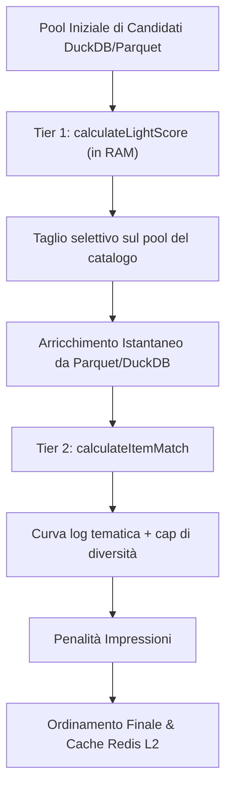

# Algoritmi di Scoring e Merging

Questo documento illustra nel dettaglio gli algoritmi, i modelli matematici e le logiche di fusione implementate in YACA per la generazione e la personalizzazione dei cataloghi.

Le logiche di calcolo e raccomandazione si trovano principalmente in:
*   [src/profile/ProfileScorer.js](../src/profile/ProfileScorer.js): Core engine di scoring per l'affinità dei contenuti (vettoriale, bayesiano e penalità di rotazione).
*   [src/profile/ProfileBuilder.js](../src/profile/ProfileBuilder.js): Gestore del ciclo di vita dei profili e aggiornamento incrementale dei vettori.
*   [src/utils/dnaExtractor.js](../src/utils/dnaExtractor.js): Estrattore di vettori e fusione matematica del DNA (statico + attivo).
*   [src/engines/hybrid/scoringEngine.js](../src/engines/hybrid/scoringEngine.js): Score ibrido per co-occorrenza (semi-seed del *Seed Network*) ed estrazione dei top-N generi/keyword dal vettore. **Non** è l'orchestratore Two-Tier: vedi §2.
*   [src/engines/hybrid/catalogStrategies.js](../src/engines/hybrid/catalogStrategies.js): Strategie di compilazione per i cataloghi speciali (*True Blend*, *Hidden Gems*, ecc.) e i cap di diversità degli hero.
*   [src/utils/resultMerger.js](../src/utils/resultMerger.js): Algoritmi di Interleaving e Consensus Scoring.
*   [src/utils/dnaRarity.js](../src/utils/dnaRarity.js): Rarità dolce, saturazione logaritmica e decadimento temporale applicati al DNA.
*   [src/engines/hybrid/animePolicy.js](../src/engines/hybrid/animePolicy.js): Risoluzione della politica anime e relativi moltiplicatori di score.
*   [src/utils/animeIdentity.js](../src/utils/animeIdentity.js): Regola canonica di identità anime (unico default del marker `_isAnime`).
*   [src/db/queryBuilder.js](../src/db/queryBuilder.js): Compilazione delle query DuckDB: paginazione deterministica, ordinamenti e FTS.
*   [src/catalog/CatalogRouter.js](../src/catalog/CatalogRouter.js): Instradamento dei cataloghi e dimensione delle pagine.

---

## 1. Taste Profile & DNA Vettoriale

YACA modella l'identità cinematografica dell'utente usando un approccio basato sul **Vector Space Model (VSM)**. Le preferenze dell'utente sono rappresentate da un vettore multidimensionale i cui elementi sono coppie chiavi-valore del tipo `prefisso:valore` (es. `g:28` per il genere Action, `k:12984` per la keyword *time travel*, `o:JP` per il Giappone, `L2:t_272` per un topos del grafo gerarchico).

> [!IMPORTANT]
> **Le persone non fanno parte del DNA.** Le chiavi `d:` (crew/registi) e `a:` (cast) vengono scartate sia in generazione sia in lettura: `isPersonDnaKey()` le riconosce e `stripPersonKeys()` le rimuove dentro `normalizeVector()` ([dnaExtractor.js](../src/utils/dnaExtractor.js#L113-L125)). Un `V_final` salvato prima di questa decisione viene ripulito al momento in cui viene riletto, senza migrazione. Motivo dichiarato nel codice: le persone rendevano il DNA troppo restrittivo. **Non esistono quindi assi autoriali nello score**: vedi §2.

Il DNA finale dell'utente (`V_final`) è il risultato della fusione dinamica di due componenti vettoriali:

### Vettore Statico (`V_static`)
Rappresenta le intenzioni dichiarate dall'utente durante la configurazione o derivanti dai preset del catalogo ([dnaExtractor.js](../src/utils/dnaExtractor.js#L3-L67)): generi, keyword gerarchiche e paese d'origine, ciascuno con peso fisso `100`.

*   **Rosetta Dictionary per Kitsu — percorso di retrocompatibilità, non più attivabile dall'utente**: il codice di traduzione esiste ancora in `extractStaticDNAFromQueries()` (`provider === 'kitsu'` → `g:16` + `o:JP` + keyword testuali come `k:isekai`), ma chi salva un catalogo con `provider: 'kitsu'` oggi lo normalizza a `'tmdb'` prima che arrivi al DNA ([validators.js](../src/api/configure/validators.js#L124-L160)). Kitsu resta solo come **formato di ID** degli item anime (`idPrefixes`, `animeIdMode`), non come sorgente selezionabile.

### Vettore Attivo (`V_active`)
Rappresenta le abitudini reali di consumo registrate tramite la cronologia di visione (`WatchHistory`). Viene arricchito in tempo reale ad ogni visione o ad ogni sincronizzazione incrementale da Trakt o Stremio. Ciascun elemento visto incrementa la forza dei rispettivi generi, keyword e paesi dell'opera. Ogni segnale è moltiplicato per un **decadimento esponenziale con emivita di 24 mesi** (`computeTimeDecay`, [dnaRarity.js](../src/utils/dnaRarity.js#L34-L43)): un interesse del 2020 pesa metà del suo valore nominale.

### Algoritmo di Fusione (`computeFinalDNA`)
La fusione è in [dnaExtractor.js](../src/utils/dnaExtractor.js#L160-L212) e avviene in quattro passi:

1.  **Rarità dolce**: `applySoftRarity()` moltiplica ogni chiave per un fattore in $[1.0, 1.80]$ prima di ogni altra operazione, così un genere onnipresente (`df` alto) non schiaccia le keyword di nicchia. Le chiavi sotto la soglia `df = 15` non ricevono alcun bonus.
2.  **Normalizzazione a $1.0$**: `normalizeVector()` scarta le chiavi persona e porta la somma dei pesi a $1.0$.
3.  **Curva di apprendimento** sul numero di interazioni pesate dell'utente ($T$): il peso del vettore attivo cresce con una **iperbole saturante**, non linearmente:
    $$W_{active} = \frac{0.85 \cdot T}{T + 50} \qquad W_{static} = 1 - W_{active}$$
    Al raggiungimento di $T = 50$ il peso attivo è $0.425$ (non $0.85$); $0.85$ è un tetto asintotico mai raggiunto.
4.  **Fusione e rinormalizzazione**: $V_{final}[i] = (V_{static}[i] \cdot W_{static} + V_{active}[i] \cdot W_{active}) \cdot 100$, seguita da una rinormalizzazione che riporta la somma a esattamente $100$. In scrittura `V_final` è quindi sempre un vettore di massa 100.

> [!NOTE]
> **Casi degenere**: se uno solo dei due vettori è non vuoto, quello prende il peso $1.0$ e l'altro $0$; se sono entrambi vuoti `V_final` è `{}`. Un profilo con `V_final` vuoto è un profilo *freddo*: non è un errore, cambia il comportamento di scoring (§2) e va trattato come tale nei test.

> ~~Curva lineare $W_{active} = \min(T/50, 1)\cdot 0.85$~~ — **non corrisponde al codice**. Il codice applica la curva $0.85\,T/(T+50)$; la formula lineare è stata sostituita insieme alla rimozione degli assi autoriali. Se la trovi altrove (wiki, appunti, ticket), è superata.

---

## 2. Il Ciclo del Two-Tier Scoring

Per ovviare ai limiti di latenza imposti dalle API esterne di TMDB durante la scansione di centinaia di titoli candidati, YACA realizza lo scoring in due passi di costo molto diverso: un passaggio *in RAM* su tutto il pool, e solo per i sopravvissuti un arricchimento e uno score completo.

> [!IMPORTANT]
> **Dove vive la pipeline.** I due livelli sono metodi di [src/profile/ProfileScorer.js](../src/profile/ProfileScorer.js): `calculateLightScore()` (Tier 1) e `calculateItemMatch()` (Tier 2). [scoringEngine.js](../src/engines/hybrid/scoringEngine.js) contiene solo il *punteggio ibrido di co-occorrenza* usato dal *Seed Network* e l'estrazione dei top-N generi/keyword: non orchestra nessun tier e non gestisce cache di scoring. Ogni strategia di catalogo chiama direttamente i due metodi ([catalogStrategies.js](../src/engines/hybrid/catalogStrategies.js#L791)).


```mermaid
graph TD
    A[Pool Iniziale di Candidati DuckDB/Parquet] --> B["Tier 1: calculateLightScore (in RAM)"]
    B --> C[Taglio selettivo sul pool del catalogo]
    C --> E[Arricchimento Istantaneo da Parquet/DuckDB]
    E --> D["Tier 2: calculateItemMatch"]
    D --> F[Curva log tematica + cap di diversità]
    F --> G[Penalità Impressioni]
    G --> H[Ordinamento Finale & Cache Redis L2]
```

### Tier 1: Light Scoring (RAM-Only)
Viene eseguito sul pool totale di candidati recuperati in massa (spesso 200-300 titoli).
*   **Nessuna chiamata API**: usa solo i dati base dell'item (ID, generi, voto e conteggio voti).
*   **Formula generale**: `genreScore * 0.7 + bayesianScore * 0.3`, il tutto moltiplicato per il `genreAlignmentMultiplier` (§2.1) e troncato a $[0, 10]$.
*   **Formula Hidden Gems / niche**: `(thematicScore * 0.8 + nicheVoteBonus * 0.2) * credibilityMultiplier`, dove `thematicScore = genreScore + keywordScore * 0.35 + nicheGenreBonus` ([ProfileScorer.js](../src/profile/ProfileScorer.js#L427-L435)).
*   **Taglio**: il tetto non è un numero fisso globale ma **per strategia**, applicato *prima* delle chiamate TMDB di dettaglio perché i cap di diversità non vengano poi neutralizzati dal cutoff. Esempio: il *Seed Network* pre-diversifica il pool a 120 candidati con `finalizeHeroQualityCandidates()` ([catalogStrategies.js](../src/engines/hybrid/catalogStrategies.js#L239-L277)).

> [!WARNING]
> ~~"Passa solo la metà migliore del pool, con un tetto massimo di 80"~~ — **non corrisponde più al codice**. Non esiste un taglio globale "metà con tetto 80": ogni strategia dichiara il proprio `targetSize` e il proprio set di cap (§5.C). La soglia 80 sopravvive solo come *fetch* di 80 simili per ogni seed, che è un'altra cosa.

#### Calcolo Niche & Hidden Gems nel Tier 1
All'interno dei cataloghi *Hidden Gems* (e in generale quando `catalogContext` è `hidden_gems` o `niche`) l'algoritmo devia per premiare opere di nicchia:
1.  **Niche Genre Bonus**: $0.75$ **per genere** incontrato nell'insieme `NICHE_GENRE_IDS = {99, 10402, 36, 37, 10770}` (Documentario, Musical, Storia, Western, TV Movie) — il bonus è cumulativo sui generi presenti, non un premio unico ([ProfileScorer.js](../src/profile/ProfileScorer.js#L5-L10), `:407-L410`).
2.  **Niche Vote Bonus**: la funzione `calculateNicheVoteBonus()` ([ProfileScorer.js](../src/profile/ProfileScorer.js#L324-L340)) premia una finestra di voti "reale ma di nicchia":
    *   $v < 20$: bonus $0$. Nel percorso *hidden gems* questi titoli vengono inoltre schiacciati da `credibilityMultiplier = 0.15`, cioè sono di fatto **penalizzati**, non solo privi di bonus.
    *   $20 \le v \le 500$: bonus lineare inverso da $+1.0$ (a 500 voti) a $+2.5$ (a 20 voti).
    *   $500 < v \le 2000$: sfumatura lineare da $+1.0$ fino a $0$.
    *   $v > 2000$: bonus $0$.

### 2.1 Alien Ratio (penalità di disallineamento)
Presente in **entrambi** i tier, con soglie diverse. In Tier 1 un genere dell'item è "alieno" se la sua affinità nel vettore è `< 0.02`; la penalità è `$0.5$` con ≥ 50% di generi alieni, `$0.75$` con ≥ 30%. In Tier 2 la stessa misura viene prima **attenuata in funzione del match tematico**: un match ≥ 6.0 moltiplica l'alien ratio per 0.1 (non penalizza quasi più nulla), ≥ 4.0 per 0.3, ≥ 2.5 per 0.6 ([ProfileScorer.js](../src/profile/ProfileScorer.js#L190-L208), `:411-L419`).

### Tier 2: Full Scoring
Viene applicato solo ai sopravvissuti del Tier 1.
1.  **Arricchimento metadati a zero latenza**: Recupera le keyword esatte, crediti (regista e primi 5 attori) e parametri tematici direttamente dal database locale Parquet tramite il motore in-memory **DuckDB** (`DuckDbProvider.js`). Il modello legacy `TmdbScoringData` su MongoDB e le chiamate dirette all'API TMDB per lo scoring sono stati completamente dismessi: il dataset locale offre dati completi a zero chiamate esterne e latenza < 10ms.

> [!WARNING]
> **I light meta di DuckDB vanno *idratati*, non alleggeriti.** `mapDuckDbRowToMeta` ([DuckDbProvider.js](../src/catalog/providers/DuckDbProvider.js#L223)) è il punto in cui una riga del parquet diventa il `rawTMDB` che il Tier 2 riceve: il Tier 1 regge la selezione, ma il Tier 2 usa `keywords`, `credits` e `vote_count`. Se quei tre campi non vengono copiati il ranking non «peggiora per poco», si distrugge in silenzio: la quota tematica e quella autoriale valgono 0, il bayesiano collassa alla costante `C` (il `vote_average` non entra più) e `voteCount < 1000` è sempre vero, quindi **ogni** titolo — blockbuster compresi — incassa il +25% da indie fino a saturare a 10.
>
> Misurato il 20/09/2026 su `movies.parquet` con un profilo Sci-Fi (topos *time travel*): con i campi completi *Ritorno al futuro* 9.660 e *Spider-Man 3* 8.285; con i light meta **entrambi 10.000**, e il primo piano del catalogo diventa l'ordine di estrazione della query. Il parquet contiene già tutto (`keywords`, `cast`, `directors`, `vote_count`): la perdita era solo nel mapper. Il contratto è [diag.recommender.h1.lightMeta.test.js](../tests/diag.recommender.h1.lightMeta.test.js).
2.  **Calcolo Affinità Completa** (`ProfileScorer.calculateItemMatch`), in quest'ordine:
    *   **Score tematico con curva logaritmica** (soft-cap): la somma grezza dei pesi di generi e keyword viene passata da $S$ a $S_{scored}$ con $$S_{scored} = 10.0 \cdot \left(1 - e^{-S/20}\right)$$, così il punteggio satura verso 10 senza che un solo tema dominante lo faccia esplodere. Se il profilo ha dei **cluster** (`V_clusters`), lo score è il massimo pesato per massa fra i cluster ([ProfileScorer.js](../src/profile/ProfileScorer.js#L190-L208)).
    *   ~~Asi Tematici (98%) + Asi Autoriali (2%)~~ → **non esistono più assi autoriali**: registi e cast non entrano nel DNA (§1) e il codice lo dichiara esplicitamente ([ProfileScorer.js](../src/profile/ProfileScorer.js#L232-L233)). Il genre/keyword è l'unico segnale del profilo.
    *   **Moltiplicatore DNA**: se sono stati impostati filtri DNA manuali e l'item non ne rispetta *nessuno*, il punteggio viene abbattuto a $0.1\times$ (`computeDnaMultiplier`).
    *   **Moltiplicatore anime**: in base alla politica del profilo (§7), da $0.40$ a $1.25$.
    *   **Hidden Gem Boost**: sotto i 1000 voti e con match ≥ 4.0, bonus proporzionale fino a $+25\%$.
    *   **Peso bayesiano dinamico**: più il match è alto, meno conta la qualità globale — `dynamicTmdbWeight = tmdbWeight * (1 - min(match/10, 0.9))`. Se il profilo non ha segnale (`V_final` vuoto), `traktWeight` viene forzato a 0 per non dimezzare il punteggio di un profilo freddo.
3.  **Fusione Sotto-Profilo/Globale**: se l'utente sta usando un sotto-profilo di contesto, lo score finale fonde le preferenze del sotto-profilo con quelle del profilo globale per non perdere la coerenza dei gusti generali dell'utente:
    $$Score_{fuso} = Score_{profilo} \cdot 0.8 + Score_{globale} \cdot 0.2$$
    Il profilo globale è passato esplicitamente in `context.globalProfile`; senza di esso la fusione non avviene e vale il solo score del profilo attivo.

---

## 3. Rating Bayesiano (Formula IMDb)

Sia nel Tier 1 che nel Tier 2, YACA modella l'indice di gradimento globale di un contenuto tramite il **Bayesian Weighted Rating (WR)**, per evitare che film con pochissimi voti ma media alta (es. un voto da 10/10) scavalchino opere ampiamente recensite.

La formula utilizzata è:
$$WR = \left(\frac{v}{v+m} \cdot R\right) + \left(\frac{m}{v+m} \cdot C\right)$$

Dove:
*   $v$ = numero di voti effettivi del contenuto (`vote_count`).
*   $m$ = voti minimi richiesti per l'affidabilità (`BAYESIAN_MIN_VOTES`, impostato a 300 in [src/config.js](../src/config.js)).
*   $R$ = media voto del contenuto (`vote_average`).
*   $C$ = voto medio dell'intero database TMDB (`BAYESIAN_MEAN_VOTE`, impostato a 6.5).

Lo score finale fonde l'affinità calcolata dall'utente con la qualità bayesiana dell'opera secondo i pesi definiti nel profilo (es. `traktWeight` per l'affinità, `tmdbWeight` per la qualità globale).

> [!NOTE]  
> **DuckDB: due formule diverse, non confonderle.** I preset nativi (`DuckDbProvider.js`) non delegano *questa* formula a DuckDB: l'ordinamento `S.BAYESIAN` è un altro prodotto, `vote_average * LOG10(vote_count)`, pensato per ordinare in modo monotono senza sanzione per i titoli poco votati ([filters.js](../src/data/filters.js#L127), `:144`). La forma a media pesata vera e propria è `S.QUALITY`: $$Q = \frac{R \cdot v + m \cdot C}{v + m} \quad (m = 500,\; C = 6.8)$$ con la popolarità come tie-breaker ([filters.js](../src/data/filters.js#L131), `:146`). **I due parametri sono diversi da quelli di Node**: $m = 500$ / $C = 6.8$ in SQL contro $m = 300$ / $C = 6.5$ in `src/config.js`. Il commento nel codice spiega la scelta di `QUALITY`: *un 8.9 con 1.100 voti non deve battere un 8.4 con 24.000*. La formula di Node resta quella di IMDb e gira solo sui candidati già filtrati.

---

## 4. Algoritmo di Rotazione e Invecchiamento (Aging Penalty)

Per evitare che i caroselli di raccomandazione del frontend rimangano congelati mostrando sempre gli stessi titoli non guardati, YACA traccia le visualizzazioni passive dei contenuti (impression).

*   Ad ogni caricamento della prima pagina del catalogo, l'addon registra la data odierna per ciascun titolo mostrato nella collezione `RecommendationImpression` (`seenDates`, un array di date univoche per utente + profilo + catalogo).
*   In fase di scoring, viene letto il **numero di giorni distinti** in cui il titolo è apparso a schermo ($D$, non il numero di impression).
*   Se un consiglio è apparso per almeno 3 giorni ($D \ge 3$), viene applicata una penalità di obsolescenza moltiplicativa:
    $$Penalty = \max\left(0.2, 1.0 - (D - 2) \cdot 0.2\right)$$
*   Il punteggio finale viene moltiplicato per questa penalità, spingendo progressivamente i contenuti vecchi verso il basso per fare spazio a nuove scoperte.

La funzione è `calculateImpressionPenalty(seenDays)` ([dataFetchers.js](../src/engines/hybrid/dataFetchers.js#L384-L389)) ed è applicata in tre punti delle strategie hero, durante la valutazione dei candidati e **prima** che questi vengano scelti per il catalogo: moltiplicare solo alla fine non serve a niente, perché un titolo già escluso dal pool non ha punteggio da penalizzare.

> [!NOTE]
> La penalità è **volutamente dipendente dal tempo** e rende i cataloghi non riproducibili bit-per-bit a distanza di giorni. I test di scoring devono fissare `seenDates` o disattivare la lettura delle impressioni: un test che fallisce solo "domani" è un test sul tempo, non sullo score.

---

## 5. Algoritmi di Merging e Interleaving

Quando il sistema esegue una ricerca avanzata composta da query multiple o fonde cataloghi pre-compilati, utilizza due strategie di unificazione:

### A. Consensus Scoring (Fattore Consenso)
Quando i risultati provengono da ricerche parallele (es. le 3 vibrazioni del *True Blend*), è molto probabile che alcuni titoli appaiano in più di una lista.
*   YACA applica un bonus di consenso quadratico basato sul numero di liste in cui l'item è presente ($C$):
    $$ConsensusBonus = C^2 - 1$$
*   Un titolo che soddisfa più criteri contemporaneamente viene spinto verso l'alto. Ad esempio, se un titolo appare in 3 liste diverse, riceve un bonus di $+8.0$ sul punteggio finale.

### B. Interleaving Alternato (Round-Robin)
Per le liste che non implementano un punteggio unico e devono preservare la parità di rappresentazione dei vari filtri (es. cataloghi misti):
*   La funzione `interleaveMultipleResults` unisce le liste alternando un elemento per ciascuna sorgente in modalità round-robin (es. [Lista1[0], Lista2[0], Lista3[0], Lista1[1]...]).
*   Durante il processo, viene eseguita la deduplicazione in tempo reale basata su ID normalizzati.

### C. Diversity Caps (Tetti di Diversità)
Per evitare che una singola saga (es. tutti i film di Harry Potter) o un singolo genere occupi interamente le prime posizioni delle raccomandazioni, viene eseguito un filtraggio di diversità in coda allo scoring ([ProfileScorer.js](../src/profile/ProfileScorer.js#L519-L566), `applyDiversityCaps`). I titoli eccedenti i limiti vengono rimossi dalla pagina corrente e rimandati a quella successiva.

*   **Genre Cap**: Massimo 10 elementi dello stesso genere.
*   **Director Cap**: Massimo 3 elementi dello stesso regista.
*   **Strand Cap**: Massimo 3 elementi dello stesso **filone narrativo** (`getItemNarrativeStrand`: true-crime-doc, anime, medical drama, police procedural, topos L2/L3 del grafo). Un cap che guarda solo al genere non ferma la monotonia tematica.

Tre dettagli che cambiano il risultato e non sono ovvi:

1.  **I generi "ombrello" non contano.** Dramma (18) e TV Movie (10770) sono onnipresenti in TMDB: se il titolo ha anche un genere specifico, il cap genere viene valutato **solo** su quelli, altrimenti il Dramma bloccherebbe il catalogo alla decima posizione.
2.  **Rilassamento per match alto**: sopra `highMatchThreshold = 3.8` il cap genere sale al valore `highMatchGenreCap` (6 sugli hero). Un titolo che centra il DNA non viene buttato via solo perché è di un genere già visto.
3.  **Gli hero usano cap molto più stretti** dei default (`HERO_DIVERSITY_CAPS = { genre: 3, highMatchGenreCap: 6, director: 1, strand: 3 }`) e aggiungono un **cap di collezione/franchise pari a 1**: al massimo un film per saga. I default 10/3/3 valgono per i cataloghi non-hero.

> [!TIP]
> `applyDiversityCaps` **non riempie**: restituisce solo ciò che passa. Se il cap butta fuori 40 candidati su 100, la pagina accorcia. Per questo gli hero chiamano prima `finalizeHeroQualityCandidates()`, che ricompia il pool scegliendo a mano il candidato con il minor overflow invece di fermarsi ([catalogStrategies.js](../src/engines/hybrid/catalogStrategies.js#L239-L277)).

---

## 6. Contratti di Catalogo: Paginazione, Determinismo e Ricerca

Queste regole valgono per ogni catalogo e sono la ragione per cui la stessa richiesta restituisce sempre le stesse righe nello stesso ordine.

### 6.1 Dimensione della pagina
`PRESET_PAGE_SIZE = 20` ([CatalogRouter.js](../src/catalog/CatalogRouter.js#L14)) si applica **solo** ai cataloghi `preset_*`; il percorso DuckDB degli altri passa `100` ([CatalogRouter.js](../src/catalog/CatalogRouter.js#L84)). Non esiste refill: una pagina restituita vale per quello che è. Attenzione che 20 è la misura di YACA anche fuori dai preset — hero (`ITEMS_PER_PAGE`), watchlist, ricerca, simulcast — mentre la pagina canonica del client Stremio è 100 e una risposta più corta gli dice «catalogo finito»: la conseguenza completa è in [STREMIO_INTERNALS.md §3.A](STREMIO_INTERNALS.md#a-paginazione-dinamica-skip-e-lookahead).

### 6.2 Ordinamento deterministico (il tie-breaker `id ASC`)
`buildCatalogQuery()` appende `, id ASC` a **ogni** `ORDER BY` che non lo contiene già ([queryBuilder.js](../src/db/queryBuilder.js#L96)). Senza quel termine il motore può restituire le righe concludenti in ordine arbitrario: la seconda pagina ripeteva la prima e la terza correggeva la seconda. Il contratto completo dell'ordinamento di un preset è quindi *il suo `orderBy` seguito da `id ASC`*, e va verificato così — per esempio `preset_burton`: `"popularity" DESC NULLS LAST, "vote_count" DESC, "id" ASC`, testato sul **contratto** (popolarità ↓, poi voti ↓, poi id ↑) e non sui titoli specifici, che cambiano a ogni aggiornamento del dump TMDB.

### 6.3 Filtro obbligatorio e dedup
Ogni query parte da `adult = false` ([queryBuilder.js](../src/db/queryBuilder.js#L23)). I preset che possono restituire righe duplicate dal dump usano `uniqueById`, risolto con `row_number() OVER (PARTITION BY id)` ([queryBuilder.js](../src/db/queryBuilder.js#L98-L100)).

### 6.4 Ricerca testuale (FTS)
La ricerca DuckDB non è un `LIKE` libero: BM25 fa da candidato veloce, ma ogni termine della query deve comparire nel titolo (`title`/`name` + `original_title`/`original_name`), e **il titolo esatto ha un boost esplicito** come primo criterio di ordinamento:
```sql
ORDER BY <esatto prima di tutto> ASC, match_bm25(...) DESC, id ASC
```
Da qui le due proprietà osservate: il titolo cercato esattamente è **#1**, e una stringa senza senso dà **0 risultati** invece di una pagina di falsi positivi. Una stringa vuota viene cortata a `1=0`.

### 6.5 Gli hero: disgiunzione e cache
I quattro hero (*True Blend*, *Seed Network*, *Hidden Gems*, *Trakt Filtered*) condividono una cache di gruppo con chiave
```
{userId}_{context}_heroes_v1_{movie|series}[_kids][_a_{politicaAnime}]
```
Contratti da non violare:

*   **Disgiunzione per priorità**: i candidati vengono assegnati ai quattro blocchi nell'ordine fisso `true_blend → seed_network → hidden_gems → trakt_filtered`, ogni ID può essere preso una volta sola ([hybridRecommendations.js](../src/engines/hybridRecommendations.js#L73-L84), `:131-L152`). L'ordine dei blocchi è un requisito, non l'ordine delle richieste HTTP.
*   **Validazione all'ingressa dalla cache**: un blocco in cache non viene servito se contiene lo stesso ID in due hero. Il numero di schema garantisce la *forma* del payload, non la sua *correttezza*: uno snapshot allocato da una versione precedente può essere ben formato e sbagliato, e viene scartato ([hybridRecommendations.js](../src/engines/hybridRecommendations.js#L156-L172)). Oggi `HERO_CACHE_SCHEMA_VERSION = 6` — alzare il numero è l'interruttore manuale per invalidare tutto.
*   **La chiave non contiene `configVersion`**, di proposito. Metterlo significherebbe orfanare l'intera cache hero a ogni salvataggio di configurazione: misurato in produzione il 2026-10-02, 18 chiavi su 23 erano orfane e la stessa terna utente+profilo+tipo veniva ricostruita 9 volte, 21-42 s ciascuna. A proteggere la cache bastano `context`, `kidsMode`, `typeSelectors` e la versione della chiave.
*   **Build concorrente unificata**: due richieste simultanee dello stesso gruppo condividono la stessa promise (`activeHeroGroupBuilds`).
*   **Degrade dichiarato**: senza token Trakt l'hero `trakt_filtered` cade sul fallback popolare; se il fallback restituisce meno di 10 item il catalogo viene **nascosto** (`metas: []`) invece di servire una lista corta che sembrerebbe una scelta editoriale.

### 6.6 Due trappole che restano (cache e determinismo)

**Il fallback finisce in cache come se fosse una raccomandazione.** Se un builder hero solleva, `runPoolBuilder` ([hybridRecommendations.js](../src/engines/hybridRecommendations.js#L183)) ci mette dentro i «più popolari» e il gruppo così costruito viene scritto nella cache di gruppo con TTL **7 giorni** e finestra SWR di **1 ora** (`RECOMMENDATIONS_CACHE_TTL_MS` / `RECOMMENDATIONS_SWR_MS` in [config.js](../src/config.js#L41-L42)); lo stesso accade nel percorso non-hero, dove gli ID del fallback vengono scritti sotto la **chiave personalizzata** dell'utente ([hybridRecommendations.js](../src/engines/hybridRecommendations.js#L392-L396)). Effetto per l'utente: profilo freddo o DuckDB non pronto ⇒ «Scelti per Te» = «Film Popolari» per giorni, e il SWR non lo libera prima. Il degrado è visibile solo nei log (`fallbackUsed=true`, `hiddenForInsufficientFallback`). Se un giorno si vuole chiudere il buco: il fallback va in una chiave separata, o con TTL breve e un flag che gli impedisca di sostituire il ranking vero.

**Il grafo dei generi non è casuale, e non deve tornarlo.** `getKeywordsForNodes` ([HierarchicalGraph.js](../src/engines/graph/HierarchicalGraph.js#L195-L199)) raccoglie le keyword dei figli L1 e, se sono più di 30, le **ordina alfabeticamente e tiene le prime 30**: deterministico per costruzione. La versione precedente campionava 30 keyword a caso (`sort(random).slice(0,30)`) e lo stesso nodo restituiva set diversi a ogni chiamata — misurato su 25 dei 469 nodi L2, quello con più keyword ne ha 57: pool diverso a ogni cache miss, ranking irreproducibile, cache che non colpisce. Il taglio deterministico è il contratto di [diag.recommender.h8.determinism.test.js](../tests/diag.recommender.h8.determinism.test.js).

> La suite `tests/diag.recommender.*` è nata come contratto rosso-capace della diagnosi del motore (20/09/2026): ogni file fissa un invariante scoperto in quel debugging e deve restare verde. L'inventario è in [TESTING_UTILITIES.md §1](TESTING_UTILITIES.md#la-suite-di-contratto-diagrecommender).

---

## 7. Identità e Politica Anime

Due livelli distinti, spesso confusi: *identità* (che cosa è un anime) e *politica* (che cosa fare con gli anime).

### 7.1 Identità: un solo default
La regola canonica è in [animeIdentity.js](../src/utils/animeIdentity.js#L1-L14): un contenuto è anime se il suo `tmdbId` è presente in `anime_mappings`, **oppure** ha genere 16 *e* (`original_language === 'ja'` **oppure** una keyword TMDB contiene "anime", escludendo i qualificatori `anime-inspired` / `influenced` / `style` per non catturare produzioni occidentali). `normalizeAnimeMarker()` stabilisce un unico default, `ANIME_MARKER_DEFAULT = false`: **senza prove non si abilita niente** — niente enrichment Kitsu, niente filtri anime, niente badge. Un `_isAnime` già presente nel payload è autorevole e viene solo propagato.

> [!NOTE]
> Il predicato **SQL** usato nei preset è volutamente più stretto e **non** valuta le keyword:
> `id IN anime_mappings OR (genres contiene 16 AND original_language = 'ja')` ([filters.js](../src/data/filters.js#L110)). È una divergenza deliberata e commentata nel codice (le keyword in SQL produrrebbero falsi positivi), quindi un preset basato su keyword anime può dare un insieme più piccolo del corrispondente `normalizeAnimeMarker()` sugli stessi item. Non è un bug da correggere: è il motivo per cui i due percorsi vanno tenuti distinti.

### 7.2 Politica: risoluzione e moltiplicatori
`resolveAnimePolicy(profile, typeSelectors)` decide in quest'ordine ([animePolicy.js](../src/engines/hybrid/animePolicy.js#L76-L86)):

1.  **Il tag manuale vince sempre**: `typeSelectors.anime` se valorizzato.
2.  Altrimenti `profile.settings.typeSelectors.anime`.
3.  In **kidsMode** la politica è forzata a `neutral` (i filtri anime non si aggiungono a quelli già severi).
4.  Altrimenti è **dedotta dal DNA**: quota di `g:16` sulla massa totale dei generi di `V_final` — ≥ 60% → `only`, 25-60% → `favored`, 10-25% → `neutral`, < 10% → `exclude`.

| Politica | × su anime | × su non-anime |
|---|---|---|
| `only` | 1.25 | 0.40 |
| `favored` | 1.15 | 1.00 |
| `neutral` | 1.00 | 1.00 |
| `exclude` | 0.40 | 1.00 |

Il moltiplicatore è applicato al punteggio VSM **e** al punteggio ibrido dei seed ([catalogStrategies.js](../src/engines/hybrid/catalogStrategies.js#L1269-L1273)).

### 7.3 I selettori anche come filtro di catalogo
Gli stessi `typeSelectors` filtrano i **cataloghi**, non solo i punteggi: `isCatalogConformant()` ([catalogKind.js](../src/catalog/catalogKind.js#L187-L239)) esclude dal manifest i cataloghi incompatibili con `film` / `serie` / `anime`. Un catalogo non conforme è **assente dal manifest** — nessuna riga vuota in Stremio — mentre la guardia "0 item" vale solo per richieste HTTP dirette. I cataloghi di utility e libreria personale sono sempre visibili per design.

> [!IMPORTANT]
> Un selettore senza `anime` non è un errore: `film: false, serie: false, anime: null` significa *nessun vincolo*, ed è il default dei profili iniziali. La retrocompatibilità è totale: l'assenza di `typeSelectors` lascia passare tutto.
