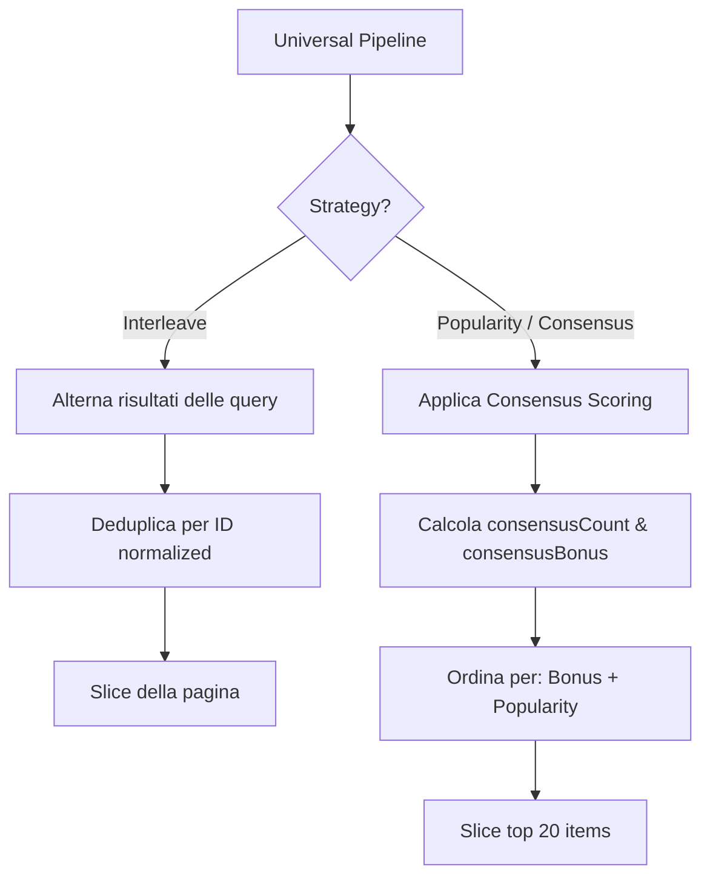
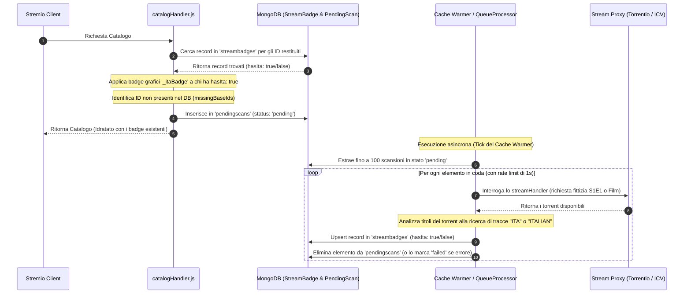

# Gestione della Logica dei Cataloghi e Pipeline dei Dati

Questo documento analizza in dettaglio l'architettura dei cataloghi di **YACA**, descrivendo come le richieste provenienti da Stremio vengono elaborate, instradate ai vari provider, unite o alternate (interleaved), filtrate e infine memorizzate nella cache per ottimizzare le prestazioni.

---

## 1. Ciclo di Vita di una Richiesta di Catalogo

Quando l'applicazione client Stremio richiede un catalogo (ad esempio per popolare la homepage o mostrare i risultati di una ricerca), la richiesta attraversa una pipeline strutturata:

```mermaid
graph TD
    A[Stremio Client] -->|GET /catalog| B[stremio.js]
    B -->|Invoca| C[catalogHandler.js]
    C -->|Genera Hash| D{L2 Cache Check}
    D -->|Fresh| E[Ritorna Dati Cache]
    D -->|Stale / SWR| F[Ritorna Stale + Trigger Revalidate]
    D -->|Miss| G[Esegui Fetch Pipeline]
    
    subgraph Fetch Pipeline
        G -->|Route Request| H[CatalogRouter.js]
        H -->|Risolve| I[Providers]
        I -->|Filtro Post-Fetch| J[Wrong Media Type & Kids Mode]
        J -->|Filtro Utente| K[FilterWatched.js]
        K -->|Badge Episodi| L[MetadataHydrator.js]
        L -->|Traduttore Anime| M[TmdbToKitsuMapper.js]
        M -->|Sort Simulcast| N[Simulcast Sorting]
        N -->|Formatta| O[StremioFormatter.js]
    end
    
    F --> Fetch Pipeline
    O -->|Salva Cache & Ritorna| A
```

### Dettaglio dei Passaggi:

1. **Routing Iniziale**: L'endpoint `/catalog/:type/:id.json` in [stremio.js](../src/api/stremio.js) cattura la richiesta da Stremio, estraendo parametri come `id`, `type` ed `extra` (che contiene filtri come `skip`, `search` o `genre`).
2. **Orchestratore**: La richiesta viene deferita a `catalogHandler` in [catalogHandler.js](../src/handlers/catalogHandler.js).
3. **Generazione dell'Hash di Richiesta**: Viene calcolato un hash univoco tramite `generateRequestHash` per identificare la richiesta. Questo hash tiene conto di:
   - ID e tipo di catalogo.
   - Parametri di paginazione (`skip`).
   - Configurazione specifica dell'utente (ID utente, ID profilo attivo).
   - Impostazioni del profilo (es. `kidsMode`).
   - Versione della configurazione (`configVersion` per il cache-busting).
   - Versione dei badge degli episodi (`BADGE_CATALOG_VERSION`).
4. **Strategia SWR (Stale-While-Revalidate)**:
   - Se l'hash è presente in cache ed è **fresh**, viene restituito immediatamente.
   - Se è **stale** (nella finestra SWR), viene restituito subito il dato archiviato e viene avviata una Promise asincrona in background per aggiornare la cache.
   - Se è un **miss**, la pipeline attende la risoluzione sincrona della fetch.
5. **Risoluzione del Catalogo**: `routeCatalogRequest` in [CatalogRouter.js](../src/catalog/CatalogRouter.js) mappa l'ID del catalogo al provider corretto.
6. **Filtri Post-Fetch**:
   - **Esclusione di tipi errati**: Filtra elementi il cui `media_type` non corrisponde alla richiesta (es. rimuove film da richieste di serie).
   - **Kids Mode Fallback**: Se il profilo ha la modalità bambini attiva, esclude contenuti con generi horror (27), thriller (53) e crime (80).
7. **Post-Processing**:
   - **Filter Watched**: Rimuove i contenuti già visti dall'utente (se abilitato nelle impostazioni).
   - **Hydration & Badge**: Se il catalogo prevede badge per gli episodi (es. simulcast o nuove uscite), arricchisce i metadati recuperando le informazioni sugli episodi.
   - **TMDB to Kitsu**: Traduce gli ID degli anime in ID Kitsu per garantire la compatibilità con i motori di streaming.
   - **Simulcast Sorting**: Se il catalogo è basato su date di rilascio dei simulcast, ordina gli elementi per la data dell'episodio più recente.
8. **Formattazione Stremio**: I metadati normalizzati vengono convertiti nel formato finale Stremio Meta Preview tramite [StremioFormatter.js](../src/catalog/formatters/StremioFormatter.js).

---

## 2. Merging e Interleaving (Universal Pipeline)

Per cataloghi complessi generati dall'intelligenza artificiale o cataloghi uniti (merged), YACA implementa la **Universal Pipeline** all'interno di [AiDiscoveryProvider.js](../src/catalog/providers/AiDiscoveryProvider.js). Questa pipeline gestisce l'esecuzione di query multiple parallele e la combinazione dei risultati tramite due strategie di presentazione:



### A. Strategia Interleave (Alternanza dei Risultati)
L'interleaving unisce i risultati di $N$ query differenti alternandoli ciclicamente (es. $Q1_1, Q2_1, Q3_1, Q1_2, Q2_2, Q3_2...$). 
La logica è implementata in `interleaveMultipleResults` all'interno di [resultMerger.js](../src/utils/resultMerger.js):
- Ciascuna query viene paginata in modo indipendente calcolando un parametro `perQuerySkip` (es. `Math.floor(skip / N)`).
- Durante l'unione, gli elementi duplicati (stesso ID normalizzato) vengono saltati per garantire l'univocità nel catalogo finale.

### B. Strategia Popularity & Consensus (Consenso)
Quando non viene richiesto l'interleaving, YACA combina i risultati di query multiple premiando la convergenza tramite la funzione `applyConsensusScoring` in [resultMerger.js](../src/utils/resultMerger.js):
- Viene mappato ogni elemento tracciando il numero di query in cui appare (`consensusCount`).
- Viene calcolato un **Consensus Bonus**:
  $$\text{consensusBonus} = (\text{consensusCount}^2) - 1$$
- Un elemento presente in una sola query riceve un bonus pari a $0$. Se presente in due query riceve $+3$, in tre query $+8$, e così via.
- Gli elementi vengono infine ordinati per la somma del punteggio TMDB (voto medio), del bonus di consenso e di un'eventuale affinità calcolata sul Taste Profile dell'utente (`finalScore = vote_average + consensusBonus + affinity`).

---

## 3. Catalog Providers

La risoluzione fisica dei dati è delegata ai provider dedicati in `src/catalog/providers/`:

*   **[TmdbProvider.js](../src/catalog/providers/TmdbProvider.js)**: 
    Costruisce dinamicamente i parametri di ricerca per TMDB (`buildDiscoveryParams`). Gestisce la conversione dei generi da film a serie TV (es. genere Azione *28* convertito in Action & Adventure *10759* per le serie) e integra filtri avanzati per keywords, attori, lingue originali e streaming provider italiani (`with_watch_providers`).
*   **[AiDiscoveryProvider.js](../src/catalog/providers/AiDiscoveryProvider.js)** e **[anilist.js](../src/clients/anilist.js)**:
    Fornisce cataloghi anime nativi (Trending, Popolari, ecc.) interrogando direttamente l'API GraphQL di AniList. La logica mappa l'output di AniList convertendolo dinamicamente in ID Kitsu per garantire la compatibilità dei flussi video di Stremio. Implementa filtri complessi per generi, tag e formati e una potente cache multi-livello per prevenire latenza. Kitsu è utilizzato solo in fase di "idratazione" (`kitsu.js`) per recuperare la mappatura esatta degli episodi.
*   **[TraktProvider.js](../src/catalog/providers/TraktProvider.js)**:
    Consente di importare le liste utente di Trakt (Watchlist, Raccolte, Liste Personali) traducendone i riferimenti in ID TMDB idonei per Stremio.
*   **[HybridProvider.js](../src/catalog/providers/HybridProvider.js)**:
    Collega il motore di raccomandazione ibrido generatore di cataloghi speciali basati sul profilo psicofisico dei gusti dell'utente (Taste Profile) come *True Blend* o *Hidden Gems*.

---

## 4. Architettura del Caching L1/L2

Per evitare di superare i rate limit delle API esterne (TMDB, Kitsu, Trakt) e garantire tempi di risposta inferiori a 100ms, YACA implementa un sistema di cache a due livelli coordinato da [CacheManager.js](../src/cache/CacheManager.js):

| Tier | Tecnologia | Scopo | Durata Tipica |
| :--- | :--- | :--- | :--- |
| **L1 (Local RAM)** | LRU Cache in memoria | Evitare letture da Database per le richieste calde e ravvicinate. | 10 Minuti |
| **L2 (Database)** | MongoDB (`CacheEntry`) | Persistenza distribuita dei cataloghi elaborati e dei mapping di ID. | 24 Ore |

### Meccanismi di Protezione Avanzati:

1.  **Stale-While-Revalidate (SWR)**:
    Se un dato in cache L1/L2 supera il tempo di freschezza (`ramTtlMs`) ma rientra nella finestra `swrMs`, YACA restituisce subito il dato vecchio al client. Contestualmente, invoca una fetch asincrona per aggiornare la cache senza bloccare il thread di rendering di Stremio.
2.  **Mitigazione del Thundering Herd (SWR Stampede)**:
    Quando più richieste concorrenti per lo stesso catalogo non trovano riscontro in cache (cache miss), potrebbe verificarsi un sovraccarico dovuto a chiamate API duplicate in parallelo. `CacheManager` risolve questo problema registrando la Promise di fetch in una mappa in RAM (`this.activePromises`). Le richieste successive per la stessa chiave attendono la risoluzione della medesima Promise anziché invocare nuovamente le API esterne.
3.  **TTL Jitter (Variazione Temporale)**:
    Per evitare che centinaia di cataloghi pre-riscaldati scadano simultaneamente a livello di database L2 (causando picchi improvvisi di richieste API per la rigenerazione), il `CacheManager` applica un fattore di variazione casuale (jitter) del **$\pm 5\%$** sul TTL programmato al momento del salvataggio:
    $$\text{jitteredTtl} = \text{effectiveTtl} \times (1 + 0.05 \times (2 \times \text{Math.random()} - 1))$$
4.  **Negative Caching**:
    Se una chiamata API non produce alcun risultato (es. un mapping non trovato o una ricerca vuota), YACA memorizza in cache il marcatore speciale `__NULL__`. In questo modo, le richieste successive identiche vengono bloccate all'istante senza colpire inutilmente le sorgenti esterne.

---

## 5. Il Sistema di Scansione dei Badge ITA (Background Stream Scanner)

Per indicare visivamente all'utente la disponibilità del doppiaggio o dei sottotitoli in italiano direttamente all'interno delle locandine dei cataloghi di Stremio, YACA implementa un sistema asincrono di scansione dei flussi in background. Questo evita di rallentare il caricamento iniziale dei cataloghi ed evita chiamate massive e sincrone ai proxy torrent.

### Flusso di Scansione ed Idratazione del Badge



### Componenti del Sistema:

1. **Rilevamento e Accodamento (`catalogHandler.js`)**:
   Nella funzione `applyPostCacheBadges`, YACA filtra gli elementi del catalogo privi di badge. Per ciascuno di essi:
   - Verifica se esiste già una scansione pregressa nella collezione `streambadges`.
   - Se l'ID non è mai stato scansionato (non è presente nel DB), crea un record nella collezione `pendingscans` con stato `pending`.
2. **Coda e Rate Limiting (`queueProcessor.js` / `rateLimiter.js`)**:
   La funzione `processPendingScans` in [queueProcessor.js](../src/utils/queueProcessor.js) viene periodicamente invocata dal `cacheWarmer.js`. Essa:
   - Estrae fino a 100 elementi `pending`.
   - Utilizza `rateLimitedMap` per eseguire le scansioni in parallelo (in lotti da 5 elementi alla volta) distanziate di almeno 1000ms, per prevenire il ban o il rate-limit da parte dei provider torrent e dei proxy (come Torrentio).
   - Genera una chiamata a `streamHandler` simulando la richiesta del primo episodio (se serie TV) o del film (se film).
3. **Analisi e Risoluzione dei Flussi (`streamHandler.js`)**:
   La funzione analizza i titoli dei flussi torrent risultanti. Se un flusso contiene parole chiave come `ita`, `italian`, `ita/eng` nel nome del file torrent, l'anime o il film viene qualificato come avente tracce in italiano.
   Il risultato viene memorizzato in `StreamBadge` con `hasIta: true` (se trovato) o `hasIta: false` (se non trovato).
4. **Negative Caching e Resubmission**:
   Gli elementi marcati con `hasIta: false` fungono da cache negativa. La pipeline del catalogo li esclude dalle scansioni successive per evitare cicli di query infiniti su contenuti privi di doppiaggio italiano.
   - *Nota operativa:* In caso di aggiornamento delle logiche di scraping o mapping (come l'introduzione della query parallela Kitsu + IMDb), è necessario eliminare manualmente dal DB le voci `hasIta: false` obsolete per costringere il sistema a rieseguire la scansione.

---

## 6. Variabili d'Ambiente Rilevanti

I comportamenti di caching e di interconnessione con i provider sono influenzati dalle seguenti chiavi d'ambiente definite nel file di configurazione globale:

*   `MONGODB_URI`: Stringa di connessione a MongoDB per la cache L2.
*   `TMDB_API_KEY`: API Key utilizzata per interrogare TMDB e per arricchire i cataloghi anime.
*   `MISTRAL_API_KEY`: Chiave API per Mistral AI, necessaria per abilitare la Universal Pipeline basata su AI Discovery.
*   `KITSU_ENDPOINT`: Endpoint dell'API di Kitsu (default: `https://kitsu.io/api/edge`).

