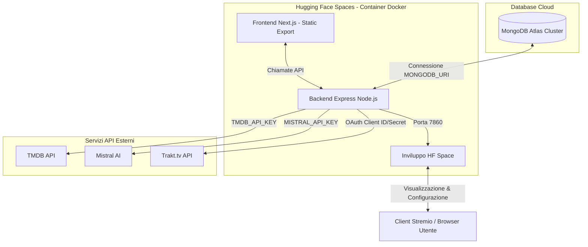

# Procedure di Deployment e Operations (Hugging Face Spaces & MongoDB Atlas)

Questo documento descrive in dettaglio la procedura di deployment di YACA (Yet Another Catalog Addon) su **Hugging Face Spaces** utilizzando un'immagine Docker personalizzata, l'integrazione con **MongoDB Atlas** come database persistente e la configurazione delle variabili d'ambiente necessarie in ambiente di produzione.

---

## Architettura di Deployment

YACA è strutturato come un'applicazione monorepo contenente sia il backend Express che il frontend Next.js (collocato nella cartella `frontend/`). L'applicazione viene compilata e rilasciata come container Docker all'interno di un Hugging Face Space.



---

## Configurazione Docker (Hugging Face Spaces)

Hugging Face Spaces richiede che le applicazioni containerizzate vengano eseguite esponendo la porta **7860**. Il file [Dockerfile](../Dockerfile) è progettato con un meccanismo di build multi-stage per ottimizzare le dimensioni dell'immagine e garantire l'esecuzione efficiente del frontend e del backend.

### Dettaglio del Multi-Stage Build

1.  **Stage 1: Build Frontend (`frontend-builder`)**:
    *   Usa l'immagine base `node:20-slim`.
    *   Installa le dipendenze nella cartella `frontend/` e compila l'applicazione Next.js tramite `npm run build`.
    *   Genera un esportazione statica nella cartella `frontend/out`.
2.  **Stage 2: Backend & Runtime (`runner`)**:
    *   Usa l'immagine base `node:20-slim`.
    *   Installa i font di sistema (`fontconfig`, `fonts-dejavu-core`, `fonts-noto-core`) necessari per il rendering dei testi in formato SVG (utilizzato da `sharp` e `librsvg` per i badge grafici e i loghi).
    *   Imposta `NODE_ENV=production` e la porta `PORT=7860` (porta obbligatoria richiesta da Hugging Face Spaces).
    *   Esegue `npm ci --omit=dev` per installare solo le dipendenze del backend strettamente necessarie alla produzione, riducendo lo spazio occupato.
    *   Copia i file del backend e la cartella statica `frontend/out` buildata nello Stage 1.
    *   Avvia l'applicazione con il flag `--expose-gc` (`node --expose-gc index.js`). Questo flag espone il Garbage Collector di Node.js, consentendo all'applicazione di eseguire cicli di pulizia della memoria manuale e prevenire crash da Out-Of-Memory (OOM) sui server gratuiti di Hugging Face Spaces.

Vedi il file completo [Dockerfile](../Dockerfile) per i dettagli di configurazione.

---

## Configurazione di MongoDB Atlas

YACA adotta un'architettura **Stateful** in cui le configurazioni utente, il Taste Profile e lo stato di sincronizzazione sono salvati in modo permanente su MongoDB. Per il setup del database:

1.  **Creazione del Cluster**: Accedere a [MongoDB Atlas](https://www.mongodb.com/cloud/atlas) e creare un cluster gratuito (Shared M0) in una regione vicina a quella di Hugging Face (es. AWS Frankfurt / `eu-central-1`).
2.  **Network Access (Whitelist IP)**: Poiché le istanze di Hugging Face Spaces non hanno indirizzi IP pubblici statici fissi, è necessario aggiungere la regola di acesso globale **`0.0.0.0/0`** (consenti l'accesso da qualsiasi IP) nel pannello *Network Access* di MongoDB Atlas. Per mitigare i rischi di sicurezza, assicurarsi di configurare una password robusta per l'utente del database.
3.  **Database User**: Creare un utente con privilegi di lettura e scrittura (`readWriteAnyDatabase` o specifico per il database di YACA).
4.  **Stringa di Connessione**: Copiare la stringa di connessione URI nel formato:
    ```bash
    mongodb+srv://<username>:<password>@<cluster-address>.mongodb.net/yaca?retryWrites=true&w=majority
    ```
    Questa stringa dovrà essere configurata come variabile d'ambiente `MONGODB_URI` all'interno dell'Hugging Face Space.

La connessione viene avviata all'inizializzazione del server in [index.js](../index.js) richiamando il modulo di connessione [src/db/connection.js](../src/db/connection.js).

---

## Variabili d'Ambiente Utilizzate

Le seguenti variabili d'ambiente devono essere impostate nella sezione **Settings > Variables and Secrets** del proprio Hugging Face Space.

> [!WARNING]
> Le chiavi obsolete come `MDBLIST_API_KEY`, `IMAGEKIT_API_KEY`, `IMAGEKIT_PUBLIC_KEY`, `IMAGEKIT_PRIVATE_KEY`, `NEXTAUTH_SECRET`, `AUTH_SECRET`, `DATABASE_ENCRYPTION_KEY` e `MASTER_ENCRYPTION_KEY` **non sono più utilizzate** dal codice di YACA e non devono essere configurate. I token OAuth e le informazioni utente vengono scritti in chiaro e gestiti direttamente dall'architettura interna a due tabelle (*UserAccount* e *AddonConfig*).

### Lista Variabili Reali ed Attive

| Variabile | Tipo | Obbligatoria | Descrizione |
| :--- | :--- | :--- | :--- |
| `MONGODB_URI` | Secret | **Sì** | URI di connessione a MongoDB Atlas per la persistenza dei dati. |
| `TMDB_API_KEY` | Secret | **Sì** | Chiave API di TheMovieDatabase (TMDB). Viene usata come chiave globale di fallback nel server se l'utente non ne inserisce una propria in fase di configurazione. |
| `MISTRAL_API_KEY` | Secret | **Sì** | Chiave API di Mistral AI. Abilita la generazione dei cataloghi guidati da AI (True Blend, Hidden Gems) e la ricerca semantica (Live Search). |
| `JWT_SECRET` | Secret | No | Consigliata. Chiave segreta per i token JWT di sessione per autenticare la dashboard di configurazione. Se non impostata, l'app genererà un fallback casuale ad ogni avvio (causando la scadenza delle sessioni attive al riavvio del server). |
| `PORT` | Variable | No | Porta su cui il server si mette in ascolto. Impostata di default a `7860` nel Dockerfile per conformità con Hugging Face. |
| `NODE_ENV` | Variable | No | Impostata a `production` per ottimizzare le performance di Express e disabilitare i log di debug logorroici. |
| `TRAKT_CLIENT_ID` | Secret | No | Client ID dell'applicazione creata su Trakt.tv. Abilita l'integrazione e la sincronizzazione bidirezionale con Trakt. |
| `TRAKT_CLIENT_SECRET` | Secret | No | Client Secret dell'applicazione creata su Trakt.tv. Necessario insieme al Client ID per effettuare il refresh dei token degli utenti. |
| `SPACE_HOST` | Variable | No | Hostname dello spazio Hugging Face (compilato automaticamente dalla piattaforma). YACA lo usa per validare le URL dei manifest Stremio. |
| `HOST_URL` | Variable | No | L'URL pubblico finale dell'addon (es. `https://username-yaca.hf.space`). Sovrascrive i calcoli dell'host basati sui proxy per i redirect e il blur delle immagini. |
| `ERDB_CONFIG` | Secret | No | Stringa JSON opzionale contenente i parametri di connessione e configurazione del database ERDB per l'Anime Mapping ibrido. |

---

## Esecuzione e Monitoraggio

### Log dell'applicazione
I log in tempo reale sono visibili direttamente all'interno della scheda **Logs** dell'Hugging Face Space. YACA logga informazioni relative a:
*   Stato della connessione al database MongoDB ([src/db/connection.js](../src/db/connection.js)).
*   Avvio del server Express e porta in ascolto ([index.js](../index.js)).
*   Eventuali errori di rate limit o fallimenti del caricamento delle chiavi API esterne.

### Garbage Collection Manuale
Grazie all'avvio con il flag `--expose-gc` in [Dockerfile](../Dockerfile), il backend può liberare periodicamente la memoria non utilizzata. YACA invoca il Garbage Collector dopo le operazioni più onerose (come la sincronizzazione massiva dei profili o la vettorializzazione) per mantenere l'utilizzo della memoria RAM sotto la soglia critica dei container gratuiti di Hugging Face Spaces (solitamente 16GB, ma limitata a livello CPU nei thread free).
