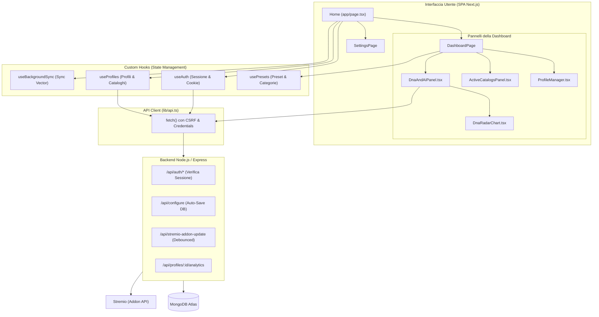

# Architettura Frontend (Next.js & React SPA)

L'interfaccia utente di YACA (Yet Another Catalog Addon) è progettata come una Single Page Application (SPA) reattiva, moderna e focalizzata sull'ottimizzazione dell'esperienza utente. È sviluppata utilizzando **React 19**, **Next.js 16 (in modalità static export)** e **Tailwind CSS v4** per lo stile.

---

## 🏗️ Architettura Generale

Il frontend è strutturato per essere compilato in modalità statica (`output: 'export'` definito in [next.config.ts](../frontend/next.config.ts)). Gli asset generati nella cartella `frontend/out` vengono serviti direttamente dal server Express del backend Node.js. Questo approccio elimina il sovraccarico di un server Node.js separato per il frontend e semplifica il deployment su piattaforme come Hugging Face Spaces.

La comunicazione con il backend avviene esclusivamente tramite API REST esposte sullo stesso host.

### Diagramma dei Flussi e dei Componenti

Il seguente diagramma illustra l'architettura dei componenti e il flusso di sincronizzazione dei dati:



---

## 📁 Struttura della Cartella `frontend/src/`

La codebase del frontend è organizzata in modo modulare nella cartella [frontend/src/](../frontend/src/):

*   **`app/`**: Contiene il routing e il layout globale di Next.js.
    *   [page.tsx](../frontend/src/app/page.tsx): È il punto di ingresso dell'applicazione (SPA). Gestisce le inizializzazioni, il caricamento del profilo utente e decide se mostrare la schermata di login ([LoginPage.tsx](../frontend/src/components/pages/LoginPage.tsx)) o il pannello di controllo ([DashboardPage.tsx](../frontend/src/components/pages/DashboardPage.tsx)).
*   **`components/`**: Diviso per area funzionale:
    *   `dashboard/`: Pannelli interattivi che compongono la dashboard (es. gestione cataloghi, DNA radar chart, impostazioni).
    *   `layout/`: Componenti strutturali come l'Header e la barra di navigazione a tab.
    *   `modals/`: Finestre di dialogo (es. per il merge dei cataloghi, l'autenticazione a Trakt).
    *   `shared/`: Componenti riutilizzabili (es. poster, badge dei tipi, barre di ricerca con autocompletamento).
    *   `ui/`: Componenti grafici atomici a basso livello (pulsanti, input, dialoghi basati su Radix UI e Shadcn).
*   **`hooks/`**: Custom hooks che incapsulano lo stato applicativo:
    *   [useAuth.ts](../frontend/src/hooks/useAuth.ts): Gestisce le credenziali e la sessione in background tramite cookie.
    *   [useProfiles.ts](../frontend/src/hooks/useProfiles.ts): Centralizza le operazioni sui profili YACA (aggiunta, rimozione, rinomina, ordinamento dei cataloghi e sync vettoriale).
    *   [usePresets.ts](../frontend/src/hooks/usePresets.ts): Recupera i cataloghi pre-configurati (preset) dal server.
    *   [useBackgroundSync.ts](../frontend/src/hooks/useBackgroundSync.ts): Avvia l'allineamento dei vettori in background sul browser dell'utente.
*   **`lib/`**: Contiene utilities e logica riutilizzabile:
    *   [api.ts](../frontend/src/lib/api.ts): Centralizza tutte le chiamate Fetch verso l'API del backend, inclusa la gestione CSRF e delle credenziali.
    *   [constants.ts](../frontend/src/lib/constants.ts): Definisce le chiavi di `localStorage`, i mapping dei generi TMDB e le opzioni globali.
    *   [utils.ts](../frontend/src/lib/utils.ts): Helper per manipolare formati di dati ed eseguire il mapping tra i modelli DB e lo stato UI.

---

## 🔒 Sicurezza e Gestione della Configurazione

### Sessione Cookie-Based e CSRF

La sicurezza dell'applicazione si basa sul principio della **Single Source of Truth** sul server. Nessun token JWT o credenziale sensibile viene salvato nel `localStorage` del client.
1.  **JWT HttpOnly**: L'identità dell'utente è custodita all'interno di un cookie cifrato gestito in modalità `HttpOnly` dal browser.
2.  **Protezione CSRF**: Ad ogni caricamento, il backend rilascia un token CSRF tramite il cookie `yaca_csrf`. Il client API ([api.ts](../frontend/src/lib/api.ts)) legge questo cookie e inietta automaticamente l'header `X-CSRF-Token` in ogni richiesta di scrittura (`POST`).

```javascript
// Estrazione del CSRF Token dal cookie e iniezione automatica
function getCsrfTokenFromCookie() {
  if (typeof document === 'undefined') return null;
  const match = document.cookie.match(/(?:^|;\s*)yaca_csrf=([^;]+)/);
  return match ? decodeURIComponent(match[1]) : null;
}

async function post(url: string, body?: object) {
  const csrfToken = getCsrfTokenFromCookie();
  const headers = csrfToken
    ? { ...JSON_HEADERS, 'X-CSRF-Token': csrfToken }
    : JSON_HEADERS;
  const res = await fetch(url, {
    method: 'POST',
    headers,
    credentials: 'include',
    body: body ? JSON.stringify(body) : undefined,
  });
  return res.json();
}
```

### Flusso di Sincronizzazione ed Economia delle Richieste

Il salvataggio delle impostazioni dell'utente avviene in due fasi separate e asincrone:

1.  **Database Auto-Save (Immediato)**: Ogni qualvolta l'utente cambia un preset, sposta o rinomina un catalogo, il frontend invoca immediatamente `/api/configure` per salvare lo stato aggiornato su MongoDB. Questo garantisce che nessuna modifica vada persa.
2.  **Stremio Addon Update (Debouncato e Incrementale)**: La notifica a Stremio di aggiornare il manifest dell'addon installato viene ritardata (debounced) per evitare di intasare le API Stremio.
    *   *Delay Base*: **20 secondi**.
    *   *Fattore di Accumulo*: Ogni modifica consecutiva effettuata dall'utente prima dello scadere del timer incrementa il delay di **1 secondo** (20s + 1s × N). Questo previene chiamate multiple se l'utente sta riordinando rapidamente una lista.

---

## 🧬 UI dei Profili e Gestione del DNA

### Profilo di Default e Custom Profiles

L'applicazione supporta profili multipli gestiti tramite il componente [ProfileManager.tsx](../frontend/src/components/dashboard/ProfileManager.tsx).
*   **Profilo Generale (`global`)**: È il profilo speciale presente di default. Ha l'emoji `🏠` bloccata e non può essere eliminato o rinominato. Raccoglie la configurazione di base dell'utente.
*   **Profili Personalizzati**: Possono essere creati liberamente partendo da un preset vuoto o applicando dei template pre-configurati (es. "Kids Only", "Anime Fan", "Cinematography Nerd").

### Modalità Bambini (Kids Mode)

Ogni profilo (escluso quello globale) può attivare la **Modalità Bambini** (`kidsMode`). Quando è abilitata, il frontend:
*   Mostra un badge visivo (`child_care`) sul profilo attivo.
*   Forza il backend a filtrare rigorosamente i cataloghi visualizzati dal profilo, censurando contenuti sensibili o contrassegnati come non adatti a un pubblico giovane (rating PG / censura contenuti espliciti).

### Visualizzazione del DNA e Radar Chart

Il DNA del profilo rappresenta i generi e le parole chiave (keyword) preferite dall'utente. Viene calcolato dal backend in base ai preset attivi e allo storico delle visioni e visualizzato nella sezione [DnaAndAiPanel.tsx](../frontend/src/components/dashboard/DnaAndAiPanel.tsx):

1.  **DNA Base (`V_static`)**: Calcolato analizzando staticamente i filtri dei preset abilitati. Mostra le preferenze "dichiarate".
2.  **DNA Evoluto (`V_final`)**: Unisce il DNA di base con i vettori estratti dall'attività di visione reale dell'utente (Stremio/Trakt history, Love e Like).
3.  **DnaRadarChart**: Il componente [DnaRadarChart.tsx](../frontend/src/components/dashboard/DnaRadarChart.tsx) (sviluppato su canvas/SVG nativo) traccia visivamente le differenze tra il DNA statico e quello dinamico evoluto, mostrando come cambiano i pesi dei generi principali nel tempo.

### Editor Manuale del DNA

Gli utenti possono forzare l'algoritmo modificando direttamente il proprio Taste Profile:
*   **Ricerca e Aggiunta**: Tramite il componente `AutocompleteSearch`, l'utente può cercare keyword direttamente sul database di TMDB.
*   **Forzatura del Peso (Score)**: A ogni genere o keyword inserito manualmente può essere assegnato un peso personalizzato da **0 a 1000** (il default è 200).
*   **Ricalcolo del DNA**: Un codice dedicato avvia il ricalcolo vettoriale sul server per forzare l'aggiornamento immediato.

```typescript
// Esempio logico di aggiunta di un tratto DNA manuale nel frontend
const handleAddManualDna = (item: DNAItem) => {
  const currentManual = profile.settings?.manualDNA ?? [];
  if (currentManual.some((d) => String(d.id) === String(item.id) && d.type === item.type)) return;
  
  const updatedManual = [...currentManual, item];
  onUpdateProfile(profile.id, {
    settings: {
      ...(profile.settings ?? {}),
      manualDNA: updatedManual,
    },
  });
};
```

---

## 🤖 Ispettore AI (Hero Catalogs)

L'interfaccia include una sezione avanzata per sviluppatori e power-user, volta a ispezionare il comportamento degli algoritmi di YACA:
*   **Per i cataloghi AI (True Blend / Hidden Gems)**: L'interfaccia interroga `/api/profiles/:id/analytics` e renderizza i log grezzi del *Query Synthesizer* di Mistral AI. L'utente può leggere la query esatta formulata dall'AI e la spiegazione di come l'engine ha convertito la descrizione in vettori di ricerca.
*   **Per i cataloghi Algoritmici (Seed Network / Trakt Filtered)**: Mostra l'esplosione dei filtri TMDB effettivamente iniettati nel calcolo. L'utente può vedere quali ID Genere e quali ID Keyword il Taste Profile ha estratto e inviato come parametri di query.
