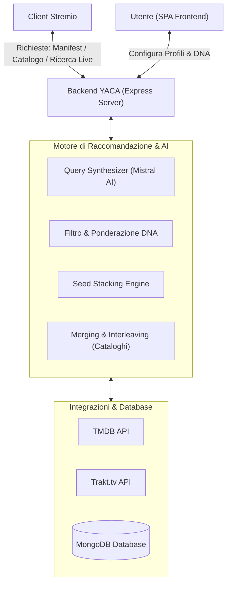

# Indice Generale della Documentazione (YACA)

Benvenuto nella documentazione tecnica di **YACA (Yet Another Catalog Addon)**. Questo indice fornisce una panoramica dell'architettura generale del sistema e mappa tutti i documenti di approfondimento disponibili per gli sviluppatori.

---

## 🏛️ Architettura Generale di YACA

YACA è un addon per Stremio progettato con un'architettura **stateful** basata su **MongoDB**. A differenza dei tradizionali addon per Stremio che fungono da semplici proxy verso API esterne, YACA mantiene un **Taste Profile** (Profilo dei Gusti) dinamico e centralizzato per ciascun utente. Questo profilo raccoglie in tempo reale l'attività dell'utente su Stremio e Trakt.tv, pesando le azioni per estrarre le preferenze.

Sopra questo Taste Profile globale, YACA consente di creare **Profili Multipli** (es. "Cinema d'Autore", "Anime Fan", "Bambini"). Ciascun profilo applica un **DNA vettoriale** unico (generi, keyword, registi e attori preferiti) che agisce come un filtro contestuale per generare cataloghi personalizzati ed eseguire ricerche semantiche tramite intelligenza artificiale.

### Mappa Architetturale

---

## 🗺️ Mappa dei Documenti

La documentazione è suddivisa in moduli specifici che analizzano le singole componenti del sistema. Clicca sui link sottostanti per accedere ai relativi dettagli tecnici:

### 1. 🚀 Deployment e Operazioni
*   **[DEPLOYMENT_OPS.md](DEPLOYMENT_OPS.md)**
    *   *Descrizione*: Guida esclusiva per il deployment dell'applicazione su **Hugging Face Spaces** utilizzando Docker. Copre la configurazione e il setup del database **MongoDB Atlas** (incluso il piano gratuito) e la gestione delle variabili d'ambiente necessarie per far girare il sistema in produzione.

### 2. 🧬 Algoritmi di Scoring e Raccomandazione
*   **[ALGORITHMS.md](ALGORITHMS.md)**
    *   *Descrizione*: Approfondimento sugli algoritmi matematici ed euristici di YACA. Spiega come viene calcolato il Taste Profile pesando le azioni dell'utente (Love x4, Like x3, Visione x2), come funziona l'estrazione vettoriale del DNA (DNA statico vs evoluto), la formula di scoring per ordinare i titoli e la logica di unione ed espansione (*Seed Stacking*).

### 3. 🤖 Motore AI ed Elaborazione del Linguaggio Natural
*   **[AI_ENGINE.md](AI_ENGINE.md)**
    *   *Descrizione*: Dettagli sull'integrazione con **Mistral AI**. Copre il funzionamento del *Query Synthesizer* per convertire le descrizioni dei cataloghi in parametri TMDB strutturati e l'integrazione del motore di ricerca semantica *Live Search* direttamente dalla barra di ricerca di Stremio.

### 4. 🖥️ Architettura Frontend (SPA)
*   **[FRONTEND.md](FRONTEND.md)**
    *   *Descrizione*: Analisi dell'applicazione frontend basata su **React 19** e **Next.js 16 (Static Export)**. Descrive la struttura dei file in `frontend/src/`, la gestione della sessione cookie-based sicura con protezione CSRF, il debouncing degli aggiornamenti degli addon in Stremio e la UI del radar chart per il DNA.

### 5. 🔀 Logica dei Cataloghi e Ciclo di Vita
*   **[CATALOG_LOGIC.md](CATALOG_LOGIC.md)**
    *   *Descrizione*: Spiega il ciclo di vita di una richiesta di catalogo proveniente da Stremio. Dettaglia l'algoritmo di unione dei cataloghi di film e serie, l'interleaving dei canali per mescolare i risultati, le strategie di presentazione delle locandine e il sistema di scansione in background dei badge ITA.

### 6. ⚙️ Internals di Stremio e Mapping Anime
*   **[STREMIO_INTERNALS.md](STREMIO_INTERNALS.md)**
    *   *Descrizione*: Analizza le logiche interne dell'addon e i workaround applicati per superare le limitazioni di Stremio. Copre il sistema di sincronizzazione dei profili multipli tramite URL dinamici, l'ordinamento TMDB per popolarità nei fallback e il *Hybrid Anime Mapping* con recupero flussi dual-query parallelo (Kitsu + IMDb).

### 7. 🔄 Integrazioni Esterne e Sincronizzazione
*   **[INTEGRATIONS.md](INTEGRATIONS.md)**
    *   *Descrizione*: Analisi tecnica del protocollo di sincronizzazione bidirezionale con **Trakt.tv** tramite il Device Auth Flow. Dettaglia i meccanismi di failover, il recupero dei dati di cronologia e voti, e l'allineamento dello stato dell'utente.

### 8. 🧬 Configurazione e Gestione dei Preset
*   **[PRESETS.md](PRESETS.md)**
    *   *Descrizione*: Approfondimento sul sistema di cataloghi pre-configurati (preset) di YACA in `src/data/presets.js`. Spiega come sono strutturati, il dizionario degli attori/registi TMDB_PEOPLE e l'uso degli script CLI in `scripts/` per l'analisi e l'iniezione automatica dei cataloghi nei profili.

### 9. 🧪 Testing e Strumenti di Amministrazione
*   **[TESTING_UTILITIES.md](TESTING_UTILITIES.md)**
    *   *Descrizione*: Manuale per sviluppatori e amministratori del sistema. Copre l'esecuzione dei test di unità/integrazione tramite Jest (`tests/`), la validazione della rilevanza dei preset (`scripts/test_relevance_all_presets.js`) e una rassegna completa di tutti i 10 script amministrativi/migrazione nella cartella `scripts/`.

---

## 🔑 Tabella delle Variabili d'Ambiente Utilizzate

Di seguito sono elencate le variabili d'ambiente effettivamente supportate ed esaminate nel codice di YACA. Per ragioni di sicurezza e pulizia del codice, le vecchie chiavi obsolete (es. ImageKit, NextAuth, Master Encryption) sono state rimosse e non devono essere configurate.

| **Variabile** | **Obbligatoria** | **Descrizione** |
|---|---|---|
| `MONGODB_URI` | **Sì** | Stringa di connessione a MongoDB (es. MongoDB Atlas). |
| `TMDB_API_KEY` | **Sì*** | API Key globale di TMDB per arricchire i metadati. Se omessa sul server, gli utenti dovranno inserirla nella UI. |
| `MISTRAL_API_KEY` | No | API Key per abilitare il *Query Synthesizer* ed i cataloghi basati su AI. |
| `JWT_SECRET` | No | Consigliata. Chiave per firmare i token JWT di sessione della dashboard (genera fallback casuale al riavvio). |
| `HOST_URL` | **Sì** | URL pubblico del server (fondamentale per la generazione di manifest e badge). |
| `PORT` | No | Porta di ascolto del server backend (default `7000`, `7860` su Hugging Face). |
| `TRAKT_CLIENT_ID` | No | Client ID di Trakt.tv per abilitare la sincronizzazione. |
| `TRAKT_CLIENT_SECRET` | No | Client Secret di Trakt.tv per completare il flow di autenticazione. |
| `CORS_ALLOWED_ORIGINS` | No | Origini CORS consentite per le API pubbliche. |
