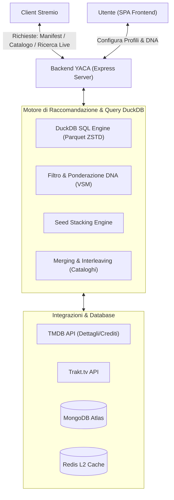

# Indice Generale della Documentazione (YACA)

Benvenuto nella documentazione tecnica di **YACA (Yet Another Catalog Addon)**. Questo indice fornisce una panoramica dell'architettura generale del sistema e mappa tutti i documenti di approfondimento disponibili per gli sviluppatori.

---

## 🏛️ Architettura Generale di YACA

YACA è un addon per Stremio progettato con un'architettura **stateful** basata su **MongoDB** (configurazioni utente, profili e librerie), **Redis** (caching distribuito L2 ad alte prestazioni) e **DuckDB** (motore analitico SQL in-memory su dataset Parquet per interrogazioni a zero latenza e zero chiamate all'API Discover di TMDB).

A differenza dei tradizionali addon per Stremio che fungono da semplici proxy verso API esterne, YACA mantiene un **Taste Profile** (Profilo dei Gusti) dinamico e centralizzato per ciascun utente. Questo profilo raccoglie in tempo reale l'attività dell'utente su Stremio e Trakt.tv, pesando le azioni per estrarre le preferenze.

Sopra questo Taste Profile globale, YACA consente di creare **Profili Multipli** (es. "Cinema d'Autore", "Anime Fan", "Bambini"). Ciascun profilo applica un **DNA vettoriale** unico (generi, keyword, registi e attori preferiti) che agisce come un filtro contestuale per generare cataloghi personalizzati ed eseguire ricerche semantiche tramite intelligenza artificiale.

### Mappa Architetturale

```mermaid
graph TD
    Stremio["Client Stremio"] <--> |Richieste: Manifest / Catalogo / Ricerca Live| Backend["Backend YACA (Express Server)"]
    
    subgraph Engine ["Motore di Raccomandazione & Query DuckDB"]
        DuckDBEngine["DuckDB SQL Engine (Parquet ZSTD)"]
        DnaEngine["Filtro & Ponderazione DNA (VSM)"]
        SeedEngine["Seed Stacking Engine"]
        MergeEngine["Merging & Interleaving (Cataloghi)"]
    end
    
    subgraph Data ["Integrazioni & Database"]
        TMDB["TMDB API (Dettagli/Crediti)"]
        Trakt["Trakt.tv API"]
        Mongo[(MongoDB Atlas)]
        Redis[(Redis L2 Cache)]
    end
    
    Backend <--> Engine
    Engine <--> Data
    
    Utente["Utente (SPA Frontend)"] <--> |Configura Profili & DNA| Backend
```

---

## 🗺️ Mappa dei Documenti

La documentazione è suddivisa in moduli specifici che analizzano le singole componenti del sistema. Clicca sui link sottostanti per accedere ai relativi dettagli tecnici:

### 1. 🚀 Deployment e Operazioni
*   **[DEPLOYMENT_HOME_SERVER.md](DEPLOYMENT_HOME_SERVER.md)**
    *   *Descrizione*: Guida architetturale e operativa per il deployment principale in self-hosting su **Home Server (`mate`)** tramite Docker Compose, Tailscale (`mate.taild24589.ts.net:7860`), GitHub Container Registry (GHCR) e aggiornamenti automatici tramite Watchtower.
*   **[DEPLOYMENT_OPS.md](DEPLOYMENT_OPS.md)**
    *   *Descrizione*: Guida per il deployment dell'applicazione su container Docker (incluso Hugging Face Spaces). Copre la configurazione e il setup del database **MongoDB Atlas** e la gestione delle variabili d'ambiente.
*   **[DEPLOYMENT_VPS_HETZNER.md](DEPLOYMENT_VPS_HETZNER.md)**
    *   *Descrizione*: Guida all'architettura e deployment alternativo su VPS Hetzner con Docker e Caddy come reverse proxy HTTPS.

### 2. 🦆 Motore Dati e Query In-Memory
*   **[DUCKDB_ARCHITECTURE.md](DUCKDB_ARCHITECTURE.md)**
    *   *Descrizione*: Architettura del motore di pre-filtraggio e discovery in-memory basato su **DuckDB** e dataset TMDB serializzati in formato Apache Parquet (ZSTD). Spiega l'eliminazione delle chiamate lente a `/discover` di TMDB e le query SQL native vettorializzate.

### 3. 🧬 Algoritmi di Scoring e Raccomandazione
*   **[ALGORITHMS.md](ALGORITHMS.md)**
    *   *Descrizione*: Approfondimento sugli algoritmi matematici ed euristici di YACA. Spiega come viene calcolato il Taste Profile pesando le azioni dell'utente (Love x4, Like x3, Visione x2), come funziona l'estrazione vettoriale del DNA (DNA statico vs evoluto), la formula di scoring per ordinare i titoli, il rating bayesiano e la logica di *Seed Stacking*.

### 4. 🤖 Motore AI ed Elaborazione del Linguaggio Naturale
*   **[AI_ENGINE.md](AI_ENGINE.md)**
    *   *Descrizione*: Dettagli sull'integrazione con **Mistral AI**. Copre il funzionamento del router AI (`router.js`) per tradurre il linguaggio naturale in filtri TMDB e l'integrazione del motore di ricerca semantica *Live Search* direttamente dalla barra di ricerca di Stremio.

### 5. 🖥️ Architettura Frontend (SPA)
*   **[FRONTEND.md](FRONTEND.md)**
    *   *Descrizione*: Analisi dell'applicazione frontend basata su **React 19** e **Next.js 16 (Static Export)**. Descrive la struttura dei file in `frontend/src/`, la gestione della sessione cookie-based sicura con protezione CSRF, il debouncing degli aggiornamenti degli addon in Stremio e la visualizzazione del grafico DNA tramite `DnaBarChart.tsx`.

### 6. 🔀 Logica dei Cataloghi e Ciclo di Vita
*   **[CATALOG_LOGIC.md](CATALOG_LOGIC.md)**
    *   *Descrizione*: Spiega il ciclo di vita di una richiesta di catalogo proveniente da Stremio. Dettaglia l'algoritmo di unione dei cataloghi di film e serie, l'interleaving dei canali per mescolare i risultati, l'architettura di caching L1 (RAM) e L2 (Redis), e l'idratazione dei badge ITA anime da `anime_airing_state`.

### 7. ⚙️ Internals di Stremio e Mapping Anime
*   **[STREMIO_INTERNALS.md](STREMIO_INTERNALS.md)**
    *   *Descrizione*: Analizza le logiche interne dell'addon e le soluzioni applicate per superare le limitazioni di Stremio. Copre la configurazione dei profili multipli, il manifest dinamico, l'ordinamento TMDB per popolarità nei fallback e il *Hybrid Anime Mapping* con recupero flussi dual-query parallelo (Kitsu + IMDb).

### 8. 🔄 Integrazioni Esterne e Sincronizzazione
*   **[INTEGRATIONS.md](INTEGRATIONS.md)**
    *   *Descrizione*: Analisi tecnica del protocollo di sincronizzazione bidirezionale con **Trakt.tv** tramite il Device Auth Flow. Dettaglia i meccanismi di failover, il recupero dei dati di cronologia e voti, e l'allineamento dello stato dell'utente.

### 9. 🧬 Configurazione e Gestione dei Preset
*   **[PRESETS.md](PRESETS.md)**
    *   *Descrizione*: Approfondimento sul sistema di cataloghi pre-configurati (preset) di YACA in `src/data/presets.js`. Spiega come sono strutturati, il dizionario degli attori/registi TMDB_PEOPLE e l'uso degli script CLI in `scripts/` per l'analisi e la validazione dei cataloghi.

### 10. 🧪 Testing e Strumenti di Amministrazione
*   **[TESTING_UTILITIES.md](TESTING_UTILITIES.md)**
    *   *Descrizione*: Manuale per sviluppatori e amministratori del sistema. Copre l'esecuzione dei test di unità/integrazione tramite Jest, la validazione della rilevanza dei preset e gli script amministrativi attivi (`clear_caches.js`, `convert_to_parquet.js`, `find_user.js`, `migrate_library_itemid_null.js`).

### 11. 📝 Guide e Logica Specifica
*   **[EPISODE_BADGES.md](EPISODE_BADGES.md)**
    *   *Descrizione*: Logica dinamica di calcolo e visualizzazione dei badge degli episodi sui poster di Stremio.
*   **[KITSU_MAPPING.md](KITSU_MAPPING.md)**
    *   *Descrizione*: Dettagli dell'algoritmo ibrido per la mappatura tra Kitsu e TMDB, con strategie anti-mescolamento per le multi-stagioni.

### 12. 📝 Changelog
*   **[CHANGELOG.md](CHANGELOG.md)**
    *   *Descrizione*: Storico delle modifiche, aggiornamenti e nuove feature implementate nel progetto YACA.

---

## 🔑 Tabella delle Variabili d'Ambiente Utilizzate

Di seguito sono elencate le variabili d'ambiente effettivamente supportate ed esaminate nel codice di YACA.

| **Variabile** | **Obbligatoria** | **Descrizione** |
|---|---|---|
| `MONGODB_URI` | **Sì** | Stringa di connessione a MongoDB (es. MongoDB Atlas). |
| `REDIS_URL` | No | URL del server Redis per la cache distribuita L2 (default `redis://127.0.0.1:6379`). |
| `TMDB_API_KEY` | **Sì*** | API Key globale di TMDB per arricchire i metadati. Se omessa sul server, gli utenti dovranno inserirla nella UI. |
| `MISTRAL_API_KEY` | No | API Key per abilitare il *Router AI* ed i cataloghi basati su AI. |
| `JWT_SECRET` | No | Consigliata. Chiave per firmare i token JWT di sessione della dashboard (genera fallback casuale al riavvio). |
| `HOST_URL` | **Sì** | URL pubblico del server (fondamentale per la generazione di manifest e badge). |
| `PORT` | No | Porta di ascolto del server backend (default `7860`). |
| `TRAKT_CLIENT_ID` | No | Client ID di Trakt.tv per abilitare la sincronizzazione. |
| `TRAKT_CLIENT_SECRET` | No | Client Secret di Trakt.tv per completare il flow di autenticazione. |
| `CORS_ALLOWED_ORIGINS` | No | Origini CORS consentite per le API pubbliche. |
