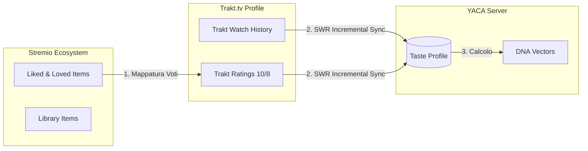

# Integrazioni Esterne e Flussi di Sincronizzazione (Trakt.tv)

Questo documento analizza le integrazioni con le piattaforme esterne integrate in YACA, focalizzandosi in particolare sul protocollo di sincronizzazione bidirezionale con **Trakt.tv**.

---

## Integrazione Trakt.tv

L'integrazione con [Trakt.tv](https://trakt.tv) permette a YACA di sincronizzare la cronologia di visione e le valutazioni dell'utente, arricchendo il suo *Taste Profile* globale per generare raccomandazioni iper-personalizzate.

I file principali che gestiscono l'integrazione sono:
*   [src/clients/trakt.js](../src/clients/trakt.js): Client HTTP per le API di Trakt.tv e logica di recupero e arricchimento dei cataloghi.
*   [src/api/stremio.js](../src/api/stremio.js): Endpoint del server Express per gestire il flusso di autenticazione ed esporre i cataloghi a Stremio.
*   [src/utils/stremioAddon.js](../src/utils/stremioAddon.js): Gestione dell'invio dei dati (Stremio $\rightarrow$ Trakt).

---

## Flusso di Autenticazione: Device Code Flow

Poiché Stremio viene eseguito su svariati client (TV, Mobile, Web) in cui non è sempre agevole completare un flusso OAuth2 classico (con reindirizzamento e inserimento di password), YACA implementa il **Trakt Device Code Authentication Flow** (RFC 8628). Questo permette all'utente di autorizzare l'addon inserendo un codice temporaneo da un secondo dispositivo.

```mermaid
sequenceDiagram
    autonumber
    actor Utente
    participant FE as Frontend Dashboard
    participant BE as Express Backend YACA
    participant Trakt as Trakt.tv API

    Note over Utente, Trakt: Fase 1: Richiesta Codici
    Utente->>FE: Clicca su "Connetti Trakt"
    FE->>BE: POST /trakt/device/code
    BE->>Trakt: POST /oauth/device/code (con Client ID)
    Trakt-->>BE: Restituisce user_code, device_code, verification_url, interval, expires_in
    BE-->>FE: Invia dati al frontend
    FE->>Utente: Mostra codice e link (es. "Vai su trakt.tv/activate e inserisci XYZ")

    Note over Utente, Trakt: Fase 2: Polling & Autorizzazione
    rect rgb(30, 30, 40)
        loop Ogni N secondi (polling)
            FE->>BE: POST /trakt/device/token (con device_code)
            BE->>Trakt: POST /oauth/device/token (con device_code e secret)
            alt In attesa di autorizzazione
                Trakt-->>BE: HTTP 400 (Pending) / HTTP 429 (Slow Down)
                BE-->>FE: Restituisce { pending: true }
            else Autorizzato
                Trakt-->>BE: HTTP 200 (access_token, refresh_token)
                BE->>BE: Salva i token nel database (UserAccount)
                BE-->>FE: Restituisce i token e conferma successo
            end
        end
    end
    Utente->>Trakt: Accede all'URL, inserisce il codice e clicca su "Autorizza"
    FE->>Utente: Mostra "Trakt Connesso con Successo!"
```



### Dettaglio degli Endpoint Backend

1.  **Richiesta Codice (`POST /trakt/device/code`)**:
    Invocato all'avvio dell'associazione. Il server legge il `TRAKT_CLIENT_ID` d'ambiente e interroga l'endpoint Trakt `/oauth/device/code` per ottenere il codice utente da mostrare a schermo.
2.  **Verifica Token (`POST /trakt/device/token`)**:
    Invocato in polling dal frontend. Interroga `/oauth/device/token` passando il `device_code`, il `TRAKT_CLIENT_ID` e il `TRAKT_CLIENT_SECRET`. Gestisce le risposte di attesa (status 400/429) o errore (404/410 token scaduto, 409 autorizzazione negata).

---

## Sincronizzazione Bidirezionale (Two-Way Sync)

La sincronizzazione tra Stremio, YACA e Trakt.tv avviene in due direzioni distinte:



### 1. Da Stremio a Trakt.tv (Push Ratings)

Quando l'utente avvia la sincronizzazione dei propri dati Stremio, YACA scarica la lista di elementi piaciuti ("Liked") e preferiti ("Loved") di Stremio.
La funzione `pushToTrakt` in [src/utils/stremioAddon.js](../src/utils/stremioAddon.js) mappa queste interazioni in valutazioni numeriche (ratings) compatibili con Trakt:
*   Gli elementi **Loved** di Stremio vengono inviati come valutazione **10/10** su Trakt.
*   Gli elementi **Liked** di Stremio vengono inviati come valutazione **8/10** su Trakt.

Le valutazioni vengono inviate massivamente in formato JSON all'endpoint di Trakt `/sync/ratings` tramite il metodo `syncTraktRatings` definito in [src/clients/trakt.js](../src/clients/trakt.js).

### 2. Da Trakt.tv a Stremio (Pull Watch History & Ratings)

YACA importa la cronologia di visione e le valutazioni dell'utente da Trakt per alimentare il Taste Profile. Questo avviene in due modalità:
1.  **Sincronizzazione Iniziale/Manuale**: Viene avviata dalla dashboard quando l'utente clicca su "Sincronizza". Scarica l'intera cronologia di Trakt per inizializzare il Taste Profile.
2.  **Sincronizzazione Incrementale Stale-SWR (Lazy Sync)**:
    Quando l'utente richiede un catalogo ibrido (es. in [src/engines/hybridRecommendations.js](../src/engines/hybridRecommendations.js)), il server controlla l'età dell'ultimo aggiornamento del Taste Profile.
    *   Se l'ultimo aggiornamento risale a **più di 12 ore fa** (`isStale = (now - profile.lastUpdated) > 12 ore`), viene avviato un processo in background asincrono (`syncIncrementalRecommendations`).
    *   Vengono scaricati solo gli ultimi 40 elementi della cronologia e delle valutazioni da Trakt.
    *   I nuovi dati vengono uniti localmente e usati per ricalcolare i vettori del DNA.
    *   La cache delle raccomandazioni viene invalidata in modo che la richiesta successiva mostri i risultati aggiornati.

---

## Gestione dei Cron Job e Throttling dei Job di Background

Per evitare di superare i limiti di rate limit delle API di Trakt.tv e Stremio, YACA adotta strategie di scheduling e throttling intelligenti:

### 1. Throttling Temporale Casuale (8h ± 2h)
Al termine di ogni sincronizzazione riuscita dei dati di Stremio, la funzione `updateSyncTimestamp` in [src/utils/stremioAddon.js](../src/utils/stremioAddon.js) aggiorna nel database la data dell'ultima sincronizzazione (`lastStremioSync`) e imposta l'intervallo consentito per la successiva sincronizzazione:
```javascript
const randomOffsetMs = (Math.floor(Math.random() * 241) - 120) * 60 * 1000; // Oscilla tra -120 e +120 minuti
const nextSyncInterval = (8 * 60 * 60 * 1000) + randomOffsetMs; // 8 ore ± 2 ore
```
Questo impedisce collisioni e picchi di richieste simultanee sul server provenienti da molteplici istanze.

### 2. Warmup Cache Endpoint (`/api/cron/warmup`)
YACA non include una libreria interna di cron (come `node-cron`) che consumerebbe risorse in modo sincrono. Espone invece un endpoint `/api/cron/warmup` in [index.js](../index.js) progettato per essere richiamato periodicamente da un servizio esterno (es. UptimeRobot, cron-job.org o Hugging Face cron scheduler).
*   **Keep-Alive**: Le richieste costanti all'endpoint impediscono all'Hugging Face Space gratuito di andare in stato di "Sleep" per inattività.
*   **Cache Warmer**: Avvia la funzione `runCacheWarmer` in [src/utils/cacheWarmer.js](../src/utils/cacheWarmer.js) che cicla tutti gli utenti e pre-carica (warmup) nei database di cache L2 i primi elementi dei cataloghi attivi dei profili, azzerando i tempi di caricamento per l'utente al click su Stremio.

