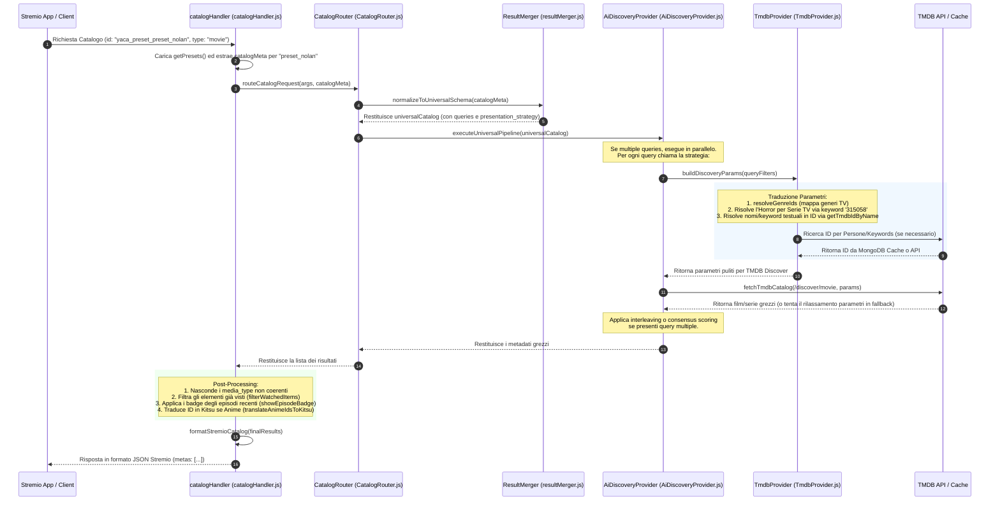

# Sistema di Preset Curati (Cataloghi Pre-Configurati)

Il sistema di preset curati di YACA consente di definire e servire cataloghi pre-configurati ("hardcoded") stabili, rapidi e ottimizzati, bypassando l'utilizzo del motore di Intelligenza Artificiale per le query standard o ad alta ricorrenza. Questo approccio assicura che gli utenti ricevano risultati accurati e coerenti in tempi minimi.

I preset sono definiti centralmente nel file [presets.js](../src/data/presets.js) e consumati dal pipeline di routing del catalogo per essere esposti come cataloghi nativi su Stremio.

---

## 1. Struttura dei Preset (`presets.js`)

Nel file [presets.js](../src/data/presets.js), la funzione `getPresets()` restituisce una lista di oggetti di configurazione. Ciascun preset è definito secondo la seguente struttura:

```javascript
{
    id: 'preset_nolan',
    name: 'Regia: Christopher Nolan',
    emoji: '⏳',
    category: "🎬 Cinema d'Autore & Registi",
    type: 'movie',
    presentation_strategy: 'popularity',
    showEpisodeBadge: false,
    queries: [
        {
            strategy: 'discovery',
            with_crew: TMDB_PEOPLE.Nolan,
            sort_by: 'vote_average.desc',
            'vote_count.gte': 200
        }
    ]
}
```

### Dettaglio dei Campi del Preset

*   `id` *(string - richiesto)*: Identificativo univoco del catalogo. Per essere richiamato correttamente da Stremio como catalogo YACA, l'ID richiesto segue la nomenclatura `yaca_preset_{id}`.
*   `name` *(string - richiesto)*: Titolo del catalogo che verrà visualizzato all'interno dell'interfaccia utente di Stremio e della Dashboard.
*   `emoji` *(string - opzionale)*: Emoji iconografica associata al catalogo, utilizzata a scopo di branding e visualizzazione grafica.
*   `category` *(string - richiesto)*: Categoria di appartenenza del catalogo (es. `🔥 Top & Trend`, `🍿 Serata Leggera & Risate`, `Adrenalina & Avventura`, etc.). Serve per raggruppare i cataloghi nella dashboard o raggruppare le righe di catalogo in Stremio.
*   `type` *(string - richiesto)*: Definisce se il catalogo contiene film (`movie`) o serie TV (`series`).
*   `presentation_strategy` *(string - opzionale)*: La strategia di unione e visualizzazione dei risultati per preset multi-query. Può assumere i valori:
    *   `popularity`: Ordina i film in base al volume di popolarità TMDB, risolvendo il consensus se gli elementi provengono da più query parallele.
    *   `interleave`: Alterna in modo equo gli elementi provenienti da diverse query concorrenti per garantire varietà visiva (es. alternare anime di azione con quelli di avventura).
*   `showEpisodeBadge` *(boolean - opzionale)*: Se impostato a `true`, la pipeline di post-processing di YACA analizzerà la cache degli episodi mandati in onda recentemente e vi applicherà un badge visivo personalizzato (es. per il simulcast).
*   `queries` *(array - richiesto)*: Array di oggetti contenente i criteri di interrogazione da inviare alle API di TMDB o Kitsu. Ogni query object può specificare:
    *   `strategy`: La strategia di fetch (es. `discovery`, `similar`, `multi_search`).
    *   `provider`: `tmdb` (default) o `kitsu` (usato per i cataloghi degli anime).
    *   `sort_by`: Criterio di ordinamento TMDB (es. `popularity.desc`, `vote_average.desc`, `revenue.desc`).
    *   `vote_count.gte` / `vote_count.lte`: Soglie minime e massime per il numero di voti.
    *   `vote_average.gte` / `vote_average.lte`: Limiti sui punteggi medi delle recensioni.
    *   `with_genres` / `without_genres`: Codici dei generi TMDB da includere o escludere.
    *   `with_companies`: ID delle case di produzione (es. `TMDB_COMPANIES.Ghibli`).
    *   `with_crew`: ID delle persone del team tecnico (es. registi).
    *   `with_cast`: ID degli attori del cast.
    *   `with_keywords` / `without_keywords`: Parole chiave di TMDB per circoscrivere tematiche specifiche.
    *   `with_original_language` / `without_original_language`: Filtri sulla lingua originale dei contenuti.
    *   `with_origin_country`: Filtri sul paese di origine (es. `GB`, `IN`).

---

## 2. Integrazione di `TMDB_PEOPLE` e Risoluzione Asincrona

Per rendere immediate e prive di manutenzione le query dedicate a registi, attori e case di produzione famose, il file [presets.js](../src/data/presets.js) definisce dizionari pre-compilati di ID statici:

```javascript
const TMDB_COMPANIES = {
    Pixar: 3, Ghibli: 10342, Marvel: 420, DC: 128064, A24: 41077, Blumhouse: 3172, Disney: 2, DreamWorks: 521, Illumination: 3166, Lucasfilm: 1
};

const TMDB_PEOPLE = {
    Nolan: 525, Tarantino: 138, Spielberg: 488, Scorsese: 224, Kubrick: 240, Villeneuve: 137427, Fincher: 1341,
    Lynch: 5602, DelToro: 10828, Peele: 185153, Eastwood: 190, Cameron: 2710, BradPitt: 287, DeNiro: 380, JohnnyDepp: 85, Denzel: 882, NicolasCage: 2963
};
```

Questi ID vengono passati direttamente alle proprietà `with_crew`, `with_cast` o `with_companies`.

### Risoluzione Asincrona degli ID

Se un preset o una query personalizzata (inclusa la ricerca live AI) richiede persone o keyword non definite staticamente tramite ID numerico ma espresse sotto forma di stringa (es. `"Christopher Nolan"` o `"viaggio nel tempo"`), la pipeline di YACA interviene a runtime nel modulo [TmdbProvider.js](../src/catalog/providers/TmdbProvider.js) mediante la funzione `buildDiscoveryParams`:

1.  **Analisi dei campi stringa**: Rileva la presenza di campi testuali come `people_list` o `keyword`.
2.  **Risoluzione Parallela**: Invia richieste parallele all'endpoint `/search/person` o `/search/keyword` di TMDB attraverso la funzione `getTmdbIdByName` all'interno di [tmdb.js](../src/clients/tmdb.js).
3.  **Caching a Due Livelli**: Per ridurre i tempi di risposta e non saturare i limiti di rate limit di TMDB, le coppie `Stringa -> ID` vengono salvate nella cache `idNameCache` gestita a livello RAM e persistita a lungo termine su MongoDB.
4.  **Generazione Query Finale**: I parametri testuali convertiti in ID numerici vengono uniti con i delimitatori opportuni (`|` per logica OR, `,` per logica AND) e aggiunti alle variabili `with_people` e `with_keywords` trasmesse a TMDB.

---

## 3. Flusso di Traduzione in Query TMDB e Visualizzazione in Stremio

Il seguente diagramma Mermaid illustra l'intero ciclo di vita di un preset, dalla richiesta effettuata dall'applicazione Stremio fino alla formattazione finale del catalogo:



### Logiche Chiave nella Pipeline

1.  **Risoluzione delle Serie TV Horror**: TMDB non possiede il genere "Horror" (27) per le serie TV. Per risolvere questa limitazione, all'interno di `buildDiscoveryParams`, se il catalogo richiede il genere Horror per le serie TV, YACA inietta automaticamente l'ID della keyword `315058` ("horror") mantenendo la coerenza del catalogo.
2.  **Mappatura dei Generi TV**: Per garantire la flessibilità, i generi inseriti nei preset vengono normalizzati da `resolveGenreIds`. Se il preset specifica un genere cinematografico (es. Action: `28` o Adventure: `12`) ma il tipo richiesto è `series` (TV), YACA mappa automaticamente questi ID nei corrispondenti televisivi (es. ActionAdventure: `10759`).
3.  **Fallback Dinamico (Relaxed Queries)**: Se la ricerca con parametri rigidi restituisce zero risultati, l'Universal Pipeline tenta di allentare i vincoli (es. riducendo a zero `vote_count.gte` o ignorando i filtri di keyword restrittive per i documentari) prima di decretare vuoto il catalogo.

---

## 4. Script di Gestione e Automazione (`scripts/`)

All'interno della cartella `scripts/` sono presenti utility Node.js progettate per facilitare l'amministrazione, il test e l'estensione del parco preset.

### 4.1. `add_catalogs.js`
Utilizzato per inserire in blocco nuovi preset tematici e dedicati ai network (Netflix, Amazon Prime Video, Disney+, Max, Paramount+, ecc.) direttamente nel file [presets.js](../src/data/presets.js).
Aggiorna inoltre i `profileTemplates` associando questi nuovi preset ai profili utente adatti (es. aggiunge "Film su Netflix" al profilo "Solo Film").
*   **Comando per l'esecuzione**:
    ```powershell
    node scripts/add_catalogs.js
    ```

### 4.2. `add_kids_catalogs.js`
Simile ad `add_catalogs.js`, questo script di migrazione si occupa esclusivamente di configurare e iniettare i cataloghi destinati a bambini e famiglie (es. "Cartoni in TV & Serie Kids", "Fiabe, Castelli & Principesse", "Animali Protagonisti") all'interno del file di preset e di associarli al template del profilo Kids (`tpl_kids`).
*   **Comando per l'esecuzione**:
    ```powershell
    node scripts/add_kids_catalogs.js
    ```

### 4.3. `analyze_presets.js`
Strumento indispensabile di **analisi statica** dei preset. Esamina tutti i cataloghi registrati nel sistema alla ricerca di anomalie strutturali o potenziali bug di configurazione, scrivendo i risultati nel file `analysis_report.json`.
Gli errori e i warning evidenziati comprendono:
*   `similar`: Preset duplicati o quasi identici (stessi generi, keyword e crew, ma ID o nomi differenti).
*   `wrong`: Errori gravi come un preset di tipo `movie` che contiene un ID di genere appartenente alle serie TV (o viceversa), o serie TV standard che mancano di escludere la keyword degli anime (`210024`), rischiando di inquinare il catalogo.
*   `tooEmpty`: Rilevamento di troppi filtri cumulativi (genere + keyword + lingua + voto alto) che rischiano di svuotare completamente il catalogo TMDB.
*   `needsQuality`: Verifica che i cataloghi ordinati per voto medio (`vote_average.desc`) contengano una soglia minima di voti (`vote_count.gte`), prevenendo la visualizzazione in cima di titoli sconosciuti con un singolo voto favorevole.
*   `needsSorting`: Controlla che le parole chiavi nel nome (come "Top", "Migliori" o "Popolari") corrispondano all'effettivo parametro di ordinamento configurato.
*   **Comando per l'esecuzione**:
    ```powershell
    node scripts/analyze_presets.js
    ```

### 4.4. `reorganize_categories.js`
Questo script analizza le definizioni dei preset all'interno di [presets.js](../src/data/presets.js) e le riorganizza sotto categorie uniformate e pulite basandosi su un dizionario di mappatura interno (`categoryMap`). Se un preset non è esplicitato all'interno della mappa, assegna una categoria di fallback in base a parole chiave presenti nel suo ID (es. assegna `🏮 Solo Anime` se l'ID contiene `"anime"`).
*   **Comando per l'esecuzione**:
    ```powershell
    node scripts/reorganize_categories.js
    ```

### 4.5. `inject_emojis.js`
Analizza le dichiarazioni dei preset e inietta automaticamente la proprietà `emoji: '...'` corrispondente a ciascun catalogo che ne è sprovvisto. La scelta dell'emoji è determinata dalla scansione del nome dell'ID confrontato con una mappatura pre-compilata (es. `nolan` -> `⏳`, `war` -> `🪖`, `horror` -> `👻`). Se non trova corrispondenze, applica come fallback l'emoji della pellicola `🎬`.
*   **Comando per l'esecuzione**:
    ```powershell
    node scripts/inject_emojis.js
    ```

---

## 5. Variabili d'Ambiente Utilizzate

Le seguenti chiavi di configurazione dell'ambiente sono utilizzate per supportare il corretto funzionamento delle API e delle risoluzioni durante il rendering dei preset:

*   `TMDB_API_KEY`: *(Richiesta)* Chiave di autenticazione per accedere alle API di The Movie Database. Utilizzata sia per il fetch dei cataloghi sia per convertire i nomi testuali di persone/keyword in ID numerici.
*   `MISTRAL_API_KEY`: *(Opzionale)* Utilizzata per il modulo AI Search. Se impostata, abilita la scomposizione e l'arricchimento semantico delle ricerche testuali degli utenti, integrandole opzionalmente con i preset di scoperta.
