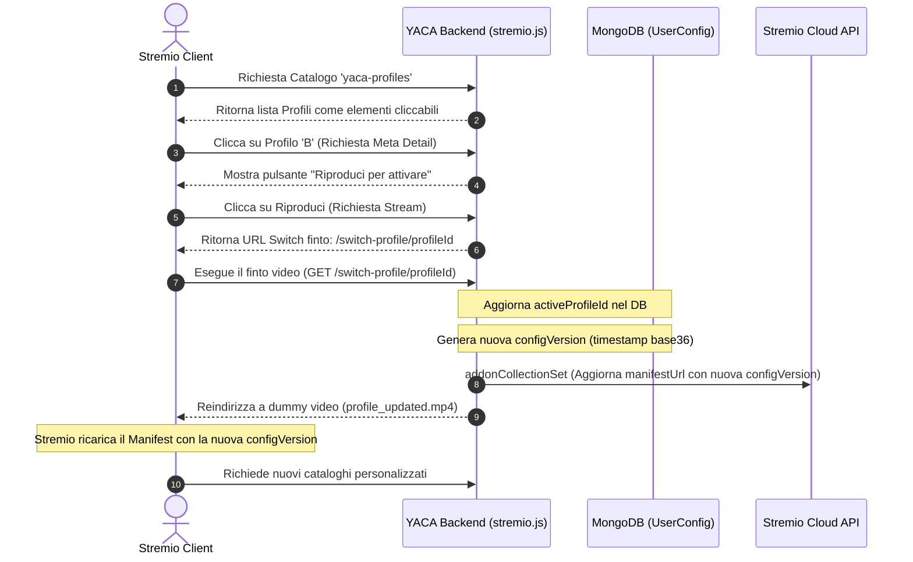

# Internals di Stremio e Workaround Tecnici di YACA

Questo documento descrive le soluzioni tecniche e i workaround ingegneristici implementati in **YACA** per superare i vincoli nativi della piattaforma Stremio, con particolare focus sulla gestione dei profili utente, sul mapping degli ID per gli Anime e sulla gestione della cache dei manifest.

---

## 1. Gestione dei Profili Utente (YACA Profiling Workaround)

### Il Problema
Stremio non fornisce supporto nativo per profili multipli all'interno di un singolo account o installazione di addon. La configurazione (inclusi i cataloghi personalizzati) viene definita staticamente al momento dell'installazione tramite l'URL del manifest (es. `https://yaca.addon/userId/manifest.json`).

### La Soluzione di YACA
YACA implementa un sistema dinamico di switch del profilo attivo basato sull'intercettazione dei flussi multimediali di Stremio:

### Componenti del Workaround:

1.  **Catalogo Virtuale**: 
    In [CatalogRouter.js](../src/catalog/CatalogRouter.js) (Caso `yaca-profiles`), YACA restituisce la lista dei profili dell'utente sotto forma di schede catalogo con avatar generati dinamicamente.
2.  **Abilitazione della Riproduzione (Meta Handler)**: 
    In [metaHandler.js](../src/handlers/metaHandler.js) (Caso `yaca-profile-`), l'addon imposta una descrizione speciale per i profili non attivi spiegando come procedere all'attivazione e abilita il pulsante di riproduzione.
3.  **Generazione dello Stream Finto**: 
    In [streamHandler.js](../src/handlers/streamHandler.js), quando l'utente preme "Play" sul profilo desiderato, YACA risponde con un unico stream il cui URL punta all'endpoint di controllo: 
    `${hostUrl}/api/users/${userConfig.userId}/switch-profile/${profileId}`.
4.  **switch-profile Endpoint**:
    In [stremio.js](../src/api/stremio.js), la chiamata HTTP innescata dal player esegue le seguenti operazioni:
    - Modifica l'attributo `activeProfileId` nella configurazione dell'utente su MongoDB.
    - Genera una nuova stringa di versione basata sul timestamp corrente convertito in base 36 (`newConfigVersion = Date.now().toString(36)`).
    - Effettua una chiamata di sincronizzazione push alle API di Stremio (`addonCollectionSet`) per sostituire l'URL di installazione dell'addon dell'utente con quello aggiornato contenente la nuova `configVersion` (es. `https://yaca.addon/userId/newConfigVersion/manifest.json`).
    - Reindirizza il player di Stremio a un video MP4 muto di 2 secondi (`profile_updated.mp4`) ospitato localmente per evitare errori di riproduzione nel client.
5.  **Bust Cache Automatico**:
    Poiché l'URL del manifest memorizzato nel client di Stremio ora include la nuova `configVersion`, Stremio cancella immediatamente la cache locale del manifest e invia richieste fresche per caricare i cataloghi associati al profilo appena attivato.

---

## 2. Mapping e Idratazione degli Anime (Hybrid Anime Mapping)

### Il Problema
Le piattaforme di streaming collegate a Stremio (come Torrentio o Anime Kitsu) gestiscono i flussi per gli anime unicamente se la richiesta contiene l'ID nativo di Kitsu (formato `kitsu:<kitsuId>:<episode>`). 
Tuttavia, i motori di raccomandazione di YACA e le API di ricerca globale operano prevalentemente su metadati TMDB (formato `tmdb:<tmdbId>`), che forniscono catalogazione, generi e affinità nettamente superiori per l'AI.

### La Soluzione: Traduzione Bidirezionale degli ID
YACA implementa un motore di traduzione asincrono in [TmdbToKitsuMapper.js](../src/utils/TmdbToKitsuMapper.js) e [kitsu.js](../src/clients/kitsu.js):

```mermaid
graph TD
    subgraph TMDB to Kitsu ID Mapping
        A[Risultato Catalogo TMDB] --> B{È un Anime?}
        B -->|No| C[Mantieni ID TMDB]
        B -->|Sì: Animazione JP| D[Richiedi External IDs da TMDB]
        D -->|Ottieni| E[TVDB ID]
        E -->|Interroga Kitsu API /mappings| F[Risolvi Kitsu ID]
        F -->|Trovato| G[Sostituisci ID con kitsu:id]
        G --> H[Salva ID TMDB originale in item.tmdbId]
    end
    
    subgraph Detail Hydration
        I[Richiesta Meta Detail Stremio] --> J{Tipo ID?}
        J -->|kitsu:id| K[getKitsuMetaDetails]
        K --> L[Trova TMDB ID nei mapping Kitsu]
        L --> M[Scarica Titolo, Descrizione e Poster IT da TMDB]
        M --> N[Scarica tutti gli episodi assoluti da Kitsu]
        N --> O[Formatta in formato Stremio kitsu:id:season:episode]
    end
```

#### 1. Rilevamento Anime
Durante la fase di post-fetch, la funzione `translateAnimeIdsToKitsu` in [TmdbToKitsuMapper.js](../src/utils/TmdbToKitsuMapper.js) analizza i metadati TMDB e classifica un contenuto come anime se presenta le seguenti condizioni:
- Il genere include *16* (Animation).
- I paesi di produzione includono *JP* (Giappone) **OPPURE** la lingua originale è *ja* (Giapponese).

#### 2. Risoluzione tramite Bridge TVDB
Kitsu non supporta il mapping diretto da ID TMDB nelle sue API pubbliche. Pertanto, YACA utilizza **TVDB** come ponte:
1. Chiama TMDB `/tv/{tmdbId}/external_ids` per ricavare l'ID TVDB della serie.
2. Esegue una query sull'endpoint `/mappings` di Kitsu filtrando per `externalSite: 'thetvdb'` ed `externalId: tvdbId`.
3. Se non viene trovato nulla, esegue fallback per i mapping strutturati come `thetvdb/series` o `thetvdb/season`.
4. Una volta ottenuto l'ID Kitsu, l'ID della risorsa nel catalogo viene convertito in `kitsu:{kitsuId}` e il TMDB ID originale viene conservato in `item.tmdbId`.

#### 3. Normalizzazione degli Episodi in `metaHandler`
Le serie Anime su Kitsu utilizzano una numerazione assoluta per gli episodi (es. episodio 150 invece di Stagione 5 Episodio 10). 
Stremio e Torrentio richiedono invece la suddivisione per stagioni. 
All'interno di `normalizeAnimeEpisodes` in [metaHandler.js](../src/handlers/metaHandler.js):
- YACA scarica l'intera lista di episodi da Kitsu (/episodes in batch tramite paginazione asincrona).
- Qualora Kitsu non fornisca un numero di stagione valido (`seasonNumber`), YACA normalizza gli episodi forzando la mappatura corretta dell'ID (es. `kitsu:{kitsuId}:{season}:{episode}`) mantenendo la coerenza con i tracker di streaming.

#### 4. Risoluzione Fallback per Titolo e Ordinamento per Popolarità
Qualora Kitsu non esponga mapping diretti verso TMDB o TVDB per un determinato anime, YACA effettua una ricerca testuale di ripiego (fallback) tramite l'endpoint `/search/tv` (o `/search/movie`) di TMDB, pulendo il titolo da suffissi di stagione (es. *Season 2*, *2nd Season*).
- **Problema di accuratezza:** Spesso TMDB contiene schede duplicate, strambe o orfane inserite dagli utenti con popolarità prossima allo zero (es. *325627* per *The Apothecary Diaries*), che compaiono al primo posto della ricerca per via della corrispondenza esatta del titolo inglese, oscurando la scheda ufficiale localizzata in italiano.
- **Risoluzione:** I risultati restituiti dalla ricerca TMDB vengono ordinati per popolarità decrescente (`popularity`). Questo assicura che YACA mappi sempre l'anime alla scheda ufficiale principale (es. *220542* - *Il monologo della Speziale*) che contiene descrizioni in italiano, poster e sfondi corretti.

#### 5. Doppia Query in Parallelo e De-duplicazione dei Flussi (Stream Proxying)
Nel proxy dei flussi ([streamHandler.js](../src/handlers/streamHandler.js)), sorge un problema analogo a livello di tracker torrent (es. Torrentio o il Corsaro Viola):
- **Problema dei flussi Kitsu:** I torrent italiani (con doppiaggio o sub ITA) vengono caricati e associati dagli indexer quasi esclusivamente sotto l'ID IMDb della serie (es. `tt4508902`). Interrogando il proxy esclusivamente con l'ID Kitsu (`kitsu:10740:1`), si ottenevano pochissimi risultati internazionali sub-eng e zero risultati italiani, causando il mancato badge **ITA** (falso negativo salvato in cache).
- **Risoluzione parallela:** Quando YACA riceve una richiesta di stream per un ID Kitsu (`kitsu:id:season:episode`), traduce preventivamente l'ID Kitsu nel rispettivo ID IMDb (ricavando la stagione e l'episodio TMDB corrispondenti) e avvia due richieste asincrone parallele al proxy: una per l'ID Kitsu e una per l'ID IMDb.
- **Fusione e De-duplicazione:** I flussi restituiti da entrambe le query vengono fusi in RAM ed eliminati i duplicati basandosi sull'identificatore univoco del torrent (`infoHash`) o sul link (`url` / `externalUrl`). Questa unione garantisce il massimo assortimento di flussi (sia le release subbate specifiche per anime indicizzate su Kitsu, sia i doppiaggi italiani tradizionali indicizzati su IMDb) e permette a YACA di applicare correttamente il badge **ITA** sui cataloghi anime in base alla presenza reale di tracce italiane.
- **Negative Caching ed Eviction dei Falsi Negativi:** L'esito della rilevazione della lingua italiana viene persistito a lungo termine nella collezione `streambadges` su MongoDB. Se un anime riceveva precedentemente un esito negativo (`hasIta: false`), la logica del catalogo evitava di inserirlo nuovamente in coda di scansione per ottimizzare le risorse. A seguito del cambio di logica (da query singola a query parallela), è stato necessario ripulire i vecchi documenti `hasIta: false` relativi a Kitsu (colonna `baseId` che inizia con `kitsu:`) per permettere al background scanner di ri-analizzarli alla luce della nuova architettura dual-query (vedi dettagli in [CATALOG_LOGIC.md](CATALOG_LOGIC.md#5-il-sistema-di-scansione-dei-badge-ita-background-stream-scanner)).

---

## 3. Workaround per le Limitazioni di Stremio

### A. Paginazione Dinamica (Skip e Lookahead)
Stremio richiede i cataloghi in blocchi paginati trasmettendo il parametro `skip` (in multipli di 20, es: `skip=20`, `skip=40`). 
Le API di TMDB richiedono invece il parametro `page` (base 1, 20 elementi per pagina).
- **Problema**: L'interleaving e il consensus scoring richiedono i dati di più query contemporaneamente. Se richiedessimo una sola pagina per ciascuna query, l'intersezione o l'alternazione potrebbe non produrre abbastanza elementi univoci per riempire la pagina da 20 elementi richiesta da Stremio, provocando cataloghi "troncati" o vuoti.
- **Soluzione**: Quando `skip === 0` (caricamento iniziale della prima pagina), YACA attiva il **Lookahead** nella Universal Pipeline, scaricando in parallelo fino a **3 pagine TMDB** (valore definito da `PAGES_PER_REQUEST` in [src/config.js](../src/config.js)) per ogni query attiva. I risultati vengono fusi, ordinati e solo i primi 20 elementi finali vengono ritornati a Stremio. Per le pagine successive (`skip > 0`), viene scaricata una sola pagina per query per minimizzare la latenza.

### B. Protezione e Controllo dell'URL di Installazione
Stremio apre l'interfaccia di configurazione cliccando sull'icona dell'ingranaggio dell'addon installato inviando una chiamata a `/:userHandle/configure`. 
Per evitare leak del token dell'utente (UUID) nei log o nei referral del browser, l'endpoint `/:userHandle/configure` in [stremio.js](../src/api/stremio.js) intercetta la chiamata e reindirizza immediatamente l'utente all'interfaccia frontend protetta (`FRONTEND_URL`), dove la sessione viene convalidata in modo sicuro tramite JWT (JSON Web Token).

---

## 4. Variabili d'Ambiente Coinvolte nei Workaround

*   `HOST_URL`: L'URL pubblico in cui è ospitato l'addon. Viene usato per generare i link di switch profilo e per aggiornare l'indirizzo del manifest sul cloud di Stremio.
*   `RENDER_EXTERNAL_URL`: Fallback per `HOST_URL` se l'applicazione è ospitata su Render.
*   `SPACE_HOST`: Hostname di Hugging Face Spaces (es. `<username>-yaca.hf.space`), utilizzato per calcolare automaticamente l'URL pubblico qualora non sia configurato un `HOST_URL` esplicito.
*   `FRONTEND_URL`: L'URL dell'applicazione frontend di YACA (Next.js/React) utilizzato per i redirect sicuri dalla schermata di configurazione di Stremio.
*   `TMDB_API_KEY`: Necessaria per richiedere gli External ID e convertire gli ID in Kitsu.
*   `ERDB_CONFIG`: Stringa di configurazione di Easy Ratings DB, utilizzata per arricchire i certificati dell'età (ad es. per il Kids Mode).
