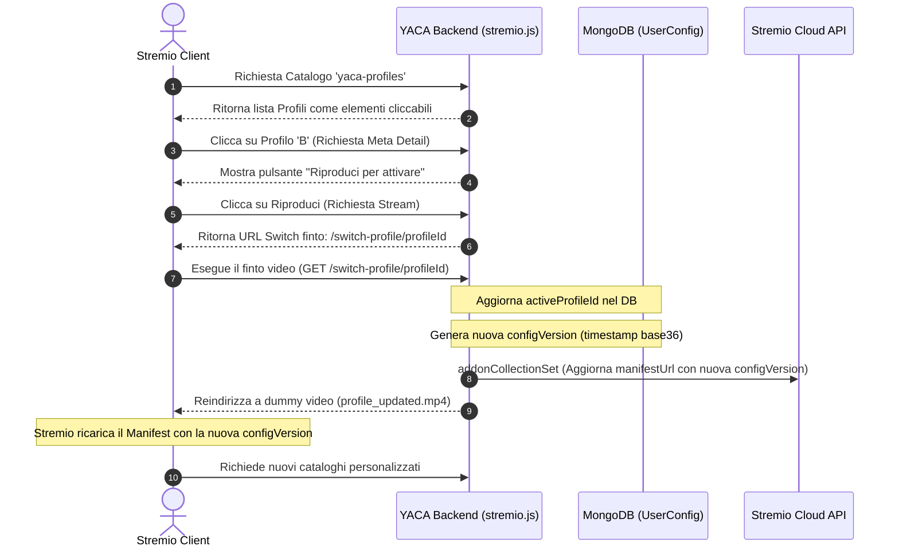

# Internals di Stremio e Workaround Tecnici di YACA

Questo documento descrive le soluzioni tecniche e i workaround ingegneristici implementati in **YACA** per superare i vincoli nativi della piattaforma Stremio, con particolare focus sulla gestione dei profili utente, sul mapping degli ID per gli Anime e sulla gestione della cache dei manifest.

---

## 1. Gestione dei Profili Utente (YACA Profiling Workaround)

### Il Problema
Stremio non fornisce supporto nativo per profili multipli all'interno di un singolo account o installazione di addon. La configurazione (inclusi i cataloghi personalizzati) viene definita staticamente al momento dell'installazione tramite l'URL del manifest (es. `https://yaca.addon/userId/manifest.json`).

### La Soluzione di YACA
YACA implementa un sistema dinamico di switch del profilo attivo basato sull'intercettazione dei flussi multimediali di Stremio:

```mermaid
sequenceDiagram
    autonumber
    actor Utente as Stremio Client
    participant API as YACA Backend (stremio.js)
    participant DB as MongoDB (UserConfig)
    participant Cloud as Stremio Cloud API

    Utente->>API: Richiesta Catalogo 'yaca-profiles'
    API-->>Utente: Ritorna lista Profili come elementi cliccabili
    Utente->>API: Clicca su Profilo 'B' (Richiesta Meta Detail)
    API-->>Utente: Mostra pulsante "Riproduci per attivare"
    Utente->>API: Clicca su Riproduci (Richiesta Stream)
    API-->>Utente: Ritorna URL Switch finto: /switch-profile/profileId
    Utente->>API: Esegue il finto video (GET /switch-profile/profileId)
    Note over API,DB: Aggiorna activeProfileId nel DB
    Note over API,DB: Genera nuova configVersion (timestamp base36)
    API->>Cloud: addonCollectionSet (Aggiorna manifestUrl con nuova configVersion)
    API-->>Utente: Reindirizza a dummy video (profile_updated.mp4)
    Note over Utente: Stremio ricarica il Manifest con la nuova configVersion
    Utente->>API: Richiede nuovi cataloghi personalizzati
```

### Componenti del Workaround:

1.  **Catalogo Virtuale**: 
    In [CatalogRouter.js](../src/catalog/CatalogRouter.js) (Caso `yaca-profiles`), YACA restituisce la lista dei profili dell'utente sotto forma di schede catalogo con avatar generati dinamicamente.
2.  **Abilitazione della Riproduzione (Meta Handler)**: 
    In [metaHandler.js](../src/handlers/metaHandler.js) (Caso `yaca-profile-`), l'addon imposta una descrizione speciale per i profili non attivi spiegando come procedere all'attivazione e abilita il pulsante di riproduzione.
3.  **Generazione dello Stream Finto**: 
    In [streamHandler.js](../src/handlers/streamHandler.js), quando l'utente preme "Play" sul profilo desiderato, YACA risponde con un unico stream il cui URL punta all'endpoint di controllo: 
    `${hostUrl}/api/users/${userConfig.userId}/switch-profile/${profileId}`.
4.  **switch-profile Endpoint**:
    In [stremio.js](../src/api/stremio.js), la chiamata HTTP innescata dal player esegue le seguenti operazioni:
    - Modifica l'attributo `activeProfileId` nella configurazione dell'utente su MongoDB.
    - Genera una nuova stringa di versione basata sul timestamp corrente convertito in base 36 (`newConfigVersion = Date.now().toString(36)`).
    - Effettua una chiamata di sincronizzazione push alle API di Stremio (`addonCollectionSet`) per sostituire l'URL di installazione dell'addon dell'utente con quello aggiornato contenente la nuova `configVersion` (es. `https://yaca.addon/userId/newConfigVersion/manifest.json`).
    - Reindirizza il player di Stremio a un video MP4 muto di 2 secondi (`profile_updated.mp4`) ospitato localmente per evitare errori di riproduzione nel client.
5.  **Bust Cache Automatico**:
    Poiché l'URL del manifest memorizzato nel client di Stremio ora include la nuova `configVersion`, Stremio cancella immediatamente la cache locale del manifest e invia richieste fresche per caricare i cataloghi associati al profilo appena attivato.

---

## 2. Mapping e Idratazione degli Anime (Hybrid Anime Mapping)

### Il Problema
Le piattaforme di streaming collegate a Stremio (come Torrentio o Anime Kitsu) gestiscono i flussi per gli anime unicamente se la richiesta contiene l'ID nativo di Kitsu (formato `kitsu:<kitsuId>:<episode>`). 
Tuttavia, i motori di raccomandazione di YACA e le API di ricerca globale operano prevalentemente su metadati TMDB (formato `tmdb:<tmdbId>`), che forniscono catalogazione, generi e affinità nettamente superiori per l'AI.

### La Soluzione: Traduzione Bidirezionale degli ID tramite Mapping Store
YACA implementa un'architettura ad alta efficienza basata su mapping statici pre-elaborati in [animeMappingStore.js](../src/data/animeMappingStore.js) e sulla regola canonica di rilevamento in [animeIdentity.js](../src/utils/animeIdentity.js):

```mermaid
graph TD
    subgraph Anime Identity & Mapping Store
        A[Risorsa TMDB] --> B{animeIdentity: È Anime?}
        B -->|No| C[Mantieni ID e metadati nativi TMDB]
        B -->|Sì: Store o 16+ja/keyword| D[animeMappingStore: Lookup O(1)]
        D -->|Serie TV| E[Anibridge: Mapping Stagione ed Episodi]
        D -->|Film| F[Fribb: tmdbToKitsuMovie]
        E --> G[Risoluzione Kitsu via Consensus Voting]
        F --> H[ID Video kitsu:kitsuId]
    end
    
    subgraph Detail Hydration
        I[Richiesta Meta Detail Stremio] --> J{Tipo Contenuto?}
        J -->|Anime Serie| K[fetchTmdbEpisodes: scarica griglia episodi TMDB]
        K --> L[applyKitsuMappingToMeta: assegna target kitsu:id:ep]
        J -->|Anime Film| M[applyKitsuMappingToMeta: assegna defaultVideoId kitsu:id]
    end
```

#### 1. Rilevamento Canonico dell'Identità Anime
L'identità anime è unificata nel modulo [animeIdentity.js](../src/utils/animeIdentity.js) (`isAnimeContent`) condiviso da tutti i percorsi dati (DuckDB locale e client TMDB live):
- **Store Match**: Il TMDB ID è presente in `animeMappingStore` (Anibridge / Fribb);
- **Euristica TMDB**: Genere TMDB *16* (Animation) **E** (`original_language === 'ja'` **OPPURE** esiste una keyword TMDB che include la parola `"anime"` case-insensitive, con filtro anti-falsi positivi per escludere animazioni occidentali come "anime-inspired" o "anime-influenced").
- La regola vale in modo identico per **serie TV** e per **film**, includendo donghua cinesi/coreani censiti ed escludendo produzioni occidentali.

#### 2. Risoluzione tramite `animeMappingStore` (Anibridge + Fribb)
Invece di lente chiamate HTTP live verso API esterne, YACA mantiene in memoria due dataset ad alte prestazioni sincronizzati ogni 12 ore con supporto ETag/304:
1. **Anibridge**: Mappature multi-provider (AniDB, AniList, MAL) con offset e range per convertire episodi TMDB in episodi Anime progressivi.
2. **Fribb (`anime-list-mini`)**: Mapping incrociato diretto per Kitsu ID, AniDB, AniList, MAL e TMDB (inclusi film).
3. **Lookup O(1) e Indici RAM**: Lo store popola un `Set` di TMDB ID anime per lookup a tempo costante (`isAnimeTmdbId(tmdbId)`) e aggiorna la tabella in-memory `anime_mappings` di DuckDB per consentire filtri nativi zero-latency (`F.anime`).

#### 3. Idratazione Episodica e Consensus Voting in `metaHandler`
All'interno di [metaHandler.js](../src/handlers/metaHandler.js):
- Per le serie TV anime, YACA scarica la griglia episodi da TMDB (`resolveAnimeEpisodes`) e poi applica `applyKitsuMappingToMeta`:
- Ogni episodio TMDB viene risolto tramite `animeMappingStore.resolveKitsu(tmdbId, season, episode)` applicando un algoritmo di **consensus voting** ponderato tra i provider.
- Se risolto con successo, l'ID dell'episodio per Stremio diventa `kitsu:{kitsuId}:{kitsuEpisode}` (compatibile con i tracker Torrentio/Anime Kitsu). In caso di collisione o assenza di mapping, viene mantenuto l'ID TMDB nativo come fallback di sicurezza.

#### 5. Doppia Query in Parallelo e De-duplicazione dei Flussi (Stream Proxying)
Nel proxy dei flussi ([streamHandler.js](../src/handlers/streamHandler.js)), sorge un problema analogo a livello di tracker torrent (es. Torrentio o il Corsaro Viola):
- **Problema dei flussi Kitsu:** I torrent italiani (con doppiaggio o sub ITA) vengono caricati e associati dagli indexer quasi esclusivamente sotto l'ID IMDb della serie (es. `tt4508902`). Interrogando il proxy esclusivamente con l'ID Kitsu (`kitsu:10740:1`), si ottenevano pochissimi risultati internazionali sub-eng e zero risultati italiani, causando il mancato badge **ITA** (falso negativo salvato in cache).
- **Risoluzione parallela:** Quando YACA riceve una richiesta di stream per un ID Kitsu (`kitsu:id:season:episode`), traduce preventivamente l'ID Kitsu nel rispettivo ID IMDb (ricavando la stagione e l'episodio TMDB corrispondenti) e avvia due richieste asincrone parallele al proxy: una per l'ID Kitsu e una per l'ID IMDb.
- **Fusione e De-duplicazione:** I flussi restituiti da entrambe le query vengono fusi in RAM ed eliminati i duplicati basandosi sull'identificatore univoco del torrent (`infoHash`) o sul link (`url` / `externalUrl`). Questa unione garantisce il massimo assortimento di flussi (sia le release subbate specifiche per anime indicizzate su Kitsu, sia i doppiaggi italiani tradizionali indicizzati su IMDb) e permette a YACA di applicare correttamente il badge **ITA** sui cataloghi anime in base alla presenza reale di tracce italiane.
- **Negative Caching ed Eviction dei Falsi Negativi (Serie e Film Non-Anime):** L'esito della rilevazione della lingua italiana viene persistito a lungo termine nella collezione `streambadges` su MongoDB. Lo scanner torrent in background copre **esclusivamente serie e film non-anime**. Gli **anime sono esclusi a monte** dallo scanner torrent: la verità sulla loro disponibilità italiana (sub e doppiaggio per-episodio) proviene dal modulo sorgente esterno (`services/anime-source`), evitando falsi negativi e ridondanze sui tracker (vedi dettagli in [CATALOG_LOGIC.md](CATALOG_LOGIC.md#5-il-sistema-di-scansione-dei-badge-ita-background-stream-scanner---solo-non-anime)). Per le serie e i film non-anime, la cache negativa (`hasIta: false`) evita interrogazioni ripetute.

---

## 3. Workaround per le Limitazioni di Stremio

### A. Paginazione Dinamica (Skip e Lookahead)
Stremio richiede i cataloghi in blocchi paginati trasmettendo il parametro `skip` (in multipli di 20, es: `skip=20`, `skip=40`). 
Le API di TMDB richiedono invece il parametro `page` (base 1, 20 elementi per pagina).
- **Problema**: L'interleaving e il consensus scoring richiedono i dati di più query contemporaneamente. Se richiedessimo una sola pagina per ciascuna query, l'intersezione o l'alternazione potrebbe non produrre abbastanza elementi univoci per riempire la pagina da 20 elementi richiesta da Stremio, provocando cataloghi "troncati" o vuoti.
- **Soluzione**: Quando `skip === 0` (caricamento iniziale della prima pagina), YACA attiva il **Lookahead** nella Universal Pipeline, scaricando in parallelo fino a **3 pagine TMDB** (valore definito da `PAGES_PER_REQUEST` in [src/config.js](../src/config.js)) per ogni query attiva. I risultati vengono fusi, ordinati e solo i primi 20 elementi finali vengono ritornati a Stremio. Per le pagine successive (`skip > 0`), viene scaricata una sola pagina per query per minimizzare la latenza.

### B. Protezione e Controllo dell'URL di Installazione
Stremio apre l'interfaccia di configurazione cliccando sull'icona dell'ingranaggio dell'addon installato inviando una chiamata a `/:userHandle/configure`. 
Per evitare leak del token dell'utente (UUID) nei log o nei referral del browser, l'endpoint `/:userHandle/configure` in [stremio.js](../src/api/stremio.js) intercetta la chiamata e reindirizza immediatamente l'utente all'interfaccia frontend protetta (`FRONTEND_URL`), dove la sessione viene convalidata in modo sicuro tramite JWT (JSON Web Token).

---

## 4. Variabili d'Ambiente Coinvolte nei Workaround

*   `HOST_URL`: L'URL pubblico in cui è ospitato l'addon. Viene usato per generare i link di switch profilo e per aggiornare l'indirizzo del manifest sul cloud di Stremio.
*   `RENDER_EXTERNAL_URL`: Fallback per `HOST_URL` se l'applicazione è ospitata su Render.
*   `SPACE_HOST`: Hostname di Hugging Face Spaces (es. `<username>-yaca.hf.space`), utilizzato per calcolare automaticamente l'URL pubblico qualora non sia configurato un `HOST_URL` esplicito.
*   `FRONTEND_URL`: L'URL dell'applicazione frontend di YACA (Next.js/React) utilizzato per i redirect sicuri dalla schermata di configurazione di Stremio.
*   `TMDB_API_KEY`: Necessaria per richiedere gli External ID e convertire gli ID in Kitsu.
*   `ERDB_CONFIG`: Stringa di configurazione di Easy Ratings DB, utilizzata per arricchire i certificati dell'età (ad es. per il Kids Mode).

---

## 5. Ottimizzazione Payload: Cataloghi vs Dettagli Meta (BSON Constraint)

### Il Problema
Stremio utilizza lo stesso formato per la visualizzazione delle locandine in griglia (Catalogo) e per la pagina dedicata del singolo film/serie (Meta). Tuttavia, i dati restituiti da TMDB sono estremamente voluminosi (es. cast completo, keyword, decine di episodi in `videos`, deep link a YouTube o IMDB). 
In passato, l'uso indiscriminato dello spread operator (`...item`) per generare gli elementi del catalogo causava la serializzazione di interi oggetti TMDB raw nella cache MongoDB (`catalogRequestCache`). Questo portava rapidamente a documenti BSON giganteschi e, nei casi limite, allo sforamento del limite di 16MB di MongoDB, oltre a sprecare una quantità enorme di RAM.

### La Soluzione: `isMetaDetail`
YACA implementa una divisione netta del payload inviato a Stremio tramite la funzione `sanitizeCatalogMeta` (situata in `StremioFormatter.js`):

- **Per i Cataloghi**: Il formatter esegue uno strict-mapping. Conserva solo lo stretto necessario (ID, nome, locandina visiva e poche altre info chiave). Tutti gli array voluminosi (come `videos` o `links`) e gli oggetti raw (es. `rawTMDB`) vengono intenzionalmente scartati.
- **Per i Dettagli (Meta)**: Quando l'utente clicca su una specifica locandina, l'endpoint `/meta/` di `stremio.js` richiama il formatter passando il flag `isMetaDetail: true`. Questo flag "sblocca" l'inclusione controllata di campi pesanti: `videos` (essenziale per mostrare le stagioni e gli episodi), `behaviorHints`, `links`, e `trailers`.

Questo approccio ibrido garantisce che i cataloghi siano "iper-digeribili" dal database e velocissimi da scorrere, pur restituendo i dati completi (inclusi i badge ITA o Kitsu applicati) quando l'utente si aspetta di guardare gli episodi o cliccare su un trailer.
