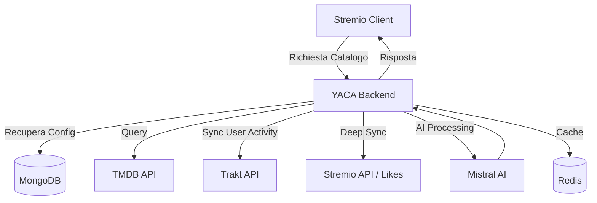

# Architettura di Sistema - YACA

YACA (Yet Another Catalog Addon) è un ecosistema complesso### Ponderazione Dinamica (Phase 1.2)
Lo score viene bilanciato tra **Assi Tematici (90%)** e **Assi Autoriali (10%)**, garantendo che il genere sia il driver principale ma la regia dia il tocco finale di precisione.
izzata.

## Visione d'Insieme

Il sistema si interpone tra le API di metadati (TMDB, Kitsu, Trakt) e l'utente Stremio, applicando un layer di intelligenza che modella i cataloghi in base al comportamento reale dell'utente.

### Flusso dei Dati

---

## Concetti Core

### 1. Il Taste Profile (Il "Cervello" Globale)
Il **Taste Profile** rappresenta l'identità cinematografica dell'utente. Non è statico, ma evolve con ogni azione:
- **Fonti**: Storico visioni Trakt, "Like" e "Love" su Stremio, libreria Stremio.
- **Punteggi**: Il sistema calcola pesi per generi, attori, registi e keyword. 
- **Evoluzione**: Un "Love" (10/10) pesa molto più di una semplice visione, influenzando pesantemente i suggerimenti futuri.

### Profile DNA Inferred
Mentre il Taste Profile è globale, il **Profile DNA** permette di creare "bolle" di contenuto.
Il DNA non è solo statico: YACA analizza periodicamente i pilastri del gusto (es. Generi dominanti) e **inferisce automaticamente** nuovi elementi del DNA se superano una soglia di dominanza (Score Pilastro $\ge 2 \times$ secondo miglior score).
- **Esempio**: Un utente può avere un profilo "Anime" e uno "Horror".
- **Logica**: Quando il profilo "Anime" è attivo, il backend utilizza il Taste Profile globale (per sapere quali anime piacciono all'utente) ma filtra aggressivamente tutto ciò che non appartiene al genere Anime tramite il DNA definito nel profilo.

### 3. Deep Sync (Exploit AddonKey)
YACA supera i limiti delle API standard di Stremio:
- **Private Collections**: Utilizzando una chiave di sessione (`authKey`), YACA accede alle collezioni private degli utenti (Liked/Loved) che Stremio non espone pubblicamente.
- **Two-Way Bridge**: Le azioni fatte su Stremio (Like) vengono propagate su Trakt (Rating), creando un ecosistema sincronizzato.

---

## Strategie di Catalogazione (Signatures)

Il sistema non restituisce semplici liste "Popolari", ma applica delle "Signatures":

| Strategia | Descrizione |
| :--- | :--- |
| **The Core** | Estrae le migliori keyword e generi dal profilo per una precisione millimetrica. |
| **The Blend** | Mescola diversi segnali per favorire la scoperta di contenuti nuovi ma affini. |
| **Seed Network** | Parte da contenuti specifici che l'utente ha amato per espandere la rete di raccomandazioni. |

---

## Scalabilità e Performance
- **Caching Multi-Livello**: L1 (RAM con LRU), L2 (Redis), L3 (MongoDB).
- **Background Warming**: Un sistema di cron job "scalda" le cache dei cataloghi per garantire tempi di risposta < 200ms.
- **Throttling Intelligente**: Sincronizzazioni pesanti (Trakt/Stremio) avvengono in modo scaglionato per evitare ban dalle API esterne.
