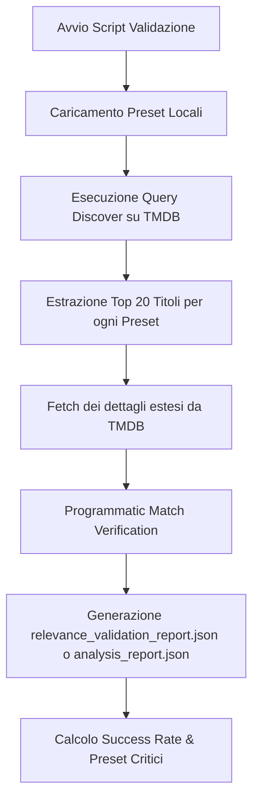

# Suite di Test e Utility di Amministrazione (YACA)

Questo documento descrive in dettaglio l'architettura dei test, le procedure di validazione automatica dei cataloghi e dei preset, e gli strumenti amministrativi per la manutenzione e il debug della piattaforma YACA (Yet Another Catalog Addon).

---

## 1. Test di Unità e Integrazione con Jest

I test di unità e integrazione sono scritti in JavaScript utilizzando il framework **Jest** (`jest`). Consentono di verificare la correttezza algoritmica di YACA senza caricare runtime complessi, mockando ove necessario i database e le API esterne (come TMDB o Trakt).

### Comando di Esecuzione
Per eseguire la suite completa dei test:
```bash
npm test
```
Questo comando attiva `jest`, che esegue automaticamente la scansione della cartella [tests/](../tests) e rileva tutti i file con estensione `.test.js`.

### Struttura della Cartella `tests/`
I file all'interno di [tests/](../tests) coprono diverse aree critiche:

1. **[LRUCache.test.js](../tests/LRUCache.test.js)**:
   Verifica il comportamento del sistema di cache in-memory personalizzato (Least Recently Used) di YACA, testando:
   - Memorizzazione e recupero dei valori.
   - Eviction (sfratto) degli elementi più vecchi al raggiungimento della dimensione massima (`max`).
   - Aggiornamento della posizione degli elementi acceduti (comportamento LRU).
   - Scadenza delle voci in base al TTL (Time to Live).

2. **[hybridRecommendations.test.js](../tests/hybridRecommendations.test.js)**:
   Verifica il calcolo dello score ibrido per le raccomandazioni Trakt/TMDB. Copre in dettaglio la funzione `calculateHybridScore` testando:
   - Punteggi basati sulla posizione della raccomandazione in Trakt.
   - Boost per le occorrenze extra su TMDB.
   - Boost basati sui generi preferiti del profilo utente (Boost per genere #1, #2, #3).

3. **[profileScorerVSM.test.js](../tests/profileScorerVSM.test.js)** e **[profileScorerCoreBias.test.js](../tests/profileScorerCoreBias.test.js)**:
   Testano il calcolo del match di un titolo a partire dal vettore `V_final` (il profilo di gusto dell'utente basato su Vector Space Model). Verificano che la combinazione delle componenti tematiche (generi e keyword) e autoriali (registi, attori) con pesi ponderati (`traktWeight` e `tmdbWeight`) calcoli correttamente il punteggio finale per l'utente.

4. **Altri test significativi**:
   - `addonConfigCatalogSchema.test.js`: Verifica l'integrità dello schema di configurazione dell'addon e dei cataloghi memorizzati.
   - `dnaExtractor.test.js`: Controlla l'estrazione del DNA (interessi e preferenze) dell'utente dai suoi metadati di visione.
   - `catalogStrategies.test.js`: Verifica le strategie di generazione dei cataloghi.

---

## 2. Script di Rilevanza e Validazione

Nella cartella `scripts/` sono presenti strumenti di validazione e analisi programmatica della rilevanza dei cataloghi/preset. Questi script si collegano alle API esterne per generare report di integrità ed evidenziare anomalie.

### [test_relevance_all_presets.js](../scripts/test_relevance_all_presets.js)
Questo script automatizza la validazione della rilevanza per ciascuno dei preset configurati nell'addon (ad esempio i preset degli anime, documentari, ecc.).
* **Flusso di funzionamento**:
  1. Recupera la lista dei preset disponibili.
  2. Esegue una chiamata di `discover` a TMDB per i primi 20 elementi di ogni preset.
  3. Per ciascun elemento trovato, interroga TMDB recuperando i dettagli estesi (`credits`, `watch/providers`, `keywords`).
  4. Valida se l'elemento rispetta rigorosamente i filtri impostati sul preset (genere, lingua originale, parole chiave incluse o escluse, cast, crew, watch provider).
  5. Calcola un tasso di successo complessivo ("Success Rate") e salva un report JSON dettagliato (`relevance_validation_report.json`).
* **Esecuzione**: `node scripts/test_relevance_all_presets.js`

### [analyze_presets.js](../scripts/analyze_presets.js)
Strumento indispensabile di **analisi statica** dei preset. Esamina tutti i cataloghi registrati nel sistema alla ricerca di anomalie strutturali o potenziali bug di configurazione, scrivendo i risultati nel file `analysis_report.json`.
Gli errori e i warning evidenziati comprendono:
*   `similar`: Preset duplicati o quasi identici (stessi generi, keyword e crew, ma ID o nomi differenti).
*   `wrong`: Errori gravi come un preset di tipo `movie` che contiene un ID di genere appartenente alle serie TV (o viceversa), o serie TV standard che mancano di escludere la keyword degli anime (`210024`), rischiando di inquinare il catalogo.
*   `tooEmpty`: Rilevamento di troppi filtri cumulativi (genere + keyword + lingua + voto alto) che rischiano di svuotare completamente il catalogo TMDB.
*   `needsQuality`: Verifica che i cataloghi ordinati per voto medio (`vote_average.desc`) contengano una soglia minima di voti (`vote_count.gte`), prevenendo la visualizzazione in cima di titoli sconosciuti con un singolo voto favorevole.
*   `needsSorting`: Controlla che le parole chiavi nel nome (come "Top", "Migliori" o "Popolari") corrispondano all'effettivo parametro di ordinamento configurato.
* **Esecuzione**: `node scripts/analyze_presets.js`

---

## 3. Diagramma del Ciclo di Validazione

Il ciclo di validazione dei preset assicura che le query inviate a TMDB e le risposte fornite all'utente finale rispettino i criteri impostati:



---

## 4. Script Amministrativi e Utility di Debug

All'interno della cartella `scripts/` sono presenti diversi script di manutenzione e debug rapido che permettono di interagire con la base di dati e resettare gli stati interni.

### [clear_caches.js](../scripts/clear_caches.js)
Questo script pulisce in modo sicuro le collezioni di caching all'interno del database MongoDB Atlas (utilizzando `process.env.MONGODB_URI` anziché credenziali hardcoded). Nello specifico, rimuove tutti i documenti all'interno di:
- `cacheentries` (cache generale delle risposte gestita dal modello `CacheEntry` in [src/models/CacheEntry.js](../src/models/CacheEntry.js)).
- `tmdbrequestcaches` (cache delle risposte HTTP dirette dal client TMDB gestita dal modello `TmdbRequestCache` in [src/models/TmdbRequestCache.js](../src/models/TmdbRequestCache.js)).
*   **Esecuzione**: `node scripts/clear_caches.js`

### [find_user.js](../scripts/find_user.js)
Utility di ricerca per ispezionare lo stato di un utente nel database locale MongoDB:
1. Carica tutte le configurazioni addon.
2. Identifica una configurazione che contenga preset legati al mondo Otaku (es. `tpl_otaku`, `otaku_hardcore`).
3. Risale all'utente (`UserAccount`) associato a quella configurazione.
4. Carica il `TasteProfile` dell'utente e stampa:
   - Il numero di elementi visti su Trakt (`sources.traktHistory`).
   - Il numero di entrate uniche presenti nel suo vettore di gusti compilato `V_final`.
*   **Esecuzione**: `node scripts/find_user.js`

---

## 5. Script di Configurazione, Migrazione e Utility dei Preset

Questi script sono progettati per automatizzare la modifica, l'iniezione o il refactoring dei preset definiti nel codice statico di YACA.

### [add_catalogs.js](../scripts/add_catalogs.js)
Utilizzato per inserire in blocco nuovi preset tematici e dedicati ai network (Netflix, Amazon Prime Video, Disney+, Max, Paramount+, ecc.) direttamente nel file [presets.js](../src/data/presets.js). Aggiorna inoltre i `profileTemplates` associando questi nuovi preset ai profili utente adatti.
*   **Esecuzione**: `node scripts/add_catalogs.js`

### [add_kids_catalogs.js](../scripts/add_kids_catalogs.js)
Questo script si occupa esclusivamente di configurare e iniettare i cataloghi destinati a bambini e famiglie (es. "Cartoni in TV & Serie Kids", "Fiabe, Castelli & Principesse", "Animali Protagonisti") all'interno del file di preset e di associarli al template del profilo Kids (`tpl_kids`).
*   **Esecuzione**: `node scripts/add_kids_catalogs.js`

### [reorganize_categories.js](../scripts/reorganize_categories.js)
Questo script analizza le definizioni dei preset all'interno di [presets.js](../src/data/presets.js) e le riorganizza sotto categorie uniformate e pulite basandosi su un dizionario di mappatura interno (`categoryMap`). Se un preset non ha una categoria esplicita, ne assegna una di fallback in base a parole chiave presenti nel suo ID.
*   **Esecuzione**: `node scripts/reorganize_categories.js`

### [inject_emojis.js](../scripts/inject_emojis.js)
Scansiona le dichiarazioni dei preset e inietta automaticamente la proprietà `emoji` a ciascun catalogo che ne è sprovvisto, basandosi sulle parole chiave del nome o dell'ID (es. `war` -> `🪖`, `horror` -> `👻`). Se non trova corrispondenze, applica l'emoji `🎬` di fallback.
*   **Esecuzione**: `node scripts/inject_emojis.js`

### [exclude_asian_languages.js](../scripts/exclude_asian_languages.js)
Filtra programmaticamente i cataloghi generalisti e occidentali modificando [presets.js](../src/data/presets.js) per escludere le lingue asiatiche (`ko|zh|th|hi|te|ta` - coreano, cinese, tailandese, hindi, telugu, tamil), evitando che produzioni Bollywood/K-Drama inquinino cataloghi generici. Esclude dalla modifica i cataloghi specificatamente contrassegnati sotto le categorie asiatiche o anime.
*   **Esecuzione**: `node scripts/exclude_asian_languages.js`

### [set_kids_mode.js](../scripts/set_kids_mode.js)
Consente di attivare forzatamente la modalità bambini (`kidsMode`) su uno specifico profilo (es. il profilo Otaku) per scopi di test e debug.
- Trova il primo utente del DB e la sua configurazione addon associata.
- Individua il profilo Otaku.
- Imposta `profiles[index].settings.kidsMode = true` e salva.
- Rimuove la cache delle richieste per costringere l'addon a ricalcolare i cataloghi applicando i filtri di protezione.
*   **Esecuzione**: `node scripts/set_kids_mode.js`

### [fetch_catalogs.js](../scripts/fetch_catalogs.js)
Utility unificata (che combina i vecchi `fetch_state.js` e `fetch_all_catalogs.js`) per generare dump completi dello stato del catalogo o estrarre rappresentazioni testuali veloci per il debug dei metadati e dei badge degli episodi. Supporta l'esecuzione in locale o sul server live bypassando le cache di Stremio.
* **Esecuzione Formato Testuale Log**: `node scripts/fetch_catalogs.js --text`
* **Esecuzione Formato JSON Locale (senza cache)**: `node scripts/fetch_catalogs.js --local --nocache --catalogs yaca_preset_preset_anime_simulcast`

