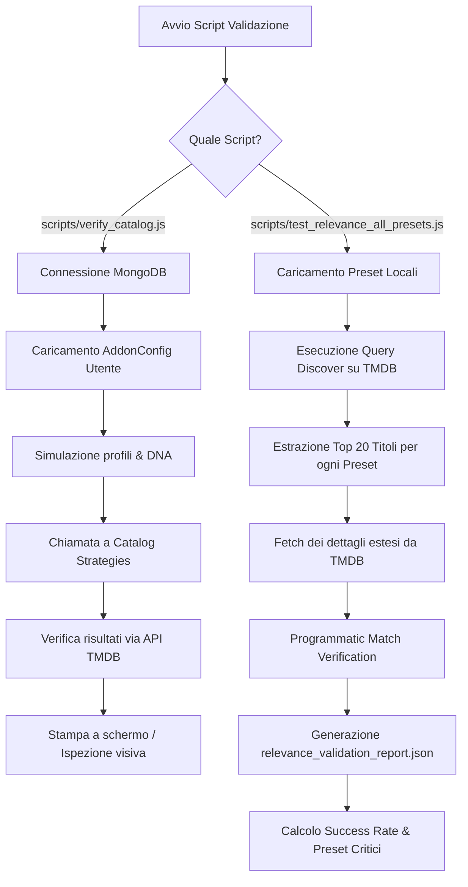

# Suite di Test e Utility di Amministrazione (YACA)

Questo documento descrive in dettaglio l'architettura dei test, le procedure di validazione automatica dei cataloghi e dei preset, e gli strumenti amministrativi per la manutenzione e il debug della piattaforma YACA (Yet Another Catalog Addon).

---

## 1. Test di Unità e Integrazione con Jest

I test di unità e integrazione sono scritti in JavaScript utilizzando il framework **Jest** (`jest`). Consentono di verificare la correttezza algoritmica di YACA senza caricare runtime complessi, mockando ove necessario i database e le API esterne (come TMDB o Trakt).

### Comando di Esecuzione
Per eseguire la suite completa dei test:
```bash
npm test
```
Questo comando attiva `jest`, che esegue automaticamente la scansione della cartella [tests/](../tests) e rileva tutti i file con estensione `.test.js`.

### Struttura della Cartella `tests/`
I file all'interno di [tests/](../tests) coprono diverse aree critiche:

1. **[LRUCache.test.js](../tests/LRUCache.test.js)**:
   Verifica il comportamento del sistema di cache in-memory personalizzato (Least Recently Used) di YACA, testando:
   - Memorizzazione e recupero dei valori.
   - Eviction (sfratto) degli elementi più vecchi al raggiungimento della dimensione massima (`max`).
   - Aggiornamento della posizione degli elementi acceduti (comportamento LRU).
   - Scadenza delle voci in base al TTL (Time to Live).

2. **[hybridRecommendations.test.js](../tests/hybridRecommendations.test.js)**:
   Verifica il calcolo dello score ibrido per le raccomandazioni Trakt/TMDB. Copre in dettaglio la funzione `calculateHybridScore` testando:
   - Punteggi basati sulla posizione della raccomandazione in Trakt.
   - Boost per le occorrenze extra su TMDB.
   - Boost basati sui generi preferiti del profilo utente (Boost per genere #1, #2, #3).

3. **[profileScorerVSM.test.js](../tests/profileScorerVSM.test.js)** e **[profileScorerCoreBias.test.js](../tests/profileScorerCoreBias.test.js)**:
   Testano il calcolo del match di un titolo a partire dal vettore `V_final` (il profilo di gusto dell'utente basato su Vector Space Model). Verificano che la combinazione delle componenti tematiche (generi e keyword) e autoriali (registi, attori) con pesi ponderati (`traktWeight` e `tmdbWeight`) calcoli correttamente il punteggio finale per l'utente.

4. **Altri test significativi**:
   - `addonConfigCatalogSchema.test.js`: Verifica l'integrità dello schema di configurazione dell'addon e dei cataloghi memorizzati.
   - `dnaExtractor.test.js`: Controlla l'estrazione del DNA (interessi e preferenze) dell'utente dai suoi metadati di visione.
   - `catalogStrategies.test.js`: Verifica le strategie di generazione dei cataloghi.

---

## 2. Script di Rilevanza e Validazione

Nella root del progetto sono presenti degli script di validazione e analisi programmatica della rilevanza dei cataloghi/preset. Questi script si collegano alle API esterne e al DB per generare report di integrità.

### [test_relevance_all_presets.js](../scripts/test_relevance_all_presets.js)
Questo script automatizza la validazione della rilevanza per ciascuno dei preset configurati nell'addon (ad esempio i preset degli anime, documentari, ecc.).
* **Flusso di funzionamento**:
  1. Recupera la lista dei preset disponibili.
  2. Esegue una chiamata di `discover` a TMDB per i primi 20 elementi di ogni preset.
  3. Per ciascun elemento trovato, interroga TMDB recuperando i dettagli estesi (`credits`, `watch/providers`, `keywords`).
  4. Valida se l'elemento rispetta rigorosamente i filtri impostati sul preset (genere, lingua originale, parole chiave incluse o escluse, cast, crew, watch provider).
  5. Calcola un tasso di successo complessivo ("Success Rate") e salva un report JSON dettagliato (`relevance_validation_report.json`).

### [verify_catalog.js](../scripts/verify_catalog.js)
Utilizzato per simulare e validare la generazione dei cataloghi ibridi per un utente specifico nel database locale.
* **Flusso di funzionamento**:
  1. Si connette a MongoDB.
  2. Cerca un utente di test e recupera la sua configurazione addon.
  3. Simula la generazione dei profili (es. con preset Otaku).
  4. Costruisce i cataloghi di test usando le quattro strategie principali di YACA:
     - **Top Genres Mix**: Mix dei generi preferiti del profilo utente.
     - **Hybrid Catalog (Rete Preferiti)**: Raccomandazioni ibride basate sui gusti dell'utente e il feedback di Trakt.
     - **Hidden Gems**: Gemme nascoste consigliate per l'utente.
     - **Trakt Filtered**: Cataloghi filtrati basati sulle liste Trakt dell'utente.
  5. Interroga TMDB per i primi 5 titoli di ciascun catalogo generato, stampando a console i metadati per l'ispezione visiva.

### [test_doc_thresholds.js](../scripts/test_doc_thresholds.js)
Script specifico per analizzare la densità e la quantità dei risultati restituiti da TMDB per i documentari storici, spaziali e naturali. Aiuta a tarare la soglia minima di voti (`vote_count.gte`) per evitare che il catalogo rimanga vuoto o che restituisca titoli irrilevanti (ad esempio, documentari con pochissimi voti).

---

## 3. Diagramma del Ciclo di Validazione

Il ciclo di validazione di un catalogo/preset assicura che le query inviate a TMDB e le risposte fornite all'utente finale rispettino i criteri impostati. Di seguito è illustrato il flusso logico degli script di validazione:



---

## 4. Script Amministrativi e Utility di Debug

All'interno della cartella `scripts/` sono presenti diversi script di manutenzione e debug rapido che permettono di interagire con la base di dati e resettare gli stati interni.

### [clear_caches.js](../scripts/clear_caches.js)
Questo script pulisce in modo sicuro le collezioni di caching all'interno del database MongoDB Atlas (utilizzando `process.env.MONGODB_URI` anziché credenziali hardcoded). Nello specifico, rimuove tutti i documenti all'interno di:
- `cacheentries` (cache generale delle risposte gestita dal modello `CacheEntry` in [src/models/CacheEntry.js](../src/models/CacheEntry.js)).
- `tmdbrequestcaches` (cache delle risposte HTTP dirette dal client TMDB gestita dal modello `TmdbRequestCache` in [src/models/TmdbRequestCache.js](../src/models/TmdbRequestCache.js)).

*Questo script unifica le funzionalità del precedente `clear_mongo.js` (ora rimosso).*

### [find_user.js](../scripts/find_user.js)
Utility di ricerca per ispezionare lo stato di un utente nel database locale MongoDB:
1. Carica tutte le configurazioni addon.
2. Identifica una configurazione che contenga preset legati al mondo Otaku (es. `tpl_otaku`, `otaku_hardcore`).
3. Risale all'utente (`UserAccount`) associato a quella configurazione.
4. Carica il `TasteProfile` dell'utente e stampa:
   - Il numero di elementi visti su Trakt (`sources.traktHistory`).
   - Il numero di entrate uniche presenti nel suo vettore di gusti compilato `V_final`.

### [set_kids_mode.js](../scripts/set_kids_mode.js)
Consente di attivare forzatamente la modalità bambini (`kidsMode`) su uno specifico profilo (es. il profilo Otaku) per scopi di test.
- Trova il primo utente del DB e la sua configurazione addon associata.
- Individua il profilo Otaku.
- Imposta `profiles[index].settings.kidsMode = true`.
- Salva la configurazione indicando a Mongoose la modifica tramite `config.markModified('profiles')`.
- Rimuove la cache delle richieste per costringere l'addon a ricalcolare i cataloghi applicando i filtri di protezione per bambini.
