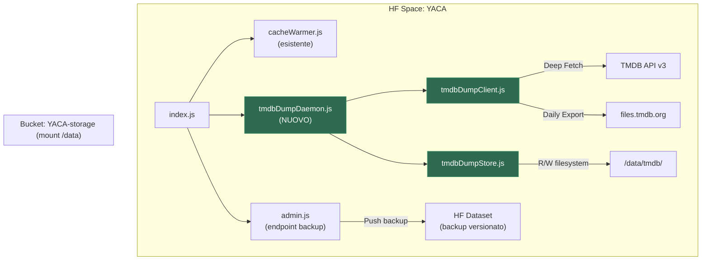
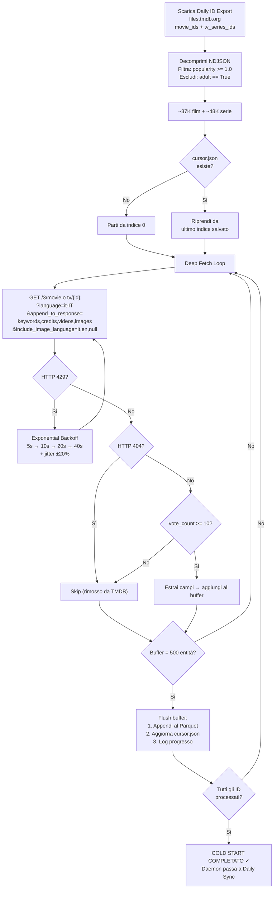
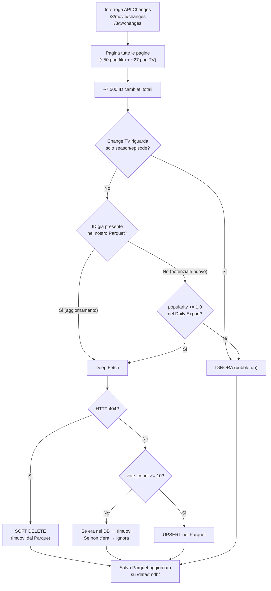

# TMDB Parquet Database — Piano Definitivo

## Contesto e Obiettivo

YACA necessita di un database locale completo di tutti i metadati TMDB (film + serie TV) per:
- Eliminare la dipendenza dalle API esterne durante il rendering dei cataloghi
- Garantire caricamenti istantanei per gli utenti Stremio
- Potenziare il motore di raccomandazione VSM con accesso immediato a keyword, generi e cast

**Tutto il codice vive dentro YACA.** Nessun HF Space esterno.

---

## Storage: Il Bucket `YACA-storage`

> [!IMPORTANT]
> Il **Storage Bucket** `Gabriele-fuoco/YACA-storage` è già montato su `/data` (Read & Write) nello Space di YACA. Questo è il meccanismo di persistenza di HF Spaces: un volume esterno al container che **sopravvive a restart, rebuild dopo commit, sleep e risveglio**.
>
> YACA lo usa già per le badge images (`/data/badges/` via `HFStorageClient.js`). I nostri file Parquet vivranno in **`/data/tmdb/`** — stessa garanzia di persistenza, zero configurazione extra.

### Struttura su disco

```
/data/                              ← Bucket YACA-storage (persistente)
├── badges/                         ← Badge images (già esistente)
└── tmdb/                           ← NUOVO
    ├── master_movies.parquet       ← ~87K film
    ├── master_tv.parquet           ← ~48K serie
    └── cursor.json                 ← Checkpoint per resume dopo restart
```

### Backup

Il bucket è persistente, ma per sicurezza aggiuntiva implementeremo un **endpoint admin** per esportare snapshot dei Parquet:

#### Backup Manuale (CLI dalla tua macchina)
```bash
# Installa hf CLI (una tantum)
pip install huggingface_hub[cli]
hf auth login

# Scarica tutto il dump
hf sync hf://buckets/Gabriele-fuoco/YACA-storage/tmdb/ ./backup_tmdb/

# Oppure singolo file
hf cp hf://buckets/Gabriele-fuoco/YACA-storage/tmdb/master_movies.parquet ./
```

#### Backup Automatico (Endpoint Admin in YACA)
```
POST /api/admin/tmdb-dump/backup
```
- Pusha una copia dei Parquet su un **HF Dataset** (`gabriele-fuoco/yaca-tmdb-backup`)
- Il Dataset è versionato (Git): ogni push crea un commit con timestamp → **cronologia completa dei backup**
- Triggerabile manualmente o schedulabile con un cron esterno (es. Uptime Robot che chiama l'endpoint ogni settimana)

#### Backup in Python (dal tuo PC)
```python
from huggingface_hub import HfApi
api = HfApi(token="hf_TWs...")
# Scarica un file specifico dal bucket
api.hf_hub_download(
    repo_id="Gabriele-fuoco/YACA-storage",
    filename="tmdb/master_movies.parquet",
    repo_type="bucket",  
    local_dir="./backup/"
)
```

---

## Dati Empirici (misurati il 19/07/2026)

| Metrica | Valore |
|---|---|
| Film con `popularity >= 1.0` (Daily Export) | **86.941** |
| Serie TV con `popularity >= 1.0` (Daily Export) | **47.632** |
| **Totale Cold Start** | **134.573 entità** |
| **Tempo Cold Start stimato** (3.5 req/s) | **~10-12 ore** |
| Changes rilevanti/giorno (API Changes) | **~2.400** |
| **Tempo sync giornaliero** | **~10 minuti** |
| Soglia popolarità | `>= 1.0` |
| Soglia voti (post-fetch) | `>= 10` |

> [!TIP]
> **Espansione futura:** Abbassare la soglia a `popularity >= 0.5` è un'operazione chirurgica: si scarica il Daily Export, si estraggono i nuovi ID (quelli tra 0.5 e 1.0 non ancora nel DB), si fa Deep Fetch solo su quelli (~174K delta), si appendono al Parquet. Nessun re-download di ciò che c'è già.

---

## Architettura



---

## Fase 1: Cold Start (Una tantum, ~10-12 ore)

### Flusso



### Dettagli tecnici

1. **Download Daily ID Exports** da `http://files.tmdb.org/p/exports/`:
   - `movie_ids_MM_DD_YYYY.json.gz` — ogni riga: `{"id":123,"original_title":"...","popularity":5.2,"adult":false,"video":false}`
   - `tv_series_ids_MM_DD_YYYY.json.gz` — ogni riga: `{"id":456,"original_name":"...","popularity":3.1}`
   - Pubblicati dopo le 08:00 UTC ogni giorno

2. **Filtro pre-fetch:**
   - Film: `popularity >= 1.0` AND `adult == false` → **~86.941 ID**
   - Serie: `popularity >= 1.0` → **~47.632 ID** (nessun campo `adult` nell'export TV)

3. **Deep Fetch con `append_to_response`:**
   - Film: `GET /3/movie/{id}?language=it-IT&append_to_response=keywords,credits,videos,images&include_image_language=it,en,null`
   - Serie: `GET /3/tv/{id}?language=it-IT&append_to_response=keywords,credits,videos,images&include_image_language=it,en,null`
   - **Nessun fetch di stagioni o episodi** — quelli li chiederemo a TMDB on-demand quando l'utente apre la serie su Stremio

4. **Filtro post-fetch:** `vote_count >= 10` sui dati reali dell'API (il Daily Export non ha vote_count)

5. **Rate Limiting:**
   - **3.5 req/sec** (margine di sicurezza sul limite ufficiale di 4/sec per IP)
   - Implementato con delay fisso di ~285ms tra le richieste
   - Su HTTP 429: **Exponential Backoff** con jitter (5s → 10s → 20s → 40s, max 60s, ±20% random)
   - Retry fino a 5 tentativi su errori transitori (timeout, 5xx)

6. **Checkpoint ogni 500 entità:**
   - Buffer di 500 record viene flushed nel file Parquet (append)
   - `cursor.json` aggiornato: `{"phase":"movies","index":12500,"total":86941,"startedAt":"2026-07-20T09:00:00Z"}`
   - Se YACA si riavvia → il daemon legge `cursor.json` e **riprende esattamente da dove si era fermato**
   - Nessun dato viene perso, nessun re-download

7. **Ordine di esecuzione:** Prima tutti i film, poi tutte le serie TV

---

## Fase 2: Sincronizzazione Quotidiana (~10 min, ogni 6 ore)

Dopo il completamento del Cold Start, il daemon entra in modalità sync.

### Flusso



### Dettagli

1. **Raccolta Changes:** Itera su tutte le pagine di `/3/movie/changes` e `/3/tv/changes`
2. **Filtra bubble-up TV:** Se il change riguarda solo chiavi `season`/`episode` → ignora
3. **Cross-reference con Parquet:**
   - ID presente → re-fetch completo (metadati potrebbero essere cambiati: poster, trailer, trama italiana, voti)
   - ID assente → controlla popolarità nel Daily Export → se supera soglia → fetch e inserisci
4. **Soft Delete:** HTTP 404 → il titolo è stato rimosso/fuso su TMDB → rimuovi dal Parquet
5. **Volume effettivo:** ~2.400 fetch rilevanti su ~7.500 changes totali (31% rilevanza)
6. **Tempo:** ~10 minuti a 3.5 req/sec
7. **Frequenza:** Il daemon aspetta **6 ore** tra un ciclo e l'altro

---

## Schema Parquet

### Film (`/data/tmdb/master_movies.parquet`)

| Colonna | Tipo | Fonte API | Note |
|---|---|---|---|
| `id` | INT32 | Root | PK, ID TMDB |
| `imdb_id` | STRING | Root | Per mapping Stremio (`tt1234567`) |
| `title` | STRING | Root | Localizzato `it-IT` (fallback `en-US`) |
| `original_title` | STRING | Root | Titolo originale |
| `original_language` | STRING | Root | Codice ISO (`en`, `it`, `ja`...) |
| `overview` | STRING | Root | Trama localizzata `it-IT` |
| `release_date` | STRING | Root | `YYYY-MM-DD` |
| `runtime` | INT32 | Root | Durata in minuti |
| `vote_average` | FLOAT | Root | Media voti (0-10) |
| `vote_count` | INT32 | Root | Numero voti |
| `popularity` | FLOAT | Root | Score di popolarità TMDB |
| `status` | STRING | Root | `Released`, `Post Production`, etc. |
| `poster_path` | STRING | Root | Path relativo (`/abc123.jpg`) |
| `backdrop_path` | STRING | Root | Path relativo sfondo |
| `genres` | STRING | Root | JSON: `[{"id":28,"name":"Azione"},...]` |
| `keywords` | STRING | `keywords.keywords` | JSON: `[{"id":123,"name":"alien"},...]` |
| `cast` | STRING | `credits.cast` | JSON: top 20 per `order`, `[{"id":1,"name":"...","character":"...","order":0}]` |
| `directors` | STRING | `credits.crew` | JSON: filtrato `job=="Director"`, `[{"id":2,"name":"..."}]` |
| `trailer_key` | STRING | `videos.results` | YouTube key del primo `type=="Trailer"` + `site=="YouTube"` |
| `_fetched_at` | STRING | Script | ISO timestamp del fetch, per sapere quanto è fresco il dato |

### Serie TV (`/data/tmdb/master_tv.parquet`)

| Colonna | Tipo | Fonte API | Note |
|---|---|---|---|
| `id` | INT32 | Root | PK, ID TMDB |
| `name` | STRING | Root | Localizzato `it-IT` |
| `original_name` | STRING | Root | |
| `original_language` | STRING | Root | |
| `overview` | STRING | Root | Trama `it-IT` |
| `first_air_date` | STRING | Root | Prima messa in onda |
| `last_air_date` | STRING | Root | Ultimo episodio andato in onda |
| `number_of_seasons` | INT32 | Root | |
| `number_of_episodes` | INT32 | Root | |
| `vote_average` | FLOAT | Root | |
| `vote_count` | INT32 | Root | |
| `popularity` | FLOAT | Root | |
| `status` | STRING | Root | `Returning Series`, `Ended`, `Canceled` |
| `type` | STRING | Root | `Scripted`, `Documentary`, `Miniseries` |
| `poster_path` | STRING | Root | |
| `backdrop_path` | STRING | Root | |
| `genres` | STRING | Root | JSON |
| `keywords` | STRING | `keywords.results` | JSON |
| `cast` | STRING | `credits.cast` | JSON: top 20 |
| `created_by` | STRING | Root | JSON: creatori della serie `[{"id":2,"name":"..."}]` |
| `trailer_key` | STRING | `videos.results` | YouTube key |
| `networks` | STRING | Root | JSON: `[{"id":213,"name":"Netflix"}]` |
| `_fetched_at` | STRING | Script | |

> [!NOTE]
> I campi complessi (genres, keywords, cast, etc.) vengono serializzati come **stringhe JSON** nel Parquet. Questo evita problemi con le strutture annidate di Parquet ed è compatibile con query DuckDB via `json_extract()` nativo. In futuro, quando YACA leggerà il Parquet, basterà un `JSON.parse()` per ottenere gli array.

---

## Proposed Changes

### Nuovi file

```
YACA/src/utils/
├── cacheWarmer.js              ← ESISTENTE (riferimento pattern)
├── rateLimiter.js              ← ESISTENTE (riusato dal daemon)
├── tmdbDumpDaemon.js           ← NUOVO: Daemon principale
├── tmdbDumpClient.js           ← NUOVO: Client TMDB con rate limiting
└── tmdbDumpStore.js            ← NUOVO: Lettura/scrittura Parquet
```

### Responsabilità di ogni modulo

---

#### [NEW] `src/utils/tmdbDumpDaemon.js` — Orchestratore

Il cuore del sistema. Segue il **pattern identico** a `cacheWarmer.js`:

```js
async function runTmdbDumpDaemon() {
    if (isRunning) return;
    isRunning = true;
    try {
        const store = new TmdbDumpStore();
        if (!store.parquetExists('movies')) {
            // COLD START: prima esecuzione, scarica tutto
            console.log('[TmdbDump] No Parquet found. Starting Cold Start...');
            await coldStart(store);
        } else {
            // DAILY SYNC: aggiorna i cambiamenti
            console.log('[TmdbDump] Parquet found. Running Daily Sync...');
            await dailySync(store);
            // Aspetta 6 ore prima del prossimo ciclo
            await sleep(6 * 60 * 60 * 1000);
        }
    } catch (e) {
        console.error('[TmdbDump] Fatal error:', e.message);
    } finally {
        isRunning = false;
        setTimeout(() => runTmdbDumpDaemon(), 5000);
    }
}
```

**Cold Start (`coldStart`):**
1. Scarica Daily ID Exports (film + TV)
2. Filtra `popularity >= 1.0`, `adult == false`
3. Legge `cursor.json` se esiste (resume dopo restart)
4. Loop: fetch → filtro `vote_count >= 10` → buffer → flush ogni 500 → aggiorna cursor
5. Prima film, poi serie TV
6. Log continuo: `[TmdbDump] MOVIES 12500/86941 (14.4%) — Last: "L'esorcista" ✓`

**Daily Sync (`dailySync`):**
1. Raccoglie tutti gli ID cambiati da API Changes (pagina tutte le pagine)
2. Filtra bubble-up TV
3. Cross-reference con Parquet esistente
4. Fetch solo i rilevanti → upsert/delete
5. Log: `[TmdbDump] Sync complete: 2400 checked, 1800 upserted, 12 deleted`

---

#### [NEW] `src/utils/tmdbDumpClient.js` — Client HTTP TMDB

```js
class TmdbDumpClient {
    constructor(apiKey, rateLimit = 3.5) { ... }
    
    // Deep fetch con append_to_response
    async fetchMovie(id) { ... }
    async fetchTv(id) { ... }
    
    // API Changes (paginata)
    async fetchAllChanges(mediaType) { ... }
    
    // Daily ID Exports
    async downloadDailyExport(mediaType) { ... }
    
    // Rate limiting interno
    async _throttledRequest(url, params) { ... }
    
    // Exponential Backoff su 429
    async _requestWithRetry(url, params, maxRetries = 5) { ... }
}
```

- **Rate Limit:** Delay di ~285ms tra richieste (3.5 req/s)
- **Backoff su 429:** 5s → 10s → 20s → 40s → 60s (max), con jitter random ±20%
- **Retry su errori transitori:** Timeout, 5xx → fino a 5 tentativi
- **Estrazione campi:** Metodo interno che mappa la risposta JSON nello schema Parquet (top 20 cast, filtro directors, primo trailer YouTube)

---

#### [NEW] `src/utils/tmdbDumpStore.js` — Storage Parquet

```js
class TmdbDumpStore {
    constructor() {
        // /data/tmdb su HF Spaces, .cache/tmdb in locale
        this.basePath = fs.existsSync('/data') 
            ? '/data/tmdb' 
            : path.resolve(__dirname, '../../.cache/tmdb');
        fs.mkdirSync(this.basePath, { recursive: true });
    }
    
    parquetExists(mediaType) { ... }      // Controlla se il file esiste
    loadIds(mediaType) { ... }            // Carica solo la colonna 'id' per cross-reference veloce
    appendBatch(rows, mediaType) { ... }  // Appende righe al Parquet
    upsert(rows, mediaType) { ... }       // Aggiorna esistenti + inserisce nuovi
    deleteIds(ids, mediaType) { ... }     // Rimuove righe per soft delete
    
    loadCursor() { ... }                  // Legge cursor.json
    saveCursor(data) { ... }              // Salva cursor.json
}
```

- Usa `parquetjs-lite` o `hyparquet` (pacchetti npm puri JS, no binding C++)
- In alternativa: salvataggio in NDJSON (una riga JSON per film) e conversione a Parquet in un secondo momento — più semplice per append/upsert
- Fallback locale: `.cache/tmdb/` per sviluppo e test

---

#### [MODIFY] [index.js](file:///C:/Users/gabri/APP/Streaming/YACA/index.js)

Aggiunta dell'avvio del daemon dopo il CacheWarmer (linea ~184):

```js
// Avvia il Demone TMDB Dump
const { runTmdbDumpDaemon } = require('./src/utils/tmdbDumpDaemon');
runTmdbDumpDaemon().catch(err => console.error('[TmdbDump Daemon] Startup Error:', err.message));
```

#### [MODIFY] [src/api/admin.js](file:///C:/Users/gabri/APP/Streaming/YACA/src/api/admin.js)

Aggiunta endpoint per status e backup:

```js
// GET /api/admin/tmdb-dump/status
// Ritorna: { phase: "sync", movies: 86500, tv: 47000, lastSync: "2026-07-20T15:00:00Z" }

// POST /api/admin/tmdb-dump/backup  
// Pusha i Parquet su un HF Dataset come snapshot versionato
```

#### [MODIFY] [.gitignore](file:///C:/Users/gabri/APP/Streaming/YACA/.gitignore)

```
TMDB_movie_dataset_v11.csv
tmdb_worker/
.cache/tmdb/
```

---

## Verification Plan

### Test 1: Smoke Test Locale (50 ID)
- Eseguire il daemon con `NODE_ENV=development` su un sottoinsieme di 50 film
- Verificare: rate limiting, schema Parquet/NDJSON, campi popolati
- Path locale: `.cache/tmdb/master_movies.parquet`

### Test 2: Resilienza (Interrupt & Resume)
- Lanciare Cold Start su 200 ID, interrompere dopo ~100 (Ctrl+C)
- Riavviare → verificare che `cursor.json` contiene l'indice corretto
- Verificare che riprende senza duplicati e senza ri-scaricare

### Test 3: Deploy su HF Space
- Commit e push → auto-deploy via `deploy.yml`
- Monitorare log nello Space: `[TmdbDump] Starting Cold Start... MOVIES 0/86941`
- Verificare che `/data/tmdb/` cresce progressivamente
- Verificare che il CacheWarmer continua a funzionare in parallelo senza interferenze

### Test 4: Daily Sync
- Dopo Cold Start completato, verificare che il daemon passa in modalità sync
- Log atteso: `[TmdbDump] Daily Sync: 2400 relevant, 1800 upserted, 12 deleted. Next sync in 6h.`
- Verificare upsert (dati aggiornati) e soft delete (HTTP 404)

### Test 5: Backup & Validazione
- Chiamare `POST /api/admin/tmdb-dump/backup` → verificare push su HF Dataset
- Scaricare il Parquet via `hf cp` → spot-check su 10 film famosi vs TMDB reale
- Verificare unicità ID, conteggio righe, assenza di `vote_count < 10`
